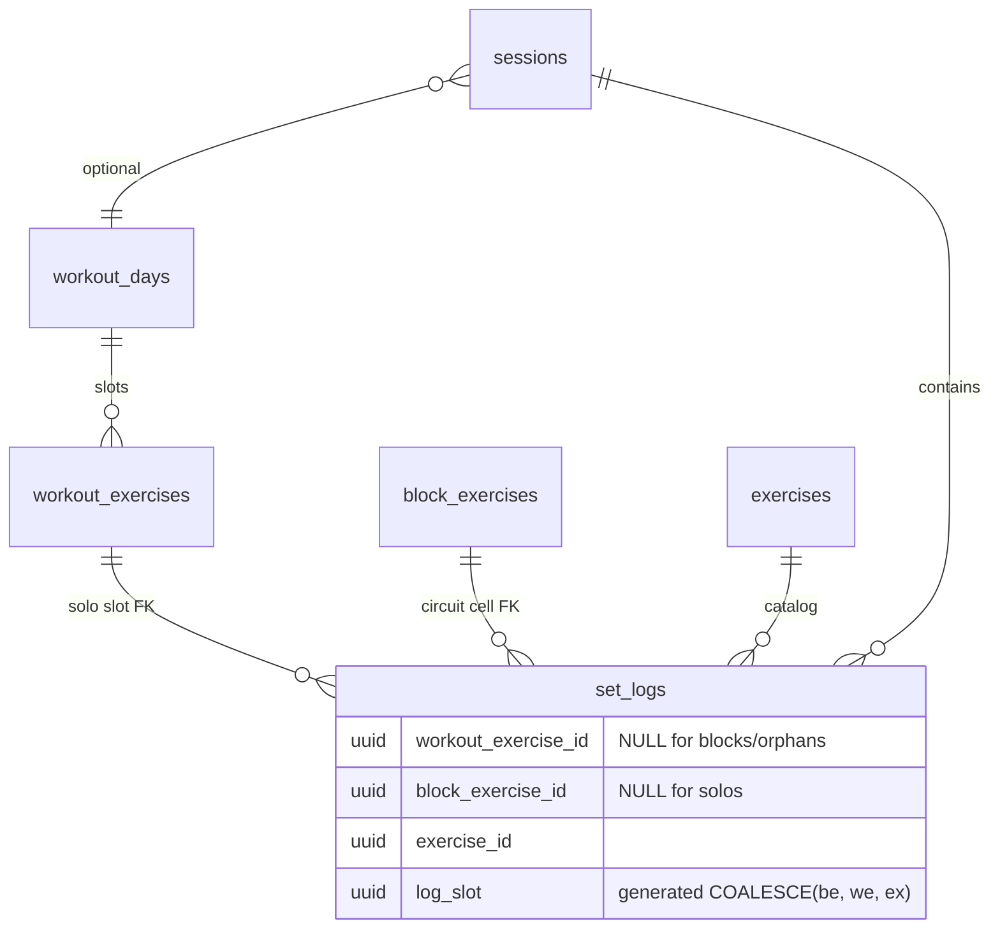
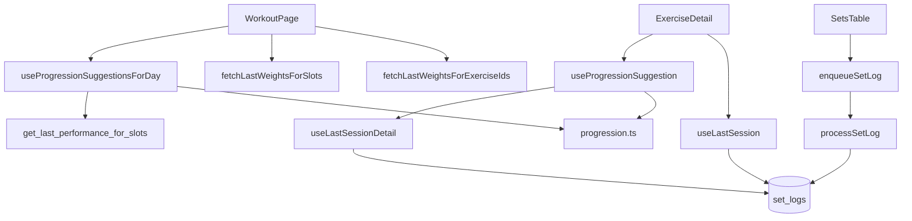

# Tech Plan — Slot-Scoped Last Performance (#463)

> Issue: [#463](https://github.com/PierreTsia/workout-app/issues/463). ADR: `file:docs/adr/0012-slot-scoped-last-performance.md`. Epic: `file:docs/Epic_Brief_—_Slot-Scoped_Last_Performance_#463.md`. Glossary: **Exercise Slot**, **Last Performance**, **Manual Override Window**.

## Architectural Approach

**Last Performance** stays a pure input to `buildPrescription` / `computeNextSessionTarget` — we change *what rows feed it*, not the engine. Solo `set_logs` gain `workout_exercise_id`; reads match `(workout_exercise_id, exercise_id)`; `log_slot` widens so two solos of the same catalog exo in one session no longer collide. Null FK → template bootstrap, never catalog-global fallback. Trends/history/PRs untouched. Single PR.

### Key Decisions

| Decision | Choice | Rationale |
|---|---|---|
| Progression identity | **Exercise Slot** + catalog `exercise_id` | ADR 0012; intent lives on the slot; swap must not inherit old movement logs |
| Schema | `set_logs.workout_exercise_id uuid NULL REFERENCES workout_exercises(id) ON DELETE SET NULL` | Mirror `block_exercise_id` SET NULL history-safe pattern |
| Uniqueness / dedupe | Redefine `log_slot = COALESCE(block_exercise_id, workout_exercise_id, exercise_id)` + queue fingerprint same order | Without this, dual same-catalog solos in one session clobber each other at upsert |
| Backfill | **None** — legacy solos stay NULL → template bootstrap | “Unique slot on the day *now*” mis-attributes after a deleted dual-intent sibling (Bugbot #464); no historical slot tombstones |
| RPC | **Drop** `get_last_performance_for_exercises`; **create** `get_last_performance_for_slots(p_workout_exercise_ids uuid[], p_exercise_ids uuid[])` | One call site; honest name; parallel arrays + client zip assert equal length |
| RPC zip mismatch | **Throw in `queryFn`** | Programming error — do not silently bootstrap every slot |
| In-session reads | `useLastSessionDetail` / `useLastSession` filter both ids; also `.is("block_exercise_id", null)` | Close the gap vs RPC/lastWeights block filter |
| Last weights | Keep catalog `fetchLastWeightsForExerciseIds` for add/swap seed; add `fetchLastWeightsForSlots` for existing-slot prefill | Epic story 6 vs 4 — opposite scopes |
| Query keys | Include slot ids (`workout_exercises.id`) explicitly | Avoid cross-slot React Query cache pollution |
| Offline legacy | Optional `workoutExerciseId`; null → column null → bootstrap | Fail-safe; no global fallback |
| Engine | No change to `progression.ts` pure logic | Input shape unchanged (`SetPerformance[]`) |
| Ship unit | **Single PR** | Correctness bug; half-ship leaves the repro alive |

### Critical Constraints

**Generated `log_slot` recreation.** Postgres cannot ALTER a generated expression in place. Migration must: drop unique index `set_logs_session_slot_set_uniq` → drop column `log_slot` → add column with new `COALESCE(block_exercise_id, workout_exercise_id, exercise_id)` → recreate unique index. Accept brief index rebuild cost at GymLogic scale.

**Queue dedupe parity.** `file:src/lib/syncService.ts` fingerprint today: `blockExerciseId ?? exerciseId`. Must become `blockExerciseId ?? workoutExerciseId ?? exerciseId` or two same-catalog solos still clobber each other in `localStorage` before upsert.

**No historical backfill.** Pre-migration solos keep `workout_exercise_id` NULL; first post-deploy session for each slot bootstraps from **Template Prescription**. Forward writes set the FK from the live slot.

**RPC array zip.** Client must throw in `queryFn` if `p_workout_exercise_ids.length !== p_exercise_ids.length`. Document in SQL comment.

**Cache keys.** Invalidate/queryKey must include slot id (`workout_exercises.id`), not only catalog id — else React Query serves a polluted cache across slots.

**Types lag.** `SetLog` in `file:src/types/database.ts` still missing `prescribed_*`; add those + `workout_exercise_id` in the same PR.

**RLS.** New column inherits `set_logs` policies; no policy rewrite. FK SET NULL on slot delete must not require elevated privileges.

**In-flight offline queue at deploy.** Old items lack `workoutExerciseId` → null FK → bootstrap. No queue migration.

---

## Data Model



### Migration SQL

```sql
-- supabase/migrations/{ts}_slot_scoped_last_performance.sql

-- 1. Column
ALTER TABLE set_logs
  ADD COLUMN workout_exercise_id uuid
    REFERENCES workout_exercises(id) ON DELETE SET NULL;

CREATE INDEX idx_set_logs_workout_exercise_logged_at
  ON set_logs (workout_exercise_id, exercise_id, logged_at DESC)
  WHERE workout_exercise_id IS NOT NULL;

-- 2. No eager historical backfill (see Key Decisions / ADR 0012 §3)

-- 3. Redefine log_slot (generated expr cannot ALTER in place)
DROP INDEX IF EXISTS set_logs_session_slot_set_uniq;
ALTER TABLE set_logs DROP COLUMN log_slot;
ALTER TABLE set_logs
  ADD COLUMN log_slot uuid
    GENERATED ALWAYS AS (
      COALESCE(block_exercise_id, workout_exercise_id, exercise_id)
    ) STORED;
CREATE UNIQUE INDEX set_logs_session_slot_set_uniq
  ON set_logs (session_id, log_slot, set_number);

-- 4. RPC replace
DROP FUNCTION IF EXISTS get_last_performance_for_exercises(uuid[]);

CREATE OR REPLACE FUNCTION get_last_performance_for_slots(
  p_workout_exercise_ids uuid[],
  p_exercise_ids uuid[]
)
RETURNS TABLE (
  workout_exercise_id uuid,
  exercise_id uuid,
  session_id uuid,
  set_number integer,
  reps_logged text,
  weight_logged numeric,
  rir integer,
  duration_seconds integer,
  prescribed_reps integer,
  prescribed_weight numeric,
  prescribed_sets integer,
  prescribed_duration_seconds integer,
  logged_at timestamptz,
  session_finished_at timestamptz
)
LANGUAGE sql
STABLE
SECURITY INVOKER
SET search_path = public
AS $$
  -- Caller must pass parallel arrays of equal length (enforced in client queryFn).
  WITH slots AS (
    SELECT *
    FROM unnest(p_workout_exercise_ids, p_exercise_ids)
      AS t(workout_exercise_id, exercise_id)
  ),
  latest_session_per_slot AS (
    SELECT DISTINCT ON (sl.workout_exercise_id, sl.exercise_id)
      sl.workout_exercise_id,
      sl.exercise_id,
      sl.session_id
    FROM set_logs sl
    JOIN sessions s ON s.id = sl.session_id
    JOIN slots sp
      ON sp.workout_exercise_id = sl.workout_exercise_id
     AND sp.exercise_id = sl.exercise_id
    WHERE s.user_id = auth.uid()
      AND sl.block_exercise_id IS NULL
      AND sl.workout_exercise_id IS NOT NULL
    ORDER BY sl.workout_exercise_id, sl.exercise_id, sl.logged_at DESC
  )
  SELECT
    sl.workout_exercise_id,
    sl.exercise_id,
    sl.session_id,
    sl.set_number,
    sl.reps_logged,
    sl.weight_logged,
    sl.rir,
    sl.duration_seconds,
    sl.prescribed_reps,
    sl.prescribed_weight,
    sl.prescribed_sets,
    sl.prescribed_duration_seconds,
    sl.logged_at,
    s.finished_at AS session_finished_at
  FROM set_logs sl
  JOIN latest_session_per_slot lsp
    ON sl.workout_exercise_id = lsp.workout_exercise_id
   AND sl.exercise_id = lsp.exercise_id
   AND sl.session_id = lsp.session_id
  JOIN sessions s ON s.id = sl.session_id
  WHERE sl.block_exercise_id IS NULL
  ORDER BY sl.workout_exercise_id, sl.exercise_id, sl.set_number;
$$;

GRANT EXECUTE ON FUNCTION public.get_last_performance_for_slots(uuid[], uuid[]) TO authenticated;
```

### Table Notes

- **Blocks:** `workout_exercise_id` stays NULL; still excluded via `block_exercise_id IS NOT NULL` / RPC filter.
- **Orphans after slot delete:** SET NULL → bootstrap next time that movement appears on a new slot.
- **Post-swap:** same `workout_exercise_id`, new `exercise_id` → no rows match → bootstrap (intentional).
- **Ambiguous legacy days** (two slots, same catalog exo): FK left NULL → bootstrap; never guess.

### Client payload

```ts
// SetLogPayloadReps | SetLogPayloadDuration
workoutExerciseId?: string | null  // solo: exercise.id; block: omit/null

// Queue fingerprint (mirrors DB log_slot):
const slot =
  payload.blockExerciseId ??
  payload.workoutExerciseId ??
  payload.exerciseId
```

`processSetLog` writes `workout_exercise_id: p.workoutExerciseId ?? null`.

---

## Component Architecture

### Layer Overview



### New Files & Responsibilities

| File | Purpose |
|---|---|
| `supabase/migrations/{ts}_slot_scoped_last_performance.sql` | FK, `log_slot`, RPC replace (no historical backfill) |
| `file:src/types/database.ts` | `SetLog.workout_exercise_id` (+ missing `prescribed_*`) |
| `file:src/lib/syncService.ts` | Payload field, upsert column, queue fingerprint |
| `file:src/components/workout/SetsTable.tsx` | Pass `workoutExerciseId: exercise.id` on both enqueue sites |
| `file:src/hooks/useProgressionSuggestionsForDay.ts` | New RPC + length zip throw + group by slot |
| `file:src/hooks/useLastSessionDetail.ts` | Dual-id filter + `block_exercise_id` null; queryKey includes slot id |
| `file:src/hooks/useLastSession.ts` | Same dual-id filter + queryKey |
| `file:src/hooks/useProgressionSuggestion.ts` | Pass `exercise.id` into detail hook |
| `file:src/lib/lastWeightsFromSetLogs.ts` | Add `fetchLastWeightsForSlots`; keep catalog fetch |
| `file:src/hooks/useLastWeights.ts` | Export slot query config / hook alongside catalog |
| `file:src/pages/WorkoutPage.tsx` | Existing-slot prefill → slot weights; add/swap keep catalog |
| Matching `*.test.ts` / `*.test.tsx` | Dual-program fixture, swap bootstrap, null-FK bootstrap, log_slot collision, RPC zip throw |

### Component Responsibilities

**`get_last_performance_for_slots`**
- Latest non-block session per `(workout_exercise_id, exercise_id)` for `auth.uid()`
- Ignores null `workout_exercise_id` rows entirely

**`useProgressionSuggestionsForDay`**
- Builds parallel id arrays from day’s solos; throws if lengths diverge; Map keyed by slot id (output shape unchanged)

**`useLastSessionDetail`**
- Supplies `sets` + `lastSessionFinishedAt` for **Manual Override Window** — slot-scoped by construction

**`useLastSession`**
- “Last time” UI line; same scope as engine input

**`fetchLastWeightsForSlots`**
- `Record<workout_exercise_id, kg>` from latest solo log matching pair; used only for existing-slot `weight === 0` prefill in `WorkoutPage`

**`fetchLastWeightsForExerciseIds`**
- Unchanged catalog-global; add/swap seed only

**`SetsTable` / `syncService`**
- Thread `workoutExerciseId` on solo logs; blocks omit it; fingerprint uses three-way COALESCE order

### Failure Mode Analysis

| Failure | Behavior |
|---|---|
| Dual-program repro (light then heavy) | Heavy slot suggestion ignores light logs |
| Two same-catalog solos one session | Distinct `log_slot`s; both upserts survive |
| Builder swap on slot | No matching `(we_id, new_ex_id)` → bootstrap template |
| Pre-migration / ambiguous legacy | FK stays null → template bootstrap; no global fallback |
| Offline payload sans `workoutExerciseId` | Column null → bootstrap next read |
| Slot deleted in Builder | SET NULL on old logs; new slot = new identity |
| Block log | `workout_exercise_id` null; still out of RPC |
| RPC array length mismatch | `queryFn` throws; error surfaces (not silent empty Map) |
| Catalog history / PR views | Unchanged queries (still by `exercise_id`) |
| Deleted dual-intent sibling | No eager attach to survivor; Bugbot-safe (legacy NULL) |

---

## Test Plan (implementation)

- **Unit / hook:** dual-program same catalog exo → distinct suggestions; swap → null Last Performance / template bootstrap; null FK → no catalog-global anchor; RPC zip length mismatch throws; queue fingerprint distinguishes two solos.
- **syncService:** upsert writes `workout_exercise_id`; `onConflict` still `session_id,log_slot,set_number`.
- **Migration:** confirm no historical UPDATE of `workout_exercise_id`; optional local supabase smoke with two programs / one shared exo.
- **Manual:** reporter repro after deploy (story 1 + stories 9–10 null/bootstrap spot-check).
