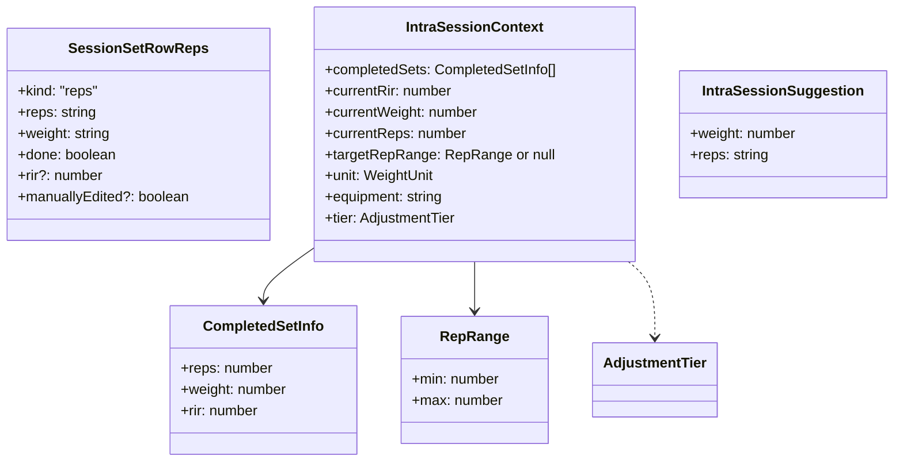
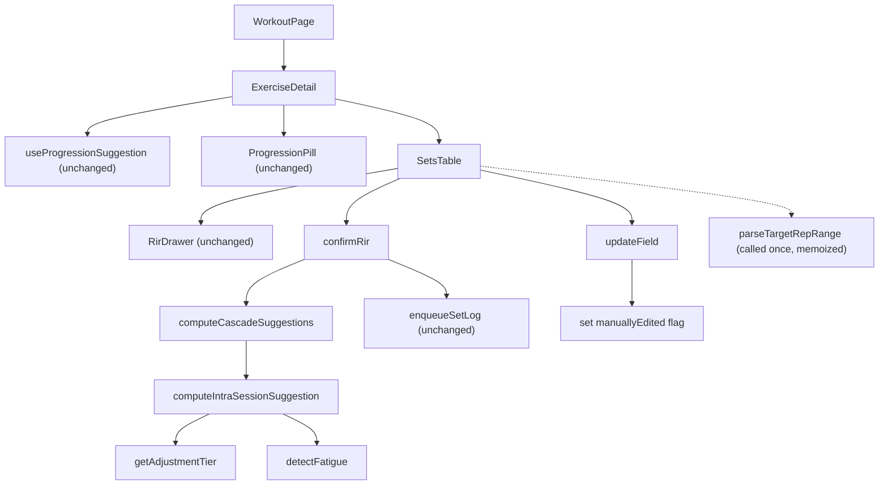

# Tech Plan — Smarter Intra-Session Set Adjustment

## Architectural Approach

### Key Decisions

| Decision | Choice | Rationale |
|---|---|---|
| Engine location | Refactor in-place in file:src/lib/rirSuggestion.ts | 29 lines today; ~150 with full rule table. Not worth a new file; keeps imports unchanged for the single caller. |
| Function signature | Replace flat params with `IntraSessionContext` object | 10+ params otherwise. Object is self-documenting and extensible. |
| Target reps source | `WorkoutExercise.rep_range_min/max` first, parse `reps` string as fallback | Triple Progression already stores structured ranges. Avoids reinventing a parser. Fallback handles legacy rows. |
| RIR coaching model | RIR 0 = deload, RIR 1-2 = efficiency zone (hold), RIR 3+ = undershoot (progress) | Evidence-based: RIR 1-2 is the productive training zone. Anything above signals underloading. |
| Fatigue model | Bucket-shift: fatigue shifts effective RIR one bucket more conservative | Keeps the rule table two-dimensional (RIR bucket × shortfall). Fatigue just determines which row you land on. |
| Cascade model | Deloads compound across remaining sets (capped at 2 increments from original); increases apply once then hold | Coach analogy: "let me keep reducing until you stabilize" (with a safety cap) vs. "try a bit more, then hold." |
| Reps deload magnitude | Proportional: `Math.round(currentReps * 0.85)`, enforced min drop of 1 on failure | Scales with high-rep sets (20 reps → -3, 10 reps → -1, 3 reps → -1). |
| Manual override | `manuallyEdited` boolean on `SessionSetRow` | Falsy by default — no localStorage migration needed. Set in `updateField`, checked in batch loop. |
| `AdjustmentTier` | Typed union + pure mapping function in `rirSuggestion.ts` | Centralizes equipment → tier logic next to the consumer. No scattered string matching. |

### Critical Constraints

**Cross-session progression is untouched.** `computeNextSessionTarget` in file:src/lib/progression.ts and `useProgressionSuggestion` in file:src/hooks/useProgressionSuggestion.ts remain separate systems. The intra-session engine only affects rows in `session.setsData` during a live workout.

**Display units throughout.** The existing engine works in display units (kg or lbs), not internal kg. file:src/components/workout/SetsTable.tsx converts to kg only for `enqueueSetLog`. The refactored engine inherits this — all weight calculations use the `WeightUnit`-aware increments already defined.

**Backwards compatibility.** Existing `SessionSetRow` objects in localStorage won't have `manuallyEdited`. `normalizeSessionSetRow` in file:src/lib/sessionSetRow.ts already handles legacy shapes — adding a falsy default requires no migration.

**Single caller.** Only file:src/components/workout/SetsTable.tsx calls `computeIntraSessionSuggestion` (confirmed by grep). The signature change is safe.

---

## Data Model



### Table Notes

**`SessionSetRowReps.manuallyEdited`** — Optional boolean, added to both `SessionSetRowReps` and `SessionSetRowDuration`. Set to `true` when the user manually changes reps or weight via `updateField` (only if the value actually changed). The batch engine skips rows where this is truthy. Ephemeral — lives in `setsData` (localStorage) for session duration; new sessions start without it.

**`AdjustmentTier`** — `"weight-first" | "reps-only"`. Derived from `equipment` string + logged weight. Not persisted.

**`CompletedSetInfo`** — Extracted from completed `SessionSetRowReps` entries in `session.setsData[exercise.id]`. Only includes sets with `done === true` and a defined `rir`.

**`RepRange`** — Derived from `WorkoutExercise.rep_range_min/max` when both are defined and positive, else parsed from the `reps` string (regex `^(\d+)-(\d+)$`). Returns `null` for non-parseable strings like `"AMRAP"`.

---

## Component Architecture

### Layer Overview



### Modified Files & Responsibilities

| File | Changes |
|---|---|
| file:src/lib/rirSuggestion.ts | Refactored engine: new types, `getAdjustmentTier`, `parseTargetRepRange`, `detectFatigue`, new `computeIntraSessionSuggestion` signature, `computeCascadeSuggestions` |
| file:src/lib/rirSuggestion.test.ts | Expanded: full RIR × shortfall × tier matrix, fatigue detection, cascade behavior, edge cases |
| file:src/lib/sessionSetRow.ts | Add `manuallyEdited?: boolean` to `SessionSetRowReps` and `SessionSetRowDuration` |
| file:src/components/workout/SetsTable.tsx | `updateField`: set `manuallyEdited`; `confirmRir`: replace single-set update with cascade batch loop |
| file:src/components/workout/SetsTable.test.tsx | Update existing tests for batch behavior |

### Component Responsibilities

**`getAdjustmentTier(equipment: string, loggedWeight: number): AdjustmentTier`**
- Maps equipment string to tier:
  - `"weight-first"`: `barbell`, `dumbbell`, `ez_bar`, `machine`, `bench`, `kettlebell`
  - `"reps-only"`: `bodyweight`, `cable`, `band`
  - Unknown/`undefined` → `"weight-first"` (safe default)
- Override: if equipment is `bodyweight` and `loggedWeight > 0` → `"weight-first"` (weighted bodyweight)

**`parseTargetRepRange(exercise: WorkoutExercise): RepRange | null`**
- If `exercise.rep_range_min` and `exercise.rep_range_max` are both defined and > 0 → `{ min, max }`
- Else: try regex `^(\d+)-(\d+)$` on `exercise.reps` → `{ min, max }`
- Else if `exercise.reps` matches `^\d+$` → `{ min: n, max: n }`
- Else (`"AMRAP"`, `"to failure"`, empty) → `null`

**`detectFatigue(completedSets: CompletedSetInfo[]): boolean`**
- Requires 2+ completed sets with defined RIR
- Returns `true` if the last 2+ sets show strictly declining RIR (e.g. 3 → 2, or 3 → 2 → 1)
- Does not trigger on flat (2 → 2), rising (1 → 2), or single-set sequences

**`computeIntraSessionSuggestion(ctx: IntraSessionContext): IntraSessionSuggestion`**
- Pure function, deterministic
- Steps:
  1. Determine effective RIR (bucket-shift if fatigued)
  2. Detect shortfall (actual reps < target range min, or `null` if no range)
  3. Look up the coaching rule table for the combination of (effective RIR bucket, shortfall, tier)
  4. Compute weight and reps adjustments
  5. Apply floors (weight >= 0, reps >= 1, weight-first floors at one increment)
- Returns `{ weight: number, reps: string }`

**`computeCascadeSuggestions(completedSets, remainingCount, targetRepRange, unit, equipment): IntraSessionSuggestion[]`**
- Pure function wrapping `computeIntraSessionSuggestion` in a cascade loop
- See Cascade Behavior section below

**`SetsTable.updateField`** (modified)
- Compares old vs. new value. If different and set is not done → spreads `manuallyEdited: true` onto the row
- No-op edits (same value) do not set the flag

**`SetsTable.confirmRir`** (modified)
- After marking current set done and logging it:
  1. Collect `completedSets`: all done reps rows for this exercise with defined `rir`
  2. Determine remaining eligible sets: `idx > setIdx && !done && !manuallyEdited && isRepsRow`
  3. Call `computeCascadeSuggestions(completedSets, eligibleCount, targetRepRange, unit, equipment)`
  4. Apply returned suggestions to the eligible rows in order
  5. Call `setSession` once with the full updated `exerciseSets`

---

## Coaching Rule Table

### Effective RIR (with fatigue bucket-shift)

| Actual RIR | Fatigue detected? | Effective bucket |
|---|---|---|
| 0 | any | 0 (failure) — can't shift lower |
| 1-2 | no | 1-2 (efficiency) |
| 1-2 | yes | 0 (failure) — shifted down |
| 3+ | no | 3+ (undershoot) |
| 3+ | yes | 1-2 (efficiency) — shifted down |

### Weight-first tier (barbell, dumbbell, ez_bar, machine, bench, kettlebell)

| Effective bucket | Shortfall? | Weight | Reps |
|---|---|---|---|
| 0 (failure) | no | −1 increment | hold at current |
| 0 (failure) | yes | −1 increment | = actual logged |
| 1-2 (efficiency) | no | hold | hold |
| 1-2 (efficiency) | yes | hold | = actual logged |
| 3+ (undershoot) | no | +1 increment | hold |
| 3+ (undershoot) | yes | hold | = actual logged |

### Reps-only tier (bodyweight, cable, band)

| Effective bucket | Shortfall? | Weight | Reps |
|---|---|---|---|
| 0 (failure) | no | suppressed | `max(1, min(round(current × 0.85), current − 1))` |
| 0 (failure) | yes | suppressed | = actual logged |
| 1-2 (efficiency) | no | suppressed | hold |
| 1-2 (efficiency) | yes | suppressed | = actual logged |
| 3+ (undershoot) | no | suppressed | +1 rep (capped at range max if range exists) |
| 3+ (undershoot) | yes | suppressed | = actual logged |

### Notes on the rule table

- **"Suppressed"** = weight passes through unchanged (0 for pure bodyweight, existing value for cable/band)
- **Shortfall with undershoot (3+):** Contradictory signal. Safest response: hold at actual. Likely cause: user stopped early or mis-entered RIR.
- **When `targetRepRange` is `null`:** No shortfall detection possible. Reps adjust based on RIR bucket only, using current reps as baseline. No cap from range max.
- **Weight increment** uses the existing `DEFAULT_INCREMENT` / `DUMBBELL_INCREMENT` maps from the current code (equipment-aware, unit-aware).
- **Weight floor:** `weight-first` floors at one increment (current behavior); never goes below 0.

---

## Cascade Behavior

```
Input: completedSets (actual), remainingCount, targetRepRange, unit, equipment
Output: IntraSessionSuggestion[remainingCount]

originalWeight = lastCompletedSet.weight
previousWeight = lastCompletedSet.weight
previousReps = lastCompletedSet.reps
effectiveRir = lastCompletedSet.rir (bucket-shifted if fatigue detected)
inc = resolveIncrement(unit, equipment)
tier = getAdjustmentTier(equipment, originalWeight)   // determined ONCE
MAX_CASCADE_STEPS = 2
deloadSteps = 0

for i in 0..remainingCount-1:
  suggestion = computeIntraSessionSuggestion({
    completedSets,      // always ACTUAL completed sets (for fatigue)
    currentRir: effectiveRir,
    currentWeight: previousWeight,
    currentReps: previousReps,
    targetRepRange, unit, equipment,
    tier,               // stable across cascade — no re-evaluation
  })
  
  results[i] = suggestion
  
  isDeload = suggestion.weight < previousWeight
          || parseInt(suggestion.reps) < previousReps
  
  if isDeload:
    deloadSteps++
    totalWeightDrop = originalWeight - suggestion.weight
    // Cap: stop after MAX_CASCADE_STEPS deload iterations,
    // OR after weight drops by MAX_CASCADE_STEPS increments
    if deloadSteps >= MAX_CASCADE_STEPS
    || totalWeightDrop >= inc * MAX_CASCADE_STEPS:
      // Capped — apply this suggestion to all remaining and stop
      for j in i+1..remainingCount-1:
        results[j] = suggestion
      break
    // Under cap — feed forward for next cascade step
    previousWeight = suggestion.weight
    previousReps = parseInt(suggestion.reps)
    continue
  
  // Hold or increase — apply to all remaining and stop
  for j in i+1..remainingCount-1:
    results[j] = suggestion
  break

return results
```

**Cascade cap:** Deloads compound but stop after **2 cascade steps** or once the total weight drop from the original reaches 2 increments (e.g. 5 kg for barbell, 4 kg for dumbbell) — whichever comes first. The step counter covers reps-only exercises (where weight never drops but reps cascade). Beyond the cap, all remaining sets hold at the last deloaded level. The user can always override via manual edit.

**Fatigue detection** uses only ACTUAL completed sets, not cascaded suggestions. Only the weight/reps base propagates through the cascade.

---

### Failure Mode Analysis

| Failure | Behavior |
|---|---|
| `manuallyEdited` false-positive from auto-prefill | Auto-prefill uses `setSession` directly (not `updateField`). Safe — flag is never set by auto-prefill. |
| User taps input, changes nothing, taps out | `updateField` compares old vs. new value. No-op edits don't lock the row. |
| `rep_range_min/max` and `reps` string disagree | Structured fields always win when both defined and positive. |
| All remaining sets are `manuallyEdited` | Cascade computes suggestions but applies none. No crash, no wasted work. |
| Non-numeric `reps` string (AMRAP) | `parseTargetRepRange` returns `null`. No shortfall detection. Reps pass through unchanged. |
| Weight = 0 on weight-first equipment | Floor at 0. Increment from 0 → `inc` on undershoot (current behavior preserved). |
| `equipment` undefined or unknown string | `getAdjustmentTier` defaults to `"weight-first"`. Same as current behavior. |
| Fatigue detected with only 1 completed set | `detectFatigue` requires 2+ sets. Returns `false`. |
| Cascade drops weight below floor | `computeIntraSessionSuggestion` already floors at `inc` (weight-first) or 0 (reps-only). Cascade cap adds a second safety net. |
| Force-refresh mid-session | `normalizeSessionSetRow` drops `manuallyEdited` (defaults to `false`). All remaining sets become eligible for batch update again. Acceptable edge case. |
| Reps proportional drop at very low count (3 reps) | `max(1, min(round(3 × 0.85), 3 − 1))` = `max(1, min(3, 2))` = 2. Always drops at least 1. |
