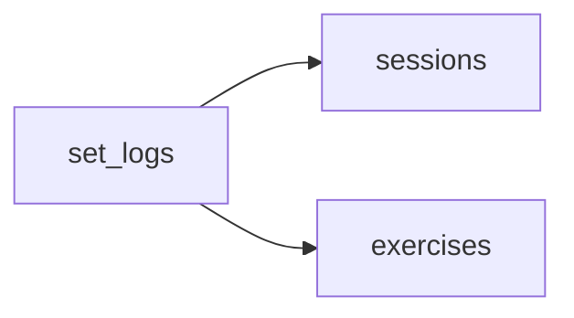

# Tech Plan — Strength Balance (#160)

## Architectural Approach

### Key Decisions

| Decision | Choice | Rationale |
|---|---|---|
| Rolling window | Fixed **30 days** for MVP | Matches issue; selector (7d/90d) deferred |
| Secondary muscle weight | **0.5** per set per secondary | Aligns with existing `ceil(sets/2)` spirit in [`file:src/lib/muscleMapping.ts`](src/lib/muscleMapping.ts); one coefficient for RPC, score, body map, and table |
| Balance score input | **Weighted set credits** (primary 1, secondary 0.5 each) | Issue’s CV score is over per-muscle set distribution; weights must match RPC so UI and math stay consistent |
| Volume / duration sets | Exclude duration sets; safe reps cast | Same `duration_seconds IS NULL` + `reps_logged ~ '^\d+$'` pattern as [`get_cycle_stats`](supabase/migrations/20260325120000_restore_get_cycle_stats_active_duration.sql) |
| Period comparison | RPC param **`p_offset_days`** (0 = current window, 30 = previous 30d block) | One function, two calls from the client; windows are `[now - offset - days, now - offset)` |
| RPC return shape | **JSON** `{ finished_sessions, muscles[] }` | `finished_sessions` = finished sessions in the window that have **≥1 `set_log`** (matches “logged sets” copy); caps: `p_days` / `p_offset_days` clamped to **1–365** |
| Gauge | **Custom SVG** half-arc | No new chart tuning; Recharts kept available for future variants |

### Critical Constraints

- **Auth:** `SECURITY DEFINER` + `auth.uid()` guard (same pattern as [`file:supabase/migrations/20260401000009_rpc_auth_guard.sql`](supabase/migrations/20260401000009_rpc_auth_guard.sql)).
- **Taxonomy:** All **13** French labels always present in `muscles` (zeros filled via `LEFT JOIN` from a fixed array in SQL).
- Exercises whose `muscle_group` is **outside** the taxonomy contribute **only** through valid `secondary_muscles` entries (edge case).

---

## Data Model

**Window:** `sessions.user_id = p_user_id` AND `finished_at IS NOT NULL` AND `finished_at >= v_start` AND `finished_at < v_end`.

---

## Component Architecture

| File | Purpose |
|---|---|
| `supabase/migrations/*_get_volume_by_muscle_group.sql` | RPC + `GRANT EXECUTE` |
| `src/lib/trainingBalance.ts` | `MUSCLE_TAXONOMY`, `AGONIST_PAIRS`, score + insights |
| `src/lib/trainingBalance.test.ts` | Unit tests |
| `src/lib/volumeByMuscleGroup.ts` | `fetchVolumeByMuscleGroup`, types, body-map adapter |
| `src/hooks/useVolumeDistribution.ts` | React Query: current + previous window |
| `src/components/history/balance/*` | Gauge, insights, table, tab shell |
| `src/pages/HistoryPage.tsx` | Fourth tab “Balance” |
| `src/locales/*/history.json` | i18n keys under `balance.*` |

---

## References

- Epic / discovery: [`file:docs/Discovery_—_Strength_Balance_#160.md`](docs/Discovery_—_Strength_Balance_#160.md)
- Issue: https://github.com/PierreTsia/workout-app/issues/160
