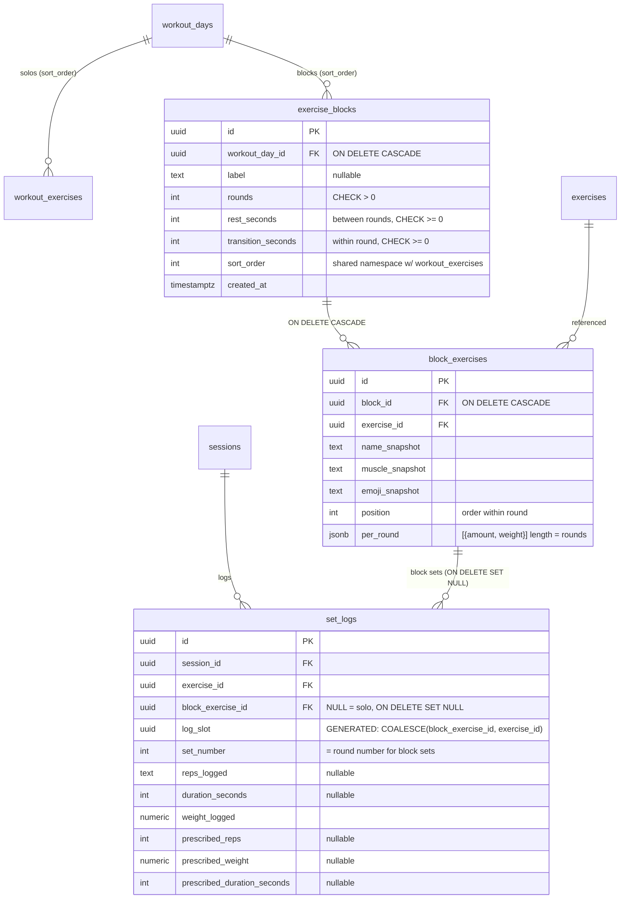
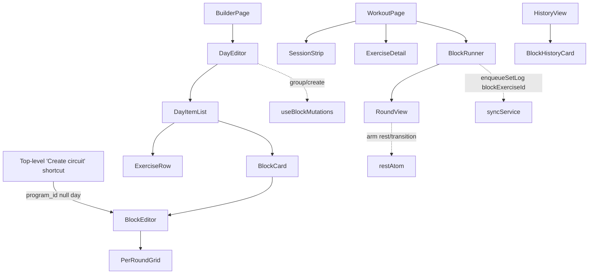

# Tech Plan — Supersets & Circuits (Exercise Blocks)

> Implements `file:docs/Epic_Brief_—_Supersets_&_Circuits_(Exercise_Blocks).md`. Architectural decision: `file:docs/adr/0007-exercise-blocks-rich-structure-no-progression.md`. Glossary: `file:docs/CONTEXT.md` (**Exercise Block**, **Round**, **Transition**, **Per-round Prescription**, **Unified Day Sequence**, **Round Screen**).

## Architectural Approach

### Key Decisions

| Decision | Choice | Rationale |
|---|---|---|
| Modèle de tables | Tables dédiées `exercise_blocks` + `block_exercises` ; `workout_exercises` intacte pour les solos | Évite de polluer la table builder centrale avec ~10 colonnes NOT NULL/progression non pertinentes pour un bloc |
| Per-round storage | `per_round jsonb` sur `block_exercises` | Blocs hors moteur (ADR 0007) → zéro consommateur SQL par round ; normalisable plus tard |
| Unified Day Sequence | `sort_order` partagé entre les deux tables, mergé client-side via `useDayItems` | Solos et blocs librement intercalés sans table d'items intermédiaire |
| Désambiguïsation `set_logs` | Colonne `block_exercise_id` (nullable, FK `ON DELETE SET NULL`) + colonne générée `log_slot` | Débloque les doublons (story 8) ET l'exclusion progression, sans dépendre de PG15 |
| Exclusion progression | Reads de last-performance filtrés `block_exercise_id IS NULL` | Les sets de bloc ne polluent pas la suggestion de l'exo solo du même `exercise_id` |
| Stats agrégées | Les sets de bloc **comptent** (volume / sets / PR / achievements) ; exclus **seulement** de la suggestion de progression | Cohérent avec le brief : « volume / PR / sets reste juste » |
| Portée du bloc | Day-scoped (`workout_day_id`, programme **ou** jour ad-hoc `program_id IS NULL`) | Couvre programme + séance one-off sans nouveau modèle ; bibliothèque réutilisable = epic ultérieur |
| Point d'entrée | Builder (DayEditor) **+** raccourci top-level créant un jour ad-hoc + bloc | Découvrabilité sans passer obligatoirement par le program builder |
| Round Screen | Nouveau composant `BlockRunner` ; un bloc = 1 item dans la navigation jour | `ExerciseDetail` mono-exo ne peut pas afficher des chiffres par round |
| Rest + transition | Réutilisent le `restAtom` mono-stream existant | États mutuellement exclusifs → un seul timer, libellé par `kind` |
| Création de bloc (builder) | Bouton « Créer un bloc » → picker multi-select existant + « grouper avec le suivant » sur une ligne | Réutilise le multi-select du picker ; pas de nouveau pattern de sélection de lignes |

### Critical Constraints

- **`set_logs` est la table la plus couplée du projet.** Lue par le RPC `get_last_performance_for_exercises`, `useLastSessionDetail`, `check_and_grant_achievements`, l'historique ; écrite via le offline queue (`file:src/lib/syncService.ts`, upsert `onConflict`). Toute modif de sa contrainte unique ripple dans `processSetLog` et les reads de progression. C'est le cœur du risque du ticket.
- **Le `onConflict` de supabase-js ne supporte pas les index partiels** (pas de prédicat WHERE injectable). D'où une **colonne générée `log_slot = COALESCE(block_exercise_id, exercise_id)`** + index unique classique, plutôt que deux index partiels.
- **`session.exerciseIndex` indexe une liste plate** (`file:src/pages/WorkoutPage.tsx`, ~ligne 295 `mergeWorkoutExercises`, ligne 634 `displayIndex`). Passer à une séquence d'items (solo | bloc) est une refacto réelle de la navigation, pas un ajout.
- **Reorder non-transactionnel** (N updates parallèles, `file:src/hooks/useBuilderMutations.ts` `useReorderExercises`). Un reorder mêlant solos et blocs touche deux tables — on accepte le même risque best-effort qu'aujourd'hui (revert via refetch on error).
- **Builder online-only** (`file:src/components/builder/OfflineBlock.tsx`) ; **session offline-first** (localStorage queue). Les blocs héritent : édition online, exécution offline.
- **Séance ad-hoc** = `workout_days` avec `program_id: null` (pattern existant `file:src/hooks/useCreateQuickWorkout.ts`). Le raccourci top-level réutilise ce chemin.

---

## Data Model



### Schema snippets

```sql
-- Migration 1 — block tables
CREATE TABLE exercise_blocks (
  id uuid PRIMARY KEY DEFAULT gen_random_uuid(),
  workout_day_id uuid NOT NULL REFERENCES workout_days(id) ON DELETE CASCADE,
  label text,
  rounds integer NOT NULL DEFAULT 3 CHECK (rounds > 0),
  rest_seconds integer NOT NULL DEFAULT 90 CHECK (rest_seconds >= 0),
  transition_seconds integer NOT NULL DEFAULT 0 CHECK (transition_seconds >= 0),
  sort_order integer NOT NULL DEFAULT 0,
  created_at timestamptz NOT NULL DEFAULT now()
);

CREATE TABLE block_exercises (
  id uuid PRIMARY KEY DEFAULT gen_random_uuid(),
  block_id uuid NOT NULL REFERENCES exercise_blocks(id) ON DELETE CASCADE,
  exercise_id uuid NOT NULL REFERENCES exercises(id),
  name_snapshot text NOT NULL,
  muscle_snapshot text NOT NULL,
  emoji_snapshot text NOT NULL,
  position integer NOT NULL DEFAULT 0,
  per_round jsonb NOT NULL DEFAULT '[]'::jsonb
);

CREATE INDEX idx_exercise_blocks_day ON exercise_blocks (workout_day_id, sort_order);
CREATE INDEX idx_block_exercises_block ON block_exercises (block_id, position);

-- RLS — ownership chain via workout_days.user_id (mirrors workout_exercises)
ALTER TABLE exercise_blocks ENABLE ROW LEVEL SECURITY;
CREATE POLICY "Users manage own exercise_blocks" ON exercise_blocks
  FOR ALL USING (
    auth.uid() = (SELECT user_id FROM workout_days WHERE id = workout_day_id)
  ) WITH CHECK (
    auth.uid() = (SELECT user_id FROM workout_days WHERE id = workout_day_id)
  );

ALTER TABLE block_exercises ENABLE ROW LEVEL SECURITY;
CREATE POLICY "Users manage own block_exercises" ON block_exercises
  FOR ALL USING (
    auth.uid() = (
      SELECT wd.user_id FROM exercise_blocks eb
      JOIN workout_days wd ON wd.id = eb.workout_day_id
      WHERE eb.id = block_id
    )
  ) WITH CHECK (
    auth.uid() = (
      SELECT wd.user_id FROM exercise_blocks eb
      JOIN workout_days wd ON wd.id = eb.workout_day_id
      WHERE eb.id = block_id
    )
  );
```

```sql
-- Migration 2 — set_logs disambiguation
ALTER TABLE set_logs
  ADD COLUMN block_exercise_id uuid REFERENCES block_exercises(id) ON DELETE SET NULL;
ALTER TABLE set_logs
  ADD COLUMN log_slot uuid GENERATED ALWAYS AS
    (COALESCE(block_exercise_id, exercise_id)) STORED;

ALTER TABLE set_logs DROP CONSTRAINT set_logs_session_exercise_set_uniq;
CREATE UNIQUE INDEX set_logs_session_slot_set_uniq
  ON set_logs (session_id, log_slot, set_number);
```

```sql
-- Migration 3 — exclude block logs from progression last-performance
-- (block_exercise_id IS NULL guard added inside get_last_performance_for_exercises)
```

### Table Notes

- **`per_round` JSONB** : tableau de longueur `rounds`, chaque cellule `{ "amount": number, "weight": number }`. `amount` = reps (entier) ou durée (secondes) selon `exercises.measurement_type` du `exercise_id`, résolu côté client (`useExerciseFromLibrary`) comme partout. Invariant `length === rounds` enforced **app-side** (pas de CHECK cross-row propre). Story 7 (mix reps+durée) marche : c'est par `block_exercise`, pas par cellule.
- **`log_slot` générée STORED** : unifie les deux espaces de nommage. Solo → `exercise_id` (dédup historique préservée). Bloc → `block_exercise_id` (chaque occurrence distincte). Collision entre un `exercise_id` et un `block_exercise_id` = deux uuid aléatoires → probabilité ~0.
- **`set_number` des sets de bloc = numéro de round.** Round 1 → `set_number = 1`. Les `prescribed_*` portent les valeurs du round (pyramide fidèle en historique).
- **`ON DELETE SET NULL`** sur `block_exercise_id` : éditer/supprimer un bloc dans le builder ne détruit pas l'historique (snapshots intacts), la ligne de log survit avec `block_exercise_id = NULL`.
- **Pas de `weight` text** (contrairement à `workout_exercises`) : greenfield → `numeric` dans le JSONB.
- **Achievements/stats** : les sets de bloc gardent `exercise_id` → comptés par défaut dans volume/sets/PR. Aucune modif de `check_and_grant_achievements`. Seuls les reads de **suggestion de progression** filtrent `block_exercise_id IS NULL`.

---

## Component Architecture



### New Files & Responsibilities

| File | Purpose |
|---|---|
| `supabase/migrations/{ts}_create_exercise_blocks.sql` | Tables `exercise_blocks` + `block_exercises` + index + RLS |
| `supabase/migrations/{ts}_add_block_exercise_id_to_set_logs.sql` | `block_exercise_id` + `log_slot` + nouvelle contrainte unique |
| `supabase/migrations/{ts}_exclude_block_logs_from_last_performance.sql` | `get_last_performance_for_exercises` → `WHERE block_exercise_id IS NULL` |
| `src/hooks/useExerciseBlocks.ts` | Read blocs + `block_exercises` d'un jour |
| `src/hooks/useDayItems.ts` | Merge solos + blocs en `DayItem[]` trié par `sort_order` |
| `src/hooks/useBlockMutations.ts` | create/update/delete block, addExerciseToBlock, updatePerRound, group, ungroup, reorder |
| `src/hooks/useCreateAdhocBlock.ts` | Raccourci top-level : jour `program_id:null` + 1 bloc (réutilise pattern `useCreateQuickWorkout`) |
| `src/components/builder/BlockCard.tsx` | Carte bloc dans la liste (rounds, rest, transition, exos) |
| `src/components/builder/BlockEditor.tsx` | Édition d'un bloc + `PerRoundGrid` |
| `src/components/builder/PerRoundGrid.tsx` | Grille exos × rounds, default « fill round 1 → propagate » |
| `src/components/workout/BlockRunner.tsx` | Exécution round-by-round (état round + position, timers) |
| `src/components/workout/RoundView.tsx` | Affichage d'un round (exos + chiffres du round) |
| `src/components/history/BlockHistoryCard.tsx` | Carte groupée légère en historique |

### Modified Files

| File | Change |
|---|---|
| `src/types/database.ts` | + `ExerciseBlock`, `BlockExercise`, `PerRoundCell`, `DayItem` ; `SetLog` += `block_exercise_id` |
| `src/pages/WorkoutPage.tsx` | `exercises[]` → `items: DayItem[]` ; branch `BlockRunner` quand item actif = bloc |
| `src/components/workout/ExerciseStrip.tsx` | Rendu d'un item-bloc comme une chip unique groupée |
| `src/store/atoms.ts` | `sessionAtom` += `blocksData: Record<blockExerciseId, RoundCell[]>` |
| `src/lib/syncService.ts` | `SetLogPayload` += `blockExerciseId?` ; `processSetLog` + `onConflict: "session_id,log_slot,set_number"` ; fingerprint dédup → `log_slot` |
| `src/components/builder/DayEditor.tsx` | Liste = `DayItem[]` ; DnD sur items ; bouton « Créer un bloc » + « grouper » |
| `src/hooks/useLastSessionDetail.ts` | Filtre `block_exercise_id IS NULL` (exclusion progression) |
| `src/locales/{en,fr}/builder.json`, `workout.json` | Nouvelles clés (block, round, transition, group/ungroup) |

### Component Responsibilities

**`useDayItems(dayId)`**
- Lit `useWorkoutExercises` + `useExerciseBlocks`, merge en `DayItem[]` (`{kind:"solo"|"block", sort_order, …}`) trié. Source unique de vérité pour builder ET session (remplace l'usage direct de `useWorkoutExercises` dans `WorkoutPage`).

**`BlockRunner`**
- État local : `roundIndex` + `positionInRound`. Ne touche **pas** `session.exerciseIndex` (qui pointe l'item-bloc).
- Log d'une cellule → `enqueueSetLog({ blockExerciseId, exerciseId, setNumber: roundIndex+1, prescribed* du round })`.
- Arme `restAtom` avec `transition_seconds` entre exos, `rest_seconds` après le dernier exo du round.
- **N'appelle jamais `useProgressionSuggestion`** → `suggestion = null` → prescription figée (opt-out progression).

**Session state (blocs)**
- `blocksData: Record<blockExerciseId, RoundCell[]>` dans `sessionAtom`, parallèle à `setsData` (keyé sur `workout_exercises.id`) pour ne pas casser `completedExerciseIdsAtom` ni le bootstrap existant. Chaque cellule `{ done, amount, weight, rir? }`.

**`syncService` (modifs)**
- `SetLogPayload` += `blockExerciseId?: string`. `processSetLog` inclut `block_exercise_id` (on n'insère pas `log_slot`, générée). `onConflict` → `"session_id,log_slot,set_number"`. Fingerprint dédup queue → `realSessionId|{blockExerciseId ?? exerciseId}|set_number`.

**`PerRoundGrid`**
- Grille lignes = exos, colonnes = rounds ; cellule `{ amount, weight }`. Default : remplir round 1 → bouton/auto « propager à tous les rounds » ; l'utilisateur édite ensuite les cellules divergentes (pyramide).

**Builder grouping**
- « Créer un bloc » ouvre `ExerciseLibraryPicker` (multi-select existant) → `useBlockMutations.create` (bloc + `block_exercises`, `sort_order` = max+1 du jour). « Grouper avec le suivant » sur une ligne solo crée un bloc à partir de 2 lignes adjacentes (round-1 = leur prescription courante). Dégroupage = round 1 → solos (recrée `workout_exercises`, supprime le bloc).

### Failure Mode Analysis

| Failure | Behavior |
|---|---|
| Même exo 2× dans un bloc (complexe) | `block_exercise_id` distincts → `log_slot` distincts → pas de collision |
| Exo en solo ET dans un bloc, même jour | `log_slot` = `exercise_id` vs `block_exercise_id` → distincts |
| Squat fait en bloc | Exclu de last-performance (`block_exercise_id IS NULL`) → ne pollue pas la suggestion du Squat solo ; **compte** dans volume/PR |
| `per_round.length ≠ rounds` (bug) | Garde app-side au render ; cellule manquante → fallback round précédent |
| Reorder solo+bloc, 1 update échoue | Best-effort (comme aujourd'hui) ; refetch on error restaure l'ordre serveur |
| Suppression d'un `block_exercise` avec historique | `ON DELETE SET NULL` → log conservé, `block_exercise_id` nullé, snapshots intacts |
| Bloc < 2 exos / 1 round | Toléré (story 20), rendu dégénéré propre, UI ne l'encourage pas |
| Grouper/dégrouper en séance active | Bloqué (story 22) — builder uniquement ; ajustement de valeur via `ExerciseEditScopeDialog` autorisé (story 16) |

---

## Découpage pressenti (pour `split-tickets`)

1. **Schéma + types** : migrations (2 tables + `set_logs` + RPC), types TS, RLS. Aucune UI.
2. **Builder — création/édition de blocs** : `useExerciseBlocks`, `useBlockMutations`, `useDayItems`, `BlockCard`, `BlockEditor`, `PerRoundGrid`, groupage/dégroupage. DnD unifié.
3. **Session — Round Screen** *(le plus risqué, isolé)* : refacto `WorkoutPage` vers `items[]`, `BlockRunner`, `RoundView`, `blocksData`, wiring rest/transition.
4. **Sync + logging** : `SetLogPayload`/`processSetLog`/`onConflict`, exclusion last-performance.
5. **Historique** : `BlockHistoryCard`.
6. **Point d'entrée top-level** : `useCreateAdhocBlock` + raccourci UI.

---

## References

- Epic Brief : `file:docs/Epic_Brief_—_Supersets_&_Circuits_(Exercise_Blocks).md`
- ADR : `file:docs/adr/0007-exercise-blocks-rich-structure-no-progression.md`
- Issue : [#351](https://github.com/PierreTsia/workout-app/issues/351)
- Modèle de séance : `file:supabase/migrations/20240101000003_create_workout_exercises.sql`, `file:supabase/migrations/20240101000005_create_set_logs.sql`, `file:src/types/database.ts`
- Session : `file:src/pages/WorkoutPage.tsx`, `file:src/components/workout/SetsTable.tsx`, `file:src/hooks/useRestTimer.ts`, `file:src/store/atoms.ts`
- Builder : `file:src/components/builder/DayEditor.tsx`, `file:src/components/builder/ExerciseDetailForm.tsx`, `file:src/hooks/useBuilderMutations.ts`
- Sync : `file:src/lib/syncService.ts`
- Ad-hoc day pattern : `file:src/hooks/useCreateQuickWorkout.ts`
