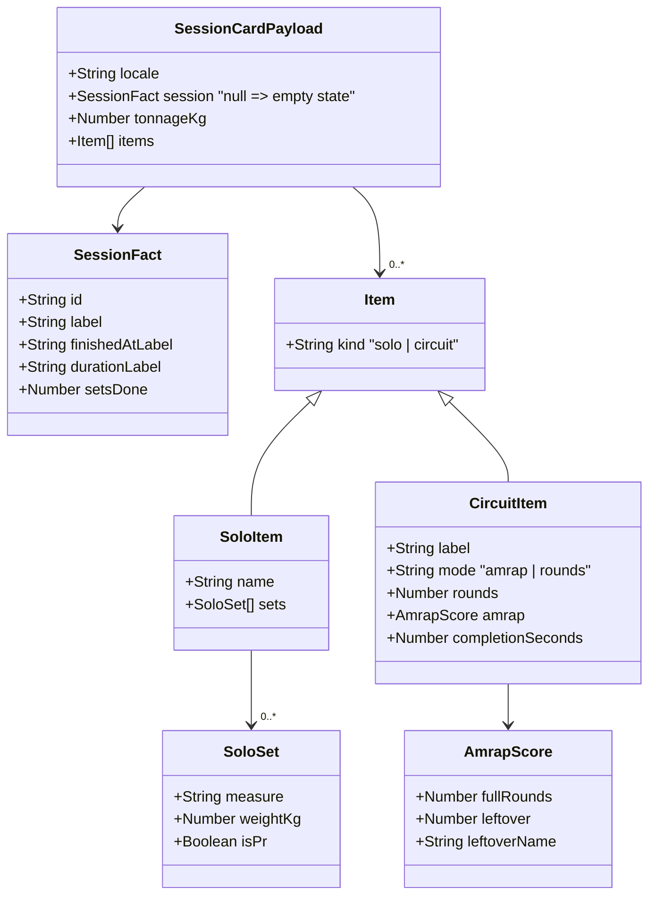
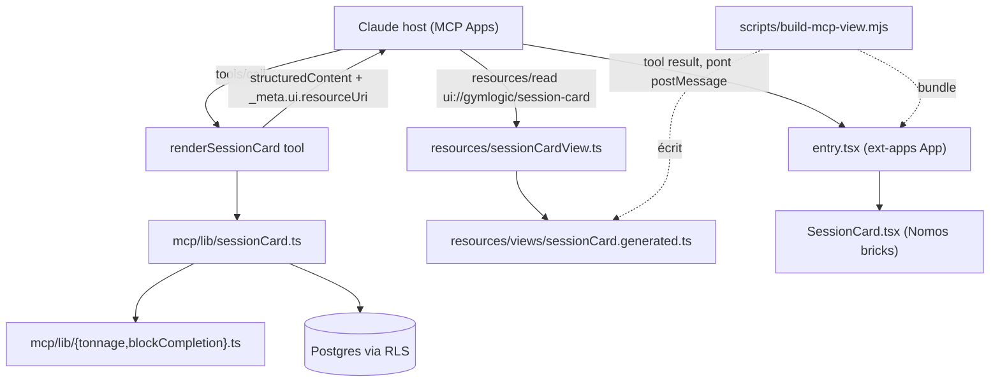

# Tech Plan — Surface agentique Nomos : une Session Card rendue dans la conversation MCP (#591)

## Architectural Approach

### Key Decisions

| Decision | Choice | Rationale |
|---|---|---|
| Protocole de vue | **MCP Apps standard** (`text/html;profile=mcp-app`, `_meta.ui.resourceUri`), pont `@modelcontextprotocol/ext-apps` (`App`) | Ce que Claude parle ; aligne Nomos ADR 0013 (« le jour où le SDK tranche ») ; ADR `file:docs/adr/0027-agentic-view-contract.md` |
| Serveur | Ajouter `meta` à `ToolDefinition` + une `ResourceDefinition` HTML ; **aucun** changement de transport (stateless HTTP, `Deno.serve`) | `registry.ts:65` spread la def (le `_meta` remonte déjà) ; `ResourceDefinition.mimeType` est libre et `text` peut être long |
| Donnée → vue | Le tool renvoie **`structuredContent`** (projection) **+** un texte markdown de repli ; le host pousse le tool result dans l'iframe | Marche sur les clients MCP Apps et non-MCP-Apps (story 6/7) |
| Projection | **TS Edge** (`lib/sessionCard.ts`) réutilisant les ports `mcp/lib/*`, lisant `sessions`/`set_logs`/`block_*` sous RLS | Cohérent avec les 11 outils ; testable Deno **et** Vitest |
| Rendu | **Nouveau composant Session Card** (briques Nomos `Card`/`Badge`/`Meter`) | N'embarque ni i18n, ni react-query, ni router de l'app ; l'app reste intacte |
| CSS de la vue | **`@nomosui/react/view.css`** (utilitaires compilés, publiés) | Livré par Nomos 0.9.0 (ADR 0034) ; plus de Tailwind au runtime ni de pipeline CSS maison |
| Locale | Argument **`locale: en\|fr`** optionnel sur l'outil ; défaut = `user_profiles.locale`, repli `en` | Même pattern que le **Program draft step** ; permet des noms catalogue localisés identiques à l'app |
| Artefact | HTML **auto-suffisant committé** + `view:check` en CI | Même régime que les tokens Nomos ; l'artefact ne peut pas périmer en silence |
| Site du source de vue | `src/mcp-views/session-card/` (couvert par `tsconfig.app.json`, non bundlé par le SPA car non importé) | Réutilise l'outillage TS/vitest existant ; les libellés importent `src/locales` au build |
| Dépendance | Bump **`@nomosui/react` 0.9.0** (T289) — `renderView` / `view.css` + dialecte MCP Apps | Le paquet est pinné 0.8.0 ; 0.9.0 est un minor (breaking 0.x autorisé) |

### Critical Constraints

- **Le transport MCP ne change pas.** Stateless, `POST` JSON-RPC, `initialize` n'annonce que `{ tools:{}, resources:{} }` (`file:supabase/functions/mcp/index.ts:43-48`). La spec MCP Apps pose `_meta.ui` sur **l'outil**, pas de capability serveur : rien à annoncer. À confirmer au premier rendu réel.
- **Contrat public.** Ajouter `meta` et un outil est **additif** mais reste un changement de la surface MCP (AGENTS.md) : ADR 0027 + test.
- **Lecture seule.** La vue n'a **aucun** chemin d'écriture ; `render_session_card` est `readOnlyHint: true` et n'appelle aucun tool mutateur. La ressource est servie sans auth.
- **Deno n'importe pas `src/locales` à l'exécution.** Les libellés statiques de la carte sont **embarqués au build** dans le bundle de vue (importés des JSON de l'app) ; le serveur ne renvoie que `locale` + des chaînes **pré-formatées** (durée, date, tonnage).
- **Consommation Nomos 0.9.0.** Le CSS de la vue vient de `@nomosui/react/view.css` (utilitaires compilés, publiés) ; `renderView` ne rend que des **briques/scènes du catalogue** (app-agnostique) et **pas** la carte produit GymLogic — le document est donc assemblé côté GL (SSR + bundle + `view.css`).
- **L'artefact committé doit être Deno-safe** : un module TS exportant une simple constante string, importé par `resources/registry.ts`.
- **L'app n'est pas refactorée.** `SessionHistoryBody` / `BlockHistoryCard` restent tels quels ; la carte est une seconde surface, la parité est tenue par **fixtures golden**, pas par import partagé.
- **Widening du handler.** `ToolDefinition.handler` type aujourd'hui `content: Array<{type;text}>` (`file:supabase/functions/mcp/tools/registry.ts:47`) — élargir à `structuredContent?: unknown` sans casser les 11 outils.

---

## Data Model

Aucun changement de schéma. Le « modèle » est une **projection de fil** calculée à la lecture depuis les tables existantes.

### Table Notes

- **Sources** (mêmes tables que `get_workout_history`, cf. `file:supabase/functions/mcp/tools/getWorkoutHistory.ts`) : `sessions` (`finished_at IS NOT NULL`, tri desc, **1** seule ligne), `set_logs`, `block_exercises` + `exercise_blocks`, `block_runs`.
- **Label du jour** = `sessions.workout_label_snapshot` (snapshot), jamais la jointure `workout_days.label`.
- **Solos vs Circuits** : discriminateur `set_logs.block_exercise_id` ; regroupement via le port existant `file:supabase/functions/mcp/lib/sessionHistoryGrouping.ts`.
- **Tonnage (nouveau port)** : `Σ weight_logged × numericReps` sur les sets de la session où `weight_logged > 0 AND duration_seconds IS NULL` ; les sets de Circuit comptent. Miroir de `file:src/lib/profile/tonnage.ts:31`.
- **Tours completion time (nouveau port)** : `round((max(logged_at) − min(logged_at))/1000)` quand la run est complète (rectangle plein), miroir de `file:src/lib/blockCompletionHistory.ts`. **AMRAP** garde `amrapScore` (déjà porté dans `file:supabase/functions/mcp/lib/amrapScore.ts`).
- **Durée** : `active_duration_ms`, repli `finished_at − started_at` quand null, même règle que `file:src/lib/sessionRowDuration.ts`.
- **Noms localisés** : joindre `exercises` et choisir `name_en` / `name` selon `locale` (le MCP ne porte aujourd'hui que le snapshot FR — gap comblé ici).

---

## Component Architecture

### Layer Overview

### New Files & Responsibilities

| File | Purpose |
|---|---|
| `supabase/functions/mcp/tools/renderSessionCard.ts` | Outil `render_session_card` : résout `locale`/`session_id`, appelle la projection, renvoie texte + `structuredContent` ; porte `meta.ui.resourceUri` |
| `supabase/functions/mcp/lib/sessionCard.ts` | Projection pure : requêtes + assemblage du `SessionCardPayload` (session la plus récente terminée) |
| `supabase/functions/mcp/lib/tonnage.ts` | Port de `loadedSetKg` + somme de session (nouveau) |
| `supabase/functions/mcp/lib/blockCompletion.ts` | Port de `runCompletionSeconds` + détection de run complète (nouveau) |
| `supabase/functions/mcp/resources/sessionCardView.ts` | `ResourceDefinition` `ui://gymlogic/session-card`, mime `text/html;profile=mcp-app`, renvoie l'artefact |
| `supabase/functions/mcp/resources/views/sessionCard.generated.ts` | **Généré/committé** : le HTML auto-suffisant (markup + CSS + bundle) |
| `src/mcp-views/session-card/entry.tsx` | Entrée de la vue : `App` ext-apps, reçoit le tool result, monte `SessionCard` |
| `src/mcp-views/session-card/SessionCard.tsx` | Le composant carte (briques Nomos), data-fed, i18n-neutre (libellés injectés) |
| `src/mcp-views/session-card/labels.ts` | Importe les libellés EN/FR depuis `src/locales`, sélectionne par `locale` |
| `src/mcp-views/session-card/render.ts` | `renderToStaticMarkup(<SessionCard …/>)` pour le repli sans JS |
| `scripts/build-mcp-view.mjs` | Build Node : SSR fallback + bundle IIFE + inline `@nomosui/react/view.css` → écrit l'artefact ; `--check` pour la dérive |
| `src/test/mcpSessionCard.arch.test.ts` | Contrat : ressource `mime`/`_meta`, artefact non périmé, aucun chemin d'écriture |
| `supabase/functions/mcp/lib/sessionCard_test.ts` / `.test.ts` | Parité projection vs fixtures golden (Deno + Vitest) |

### Component Responsibilities

**`render_session_card`**
- Lit `locale` (arg → `user_profiles.locale` → `en`) et un `session_id` optionnel.
- Délègue à `lib/sessionCard.ts` ; renvoie `{ content:[{type:'text', text}], structuredContent, isError? }`.
- `annotations: { title: 'Show session card', readOnlyHint: true, idempotentHint: true }` ; `meta: { ui: { resourceUri: 'ui://gymlogic/session-card' } }`.
- Aucun accès en écriture.

**`lib/sessionCard.ts`**
- Requêtes RLS-scopées (comme `getWorkoutHistory`) ; **zéro** nouvelle policy.
- Assemble `SessionCardPayload` ; pré-formate durée/date/tonnage (chaînes) ; résout les noms catalogue selon `locale`.
- `session: null` → état vide honnête, pas un zéro.

**`sessionCardView` (ressource)**
- Renvoie `contents:[{ uri, mimeType:'text/html;profile=mcp-app', text: SESSION_CARD_HTML }]` ; ignore `supabase` (statique).

**`entry.tsx`**
- `new App(...)` (ext-apps) : handshake `ui/initialize`, reçoit le tool result, `render(<SessionCard payload=… locale=… />)`.
- Aucune intention d'écriture ; pas de `callTool`.

**`SessionCard.tsx`**
- Rend l'état **plein**, **vide** (`session:null`), et **erreur** ; libellés depuis `labels.ts` ; chaînes dynamiques rendues verbatim.

### Failure Mode Analysis

| Failure | Behavior |
|---|---|
| Aucune session terminée | `session:null` + texte « no sessions yet » ; la vue rend l'état vide (repli SSR identique) |
| `session_id` inconnu | `{ content:[…], isError:true }` (pas une erreur JSON-RPC) |
| Auth absente/invalide | Le tool renvoie un texte d'auth requise ; l'hôte ne rend pas la vue |
| Hôte non-MCP-Apps (Cursor, Le Chat) | Le tool renvoie le texte markdown ; la carte n'est pas rendue — le client ne casse pas |
| JS désactivé / handshake échoue | Le markup pré-rendu (état vide) s'affiche — dégradation gracieuse |
| CSS/bundle périmé | `view:check` échoue en CI |
| JSON-RPC invalide / méthode inconnue | Inchangé (`-32700` / `-32601`) |
| Payload/taille Edge | Mesurer au premier rendu ; marge attendue (centaines de Ko) |

---

## i18n contract

**Namespace / chaînes :** aucune clé nouvelle. La carte **réutilise** des clés app existantes, embarquées EN+FR au build (`src/mcp-views/session-card/labels.ts`) ; le serveur renvoie `locale` + des chaînes dynamiques pré-formatées.

| Key (réutilisée) | EN | FR | Usage |
|---|---|---|---|
| `workout:recap.tabLastSession` | Last session | Dernière séance | Titre de la carte |
| `profile:tonnage.title` | Tonnage | Tonnage | Libellé tonnage |
| `history:sets` | sets | séries | Compteur de séries |
| `history:pr` | PR | PR | Badge record |
| `history:circuit.fallbackLabel` | Circuit | Circuit | Circuit sans label |
| `history:circuit.completionTime` | Time | Temps | Score **Tours** |
| `history:circuit.rounds_one` / `_other` | round / rounds | tour / tours | Score **AMRAP** |
| `workout:blockRunner.amrapScoreGloss` | As many rounds as possible. | Autant de tours que possible. | Gloss **AMRAP** (jamais nu) |
| `history:noSessions` / `noSessionsHint` | No sessions yet / … | Aucune séance / … | État vide |
| `error:*` (à confirmer) | — | — | État d'erreur |

> Les chemins exacts des clés sont confirmés avec la skill `microcopy` à l'implémentation. Si une clé manque, elle est ajoutée en EN **et** FR (parité tenue par `file:src/locales/locales.test.ts`).

---

## Stress-Test

1. **Parité des dérivations.** Tonnage/Tours/durée recalculés côté Edge peuvent diverger de `src/lib`. Mitigation : fixtures golden partagées + tests double-runner (pattern déjà en place). Coût accepté : deux implémentations.
2. **Section risquée réduite.** Nomos 0.9.0 publie `view.css` (utilitaires compilés, ADR 0034) — GL n'a plus de pipeline CSS à maintenir ; le seul build restant est SSR + bundle GL.
3. **`ext-apps` sur Claude mobile non vérifié** : Desktop validé d'abord, mobile suivi dans le même epic (décision).
4. **`_meta` sur l'outil non rendu par certains hôtes** : repli texte garanti.
5. **Incohérence assumée** : l'Epic dit « identique à l'app par construction » ; ce plan dégrade à « même grain de données + mêmes tokens, parité par test » (pas de skin GL nommé).
