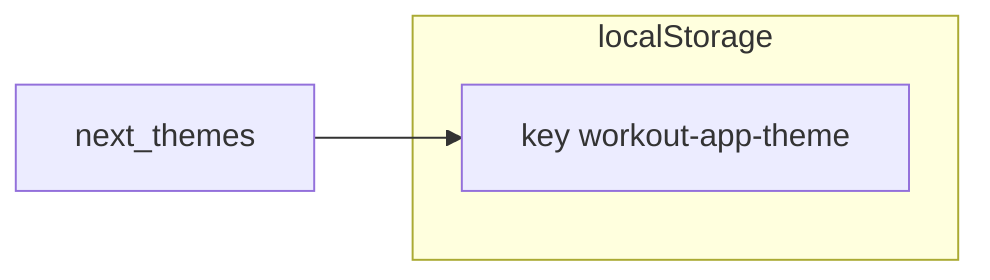
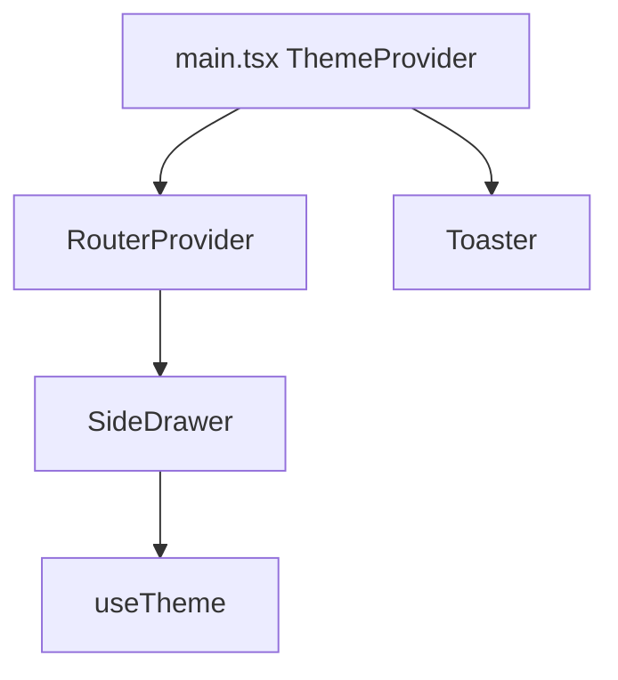

# Tech Plan — Theme preference persistence

## Architectural Approach

GitHub issue [#75](https://github.com/PierreTsia/workout-app/issues/75) asked for persisted dark/light preference and system fallback. The implementation removes **duplicate persistence** on the `theme` localStorage key: Jotai’s `atomWithStorage` used JSON encoding while **next-themes** expects plain `dark` | `light` | `system`, so both writers could corrupt each other on refresh.

**Outcome:** next-themes is the **only** persisted authority, using localStorage key `workout-app-theme` (not `theme`, which is easily clobbered). file:src/store/atoms.ts no longer exports `themeAtom`. file:src/components/SideDrawer.tsx uses `useTheme()` (`resolvedTheme`, `setTheme`) for the switch. file:src/main.tsx runs file:src/lib/themeStorage.ts `prepareThemeLocalStorage` once at boot, then wraps the app in `ThemeProvider` with `storageKey`, `defaultTheme="system"`, and `enableSystem`. file:index.html includes a small inline script (same keys as file:src/lib/themeStorage.ts) so `document.documentElement` gets the correct `light`/`dark` class before the JS bundle runs.

**Preference order (resolved appearance):** (1) value in localStorage (`workout-app-theme`, after migration from `theme`); (2) if absent or stored `system`, `prefers-color-scheme`; (3) if the media query is unavailable, **dark** (`THEME_FALLBACK_RESOLVED` in file:src/lib/themeStorage.ts). next-themes uses `defaultTheme="system"` so “no key” is modeled as follow-OS, not as hardcoded dark.

### Key Decisions

| Decision | Choice | Rationale |
|---|---|---|
| Persistence | next-themes only | Owns `document.documentElement` class; avoids Jotai/next-themes sync effects. |
| Jotai `themeAtom` | Removed | Only SideDrawer used it; dual storage caused the bug. |
| Default chain | `defaultTheme="system"` + `enableSystem` + `THEME_FALLBACK_RESOLVED` | Stored pref wins; else OS; else resolved default **dark** (boot script + `resolveThemeClassForBoot`). Explicit toggle sets `dark` or `light` and persists to localStorage. |
| Switch UI | `resolvedTheme === 'dark'` + `onCheckedChange` → `setTheme` | Reflects actual appearance when `theme === 'system'`; Radix boolean drives explicit theme. |
| Storage key | `workout-app-theme` + migrate from `theme` | Avoids collisions on the generic `theme` key; `prepareThemeLocalStorage` migrates and removes legacy when canonical is valid. |
| Legacy data | `normalizeLegacyThemeLocalStorage` | Converts JSON-encoded `dark`/`light` from old Jotai writes to plain strings; trims whitespace; drops invalid values. |

### Critical Constraints

- Do not reintroduce a second persisted theme store; keep `ThemeProvider` `storageKey` aligned with file:src/lib/themeStorage.ts and the inline script in file:index.html.
- file:src/components/ui/sonner.tsx continues to use `useTheme()`; `resolvedTheme` still drives toast styling when `theme` is `system`.
- Boot preparation must run **before** React render (file:src/main.tsx: `prepareThemeLocalStorage(localStorage)` then `createRoot`). The inline script in file:index.html reduces flash and matches the same read/parse rules.

---

## Data Model

**Stored values:** `dark` | `light` | `system` (plain strings, next-themes contract). Legacy `theme` is migrated once then removed when canonical is valid.

### Table notes

- Historical docs under file:docs/done/ may still mention `themeAtom`; those files are archived context, not updated here.

---

## Component Architecture

### Layer Overview

### New Files & Responsibilities

| File | Purpose |
|---|---|
| file:src/lib/themeStorage.ts | `THEME_STORAGE_KEY`, `normalizeLegacyThemeLocalStorage` for one-time legacy fix. |
| file:src/lib/themeStorage.test.ts | Unit tests for normalization behavior. |

### Component Responsibilities

**ThemeProvider (file:src/main.tsx)**  
- `attribute="class"` for Tailwind dark mode.  
- `defaultTheme="system"`, `enableSystem` for OS fallback when nothing valid is stored.

**SideDrawer**  
- Dark mode row: `resolvedTheme` and `setTheme` from `useTheme()` only.

### Failure Mode Analysis

| Failure | Behavior |
|---|---|
| Legacy JSON in `localStorage.theme` | Normalized to plain `dark`/`light` or key removed. |
| `resolvedTheme` briefly undefined | Switch `checked` is false until resolved; acceptable for CSR. |
| User wants explicit “use system” in UI | Not in #75 scope; clearing site data or future control could restore `system`. |

---

## References

- [Issue #75 — Theme preference not persisted](https://github.com/PierreTsia/workout-app/issues/75)
- file:.cursor/rules/docs-format.mdc
- file:.cursor/rules/react-no-unnecessary-effects.mdc
