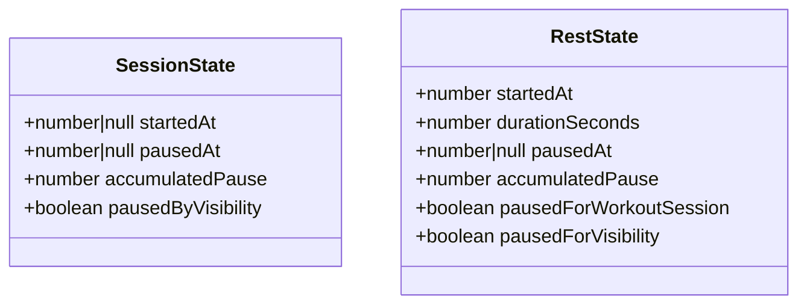
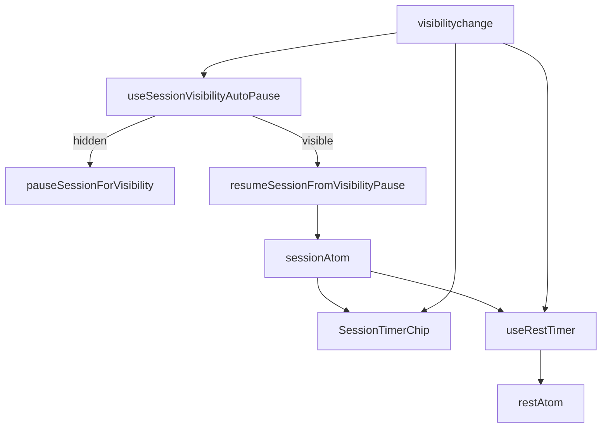

# Tech Plan — Timers en arrière-plan (#664)

## Architectural Approach

### Key Decisions

| Decision | Choice | Rationale |
|---|---|---|
| Mécanisme de garde | Pause posée par la garde à `hidden`, résolue au retour | Réutilise `pausedByVisibility` (#655) ; l'auto-reprise ne touche jamais une pause manuelle |
| Seuil | `VISIBILITY_GUARD_MS = 15 * 60 * 1000` exporté de `session.ts` | Une seule source de vérité, testable, partagée avec le repos |
| Exclusion | `hiddenDuration > seuil` → replié dans `accumulatedPause` ; sinon 0 | « ≤ 15 min compte, > 15 min exclu » |
| Mesure | Temps **caché** uniquement (`now − pausedAt`), pas l'inactivité au premier plan | Décision grillée |
| Tick forcé | Listener `visibilitychange` dans chaque timer | L'intervalle peut être throttlé/gelé en fond ; le timestamp reste juste |
| Repos court | `pausedForVisibility` sur `RestState` + seuil → ne replie pas si ≤ 15 min | Le repos compte un court passage en fond |
| Alerte repos | Best-effort via le `tick()` de retour, pas de Web Push | Décision grillée v1 |
| Self-heal 3 h | Inchangé | Hors périmètre |

### Critical Constraints

- `useSessionVisibilityAutoPause` est monté dans `AppShell` (survit aux
  démontages de `WorkoutPage`) — `file:src/components/AppShell.tsx`.
- `SessionTimerChip` et `useRestTimer` sont timestamp-based : la **valeur** est
  juste en fond, seul l'affichage est throttlé. Le tick forcé ne fait que
  recalculer depuis le timestamp.
- Le repos se fige quand la séance est en pause (`sessionPausedAt`) via
  `useLayoutEffect` — `file:src/hooks/useRestTimer.ts`. La garde doit donc
  distinguer une pause de visibilité d'une pause manuelle pour ne pas exclure un
  court passage en fond.
- `resumeSessionFromPause` (reprise manuelle via le chip) replie toujours : c'est
  un choix explicite de l'utilisateur, on ne le change pas.
- Aucune écriture DB : `active_duration_ms` est calculé au finish depuis
  `getEffectiveElapsed` / `accumulatedPause`.

---

## Data Model

Aucune migration. Deux champs d'état local (localStorage via `atomWithStorage`) :

### Table Notes

- `SessionState.pausedByVisibility` existe déjà (#655) : il marque une pause
  posée par la garde, jamais une pause manuelle.
- `RestState.pausedForVisibility` est **nouveau** : il mémorise que la pause du
  repos vient d'une pause de visibilité de la séance, pour décider du repli au
  retour.

---

## Component Architecture

### Layer Overview

### New Files & Responsibilities

| File | Purpose |
|---|---|
| `docs/adr/0029-inactivity-guard-15min.md` | Décision : garde 15 min remplace l'auto-pause immédiate de #655 |

### Component Responsibilities

`**session.ts**`
- `VISIBILITY_GUARD_MS` : seuil 15 min.
- `pauseSessionForVisibility(prev, now)` : pose la pause de garde (inchangé).
- `resumeSessionFromVisibilityPause(prev, now, threshold)` : résout la pause de
  garde ; replie `hiddenDuration` seulement si `> threshold` ; ne touche pas une
  pause manuelle.

`**useSessionVisibilityAutoPause**`
- `hidden` → `pauseSessionForVisibility`.
- `visible` → `resumeSessionFromVisibilityPause` (si pause de garde).
- Monté dans `AppShell`.

`**SessionTimerChip**`
- Listener `visibilitychange` → `setNow(Date.now())` quand visible.

`**useRestTimer**`
- `pausedForVisibility` posé quand la séance se met en pause par visibilité.
- Au retour, replie `pauseDuration` seulement si `> VISIBILITY_GUARD_MS`.
- Listener `visibilitychange` → `tick()` quand visible (alerte best-effort).

### Failure Mode Analysis

| Failure | Behavior |
|---|---|
| Intervalle JS gelé en fond | La valeur reste timestamp-based ; le tick de retour recalcule |
| Repos fini en fond | `remaining` clampé à 0, affiché terminé, pas de redémarrage |
| Pause manuelle + arrière-plan | `pauseSessionForVisibility` no-op ; le retour ne reprend pas |
| App tuée en fond puis rouverte | `pausedByVisibility` persisté → auto-reprise au mount si visible |

---

## i18n contract

Aucune nouvelle chaîne utilisateur : le comportement change, pas la copie.
