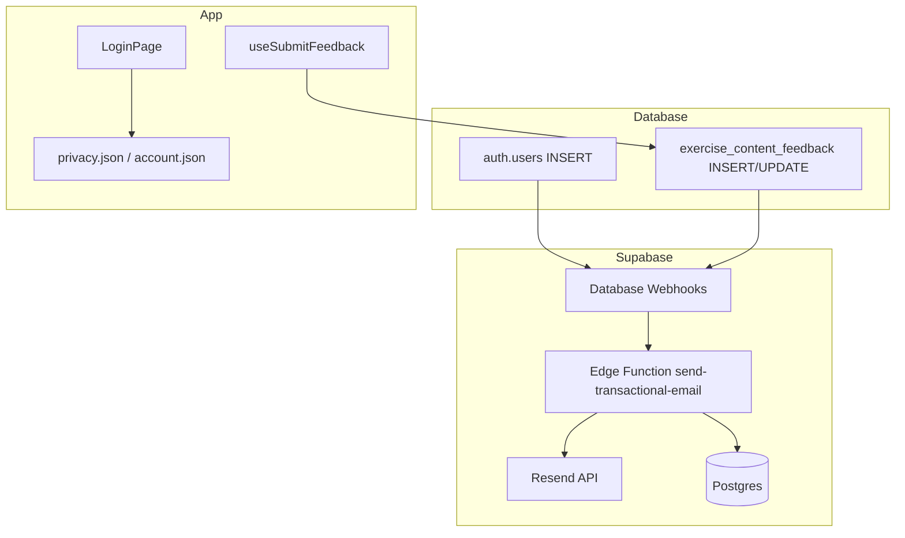

# Tech Plan — Transactional Email (Resend) & GymLogic Domains #117

## Architectural Approach

### Key Decisions

| Decision | Choice | Rationale |
|---|---|---|
| Email provider | **Resend** HTTP API | Matches Epic Brief and issue [#117](https://github.com/PierreTsia/workout-app/issues/117); Deno-compatible via `npm:resend` or `esm.sh/resend`. |
| Send location | **Supabase Edge Functions** only | Keeps API keys server-side; same pattern as `file:supabase/functions/delete-account/index.ts` and AI functions. No mail from Vercel serverless unless we add a Node API later (out of scope). |
| Welcome trigger | **Database Webhook** on `auth.users` **INSERT** → HTTP POST to Edge Function | Fires once per new account (OAuth or future email auth), not on every session refresh. [Supabase Database Webhooks](https://supabase.com/docs/guides/database/webhooks) support `auth.users`; uses `pg_net` under the hood — non-blocking for the auth transaction. |
| Webhook auth | Shared **secret** header (e.g. `Authorization: Bearer <WEBHOOK_SECRET>`) configured in Dashboard + `supabase secrets` | Edge Function has **`verify_jwt = false`** for this route (webhook is not a user JWT). Reject requests without valid secret. |
| Idempotency | **`transactional_email_log`** + partial **unique** indexes (welcome per `user_id`; ack/resolved per `feedback_id`) | Prevents duplicate sends on webhook retries; feedback kinds keyed by report, not only by user. |
| Welcome template | **Minimal HTML** (no heavy images); English V1 | Cold-start deliverability (Epic Brief). FR can read `user_profiles` / `raw_app_meta_data` later — optional second phase. |
| Support email in UI | **Single constant** `admin@gymlogic.me` via i18n + optional `VITE_SUPPORT_EMAIL` | Today `file:src/locales/en/privacy.json` and FR counterpart still use a personal Gmail — replace with GymLogic address for consistency. |
| Feedback lifecycle (phase 2) | **Database Webhooks** on `exercise_content_feedback` INSERT + UPDATE (status → `resolved`) → same or sibling Edge Function | Keeps client dumb (`file:src/hooks/useSubmitFeedback.ts` stays insert-only); no extra trust in browser. |
| Unsubscribe (if feedback mail ships) | **`user_email_preferences`** row per user + signed **token** link to small Edge Function or public route | Mandatory per Epic Brief; `List-Unsubscribe` header + visible link in body. Default `feedback_notifications = true` for new users. |

**Rejected alternatives**

| Alternative | Why not |
|---|---|
| Supabase Auth **SMTP** for welcome | Epic uses `enable_confirmations = false`; welcome is **not** the confirmation template — mixing concerns. |
| Client invokes “send email” after signup | Leaks abuse surface; bypasses server guarantees. |
| Only trigger on `user_profiles` insert | Users who delay onboarding would get no welcome; Epic wants **new auth user**. |

### Critical Constraints

**`auth.users` access.** Edge Functions use `file:supabase/functions/_shared/supabase.ts` **`createServiceClient()`** for admin reads/writes. The webhook handler must **never** expose the service role key to clients.

**Local development.** Database Webhooks target deployed function URLs. For **`supabase start`**, configure webhook URL to local Edge Runtime or use **manual curl** / Studio “Invoke” until a tunnel (e.g. ngrok) points to local functions — document in README snippet. Production webhook URL: `https://<project-ref>.supabase.co/functions/v1/<name>`.

**JWT gateway.** Set `[functions.send-transactional-email] verify_jwt = false` in `file:supabase/config.toml` (same pattern as `file:supabase/functions/delete-account/index.ts` lines 281–283). Validate only the **webhook secret**, not end-user JWT, for webhook ingress.

**Privacy.** Feedback emails must not quote internal admin fields; align copy with `file:docs/done/Epic_Brief_—_Compliance_Legal_Privacy_and_Account_Deletion.md`. Unsubscribe honors **legitimate** opt-out without blocking account-critical mail (welcome can remain non-unsubscribable or use separate “account notices” policy — product call: default is **feedback-only** unsubscribe).

**Testing users.** E2E creates users via admin API (`file:e2e/global-setup.ts`); webhook may send real mail unless **staging** Resend key + allowlist or **suppress** sends when `email` matches test pattern — add env `SKIP_EMAIL_DOMAINS=@example.com` or similar in function.

---

## Data Model

```mermaid
erDiagram
  auth_users ||--o{ transactional_email_log : "sends"
  auth_users ||--o| user_email_preferences : "optional"
  exercise_content_feedback ||--o{ transactional_email_log : "feedback sends"
  exercise_content_feedback }o--|| auth_users : "user_id nullable"

  transactional_email_log {
    uuid id PK
    uuid user_id FK
    text email_kind
    uuid feedback_id FK_nullable
    timestamptz sent_at
    text provider_id_nullable
  }

  user_email_preferences {
    uuid user_id PK_FK
    boolean feedback_notifications
    timestamptz updated_at
  }

  exercise_content_feedback {
    uuid id PK
    text user_email
    text status
    timestamptz resolved_at
  }
```

### SQL sketch (migration)

```sql
-- Idempotency: welcome = one row per (user, kind); feedback = one row per feedback report
CREATE TABLE transactional_email_log (
  id uuid PRIMARY KEY DEFAULT gen_random_uuid(),
  user_id uuid NOT NULL REFERENCES auth.users(id) ON DELETE CASCADE,
  email_kind text NOT NULL CHECK (email_kind IN ('welcome', 'feedback_ack', 'feedback_resolved')),
  feedback_id uuid REFERENCES exercise_content_feedback(id) ON DELETE SET NULL,
  sent_at timestamptz NOT NULL DEFAULT now(),
  provider_id text
);
CREATE UNIQUE INDEX transactional_email_log_welcome_unique
  ON transactional_email_log (user_id) WHERE email_kind = 'welcome';
CREATE UNIQUE INDEX transactional_email_log_feedback_ack_unique
  ON transactional_email_log (feedback_id) WHERE email_kind = 'feedback_ack';
CREATE UNIQUE INDEX transactional_email_log_feedback_resolved_unique
  ON transactional_email_log (feedback_id) WHERE email_kind = 'feedback_resolved';
ALTER TABLE transactional_email_log ENABLE ROW LEVEL SECURITY;
-- No user policies: Edge Function uses service role only

-- Phase 2: feedback unsubscribe
CREATE TABLE user_email_preferences (
  user_id uuid PRIMARY KEY REFERENCES auth.users(id) ON DELETE CASCADE,
  feedback_notifications boolean NOT NULL DEFAULT true,
  updated_at timestamptz NOT NULL DEFAULT now()
);
ALTER TABLE user_email_preferences ENABLE ROW LEVEL SECURITY;
CREATE POLICY "Users read own email preferences"
  ON user_email_preferences FOR SELECT USING (auth.uid() = user_id);
CREATE POLICY "Users update own email preferences"
  ON user_email_preferences FOR UPDATE USING (auth.uid() = user_id);
-- INSERT: on first login via trigger or lazy insert when user opens settings (Tech choice: trigger on auth.users optional)
```

### Table Notes

- **`transactional_email_log`:** Insert row **after** successful Resend response; partial unique indexes prevent duplicate welcome per user and duplicate ack/resolved per `feedback_id`. On failure, no row → webhook may retry; second attempt hits unique conflict after first success — handle **23505** as success path.
- **`user_email_preferences`:** If no row, treat as `feedback_notifications = true` to avoid blocking sends for existing users.
- **Feedback resolved:** Only email if `user_email` IS NOT NULL and **still** `feedback_notifications` for `user_id` when present.

### TypeScript

Regenerate `file:src/types/database.ts` after migration (project script or Supabase CLI `gen types`).

---

## Component Architecture

### Layer Overview



### New Files & Responsibilities

| File | Purpose |
|---|---|
| `supabase/functions/send-transactional-email/index.ts` | Parse webhook payload (`schema`, `table`, `type`, `record`); verify secret; branch by `auth.users` vs `exercise_content_feedback`; call Resend; write `transactional_email_log`; respect preferences for feedback. |
| `supabase/functions/send-transactional-email/templates/welcome.ts` (or inline) | Plain, lightweight HTML + subject for welcome. |
| `supabase/functions/email-unsubscribe/index.ts` (phase 2) | `GET` or `POST` with signed token; sets `feedback_notifications = false`. |
| `supabase/migrations/YYYYMMDDHHMMSS_transactional_email.sql` | `transactional_email_log` + optional `user_email_preferences`. |
| `supabase/config.toml` | `[functions.send-transactional-email] verify_jwt = false`; add `[functions.email-unsubscribe] verify_jwt = false` if unauth GET. |

### Component Responsibilities

**`send-transactional-email` Edge Function**

- Validate `Authorization: Bearer <WEBHOOK_SECRET>` (or header Supabase webhook UI supports).
- **`auth.users` INSERT:** Extract `id`, `email` from `record`. If no email (rare), skip or log. Check `transactional_email_log` for `welcome`; if absent, call Resend from `no-reply@gymlogic.me`, then insert log row.
- **`exercise_content_feedback` INSERT:** Phase 2 — if `feedback_ack` enabled and preferences allow, send ack to `user_email`; log `feedback_ack` per `feedback.id` may need **`UNIQUE(feedback_id, email_kind)`** extension — if one ack per report, add `feedback_id uuid` nullable to log table or separate table; **Tech choice:** `transactional_email_log` add nullable `feedback_id` with partial unique index.
- **`exercise_content_feedback` UPDATE:** Detect transition to `resolved`; send once per feedback id (log line or `feedback_resolved` keyed by `feedback_id`).
- **Errors:** Return 200 after logging failure to Resend only if you want webhook to stop retrying — prefer **return 500** on transient errors so Supabase retries; **return 200** on “already sent” idempotent path.

**`email-unsubscribe` (phase 2)**

- Verify HMAC-signed token (`user_id`, `exp`, `purpose=feedback`).
- Upsert `user_email_preferences` with `feedback_notifications = false`.

**Frontend (i18n only for V1 contact copy)**

- Replace support contact strings in `file:src/locales/en/privacy.json`, `file:src/locales/fr/privacy.json`, and consider `file:src/locales/en/account.json` / `fr` (“contact support”) with **admin@gymlogic.me**.
- Optional: `file:src/locales/en/auth.json` short line under login card (“Questions? …”) — product copy review.

**`useSubmitFeedback`**

- No change required for welcome mail. Phase 2: optional toast “check your inbox” only if product wants — email sends independently.

### Failure Mode Analysis

| Failure | Behavior |
|---|---|
| Resend API down / 5xx | Edge Function returns 500; webhook retries; idempotency prevents duplicate sends once first succeeded. |
| Invalid webhook secret | 401; no DB writes; investigate misconfigured Dashboard. |
| Duplicate webhook delivery | `transactional_email_log` unique constraint → second send skipped (catch unique violation). |
| User has no email in `auth.users` | Skip welcome; log. |
| Test / CI users | Env gate skips send or uses Resend test mode. |
| Feedback email with unsubscribe | User taps unsubscribe → no more feedback mails; welcome already sent remains logged. |
| Cold start / spam folder | Follow Epic **Deliverability testing** (Gmail, Outlook, iCloud) before prod; iterate template weight. |

---

## Deliverability & QA gate

Before enabling production traffic:

1. Send real **welcome** tests to **Gmail**, **Outlook/Hotmail**, and **iCloud** addresses; check **first** message placement (inbox vs junk).
2. Record date + result in a short internal note (Notion or `docs/` scratch — not committed if sensitive).
3. DMARC: start `p=none`, monitor, then tighten per Epic Brief.

---

## Related docs

- Epic Brief: `file:docs/Epic_Brief_—_Transactional_Email_Resend_&_GymLogic_Domains_#117.md`
- Issue: [#117](https://github.com/PierreTsia/workout-app/issues/117)

---

When you are ready, say **split into tickets** to break this into implementation tickets (DNS/Resend ops, migration + Edge Function, webhooks, i18n, phase-2 feedback + unsubscribe).
