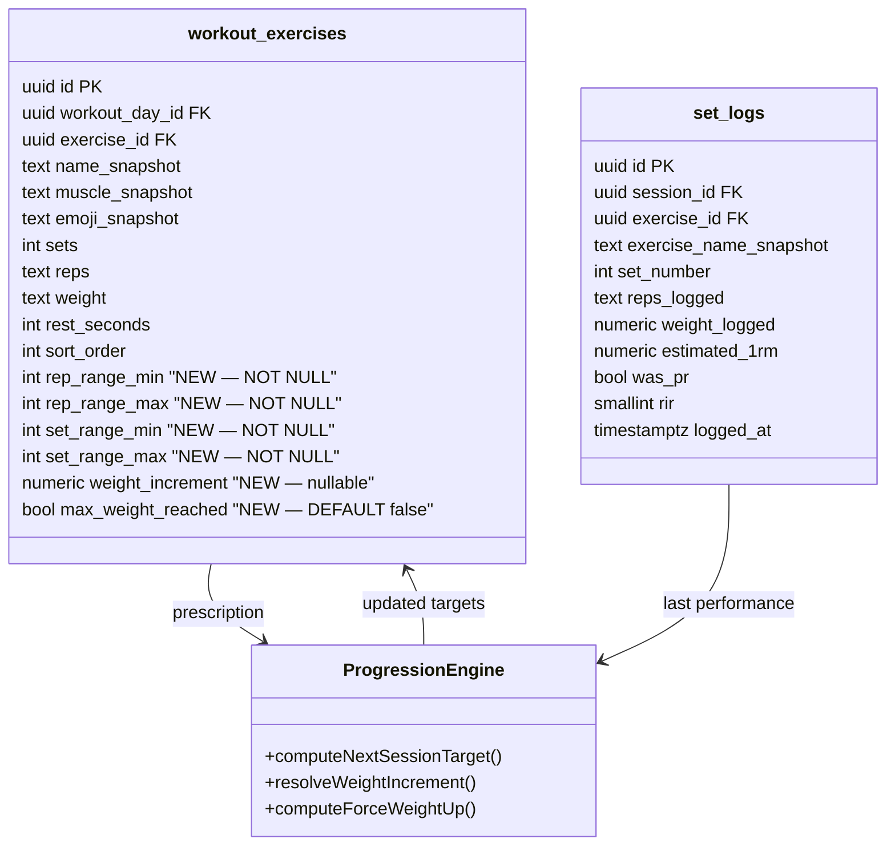
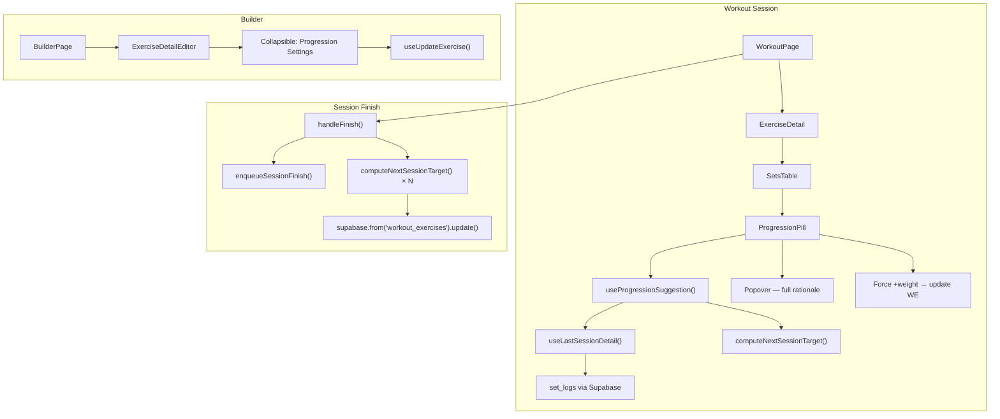
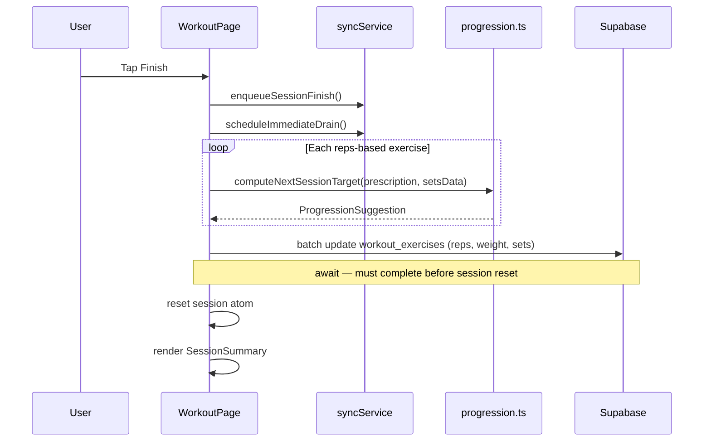

# Tech Plan — Triple Progression Logic

## Architectural Approach

### Key Decisions

| Decision | Choice | Rationale |
|---|---|---|
| Engine location | Pure function in `file:src/lib/progression.ts`, zero imports from React/Supabase/Jotai | Trivially testable, can be called from any context (session finish, builder preview, future API). Rejected: hook-level logic (harder to test, couples to React lifecycle) |
| Pill placement | Top of `SetsTable` as a full-width row above column headers | Compact, reads naturally before the sets, doesn't interfere with the 4-column grid. Rejected: separate banner in `ExerciseDetail` (too far from the action), inline in header row (too cramped on mobile) |
| Pill interaction | Tap opens `Popover` with full rationale | Tooltips are hover-only — useless on mobile. Popover is the established pattern (`RirDrawer` info icon uses `file:src/components/ui/popover.tsx`) |
| Force weight UX | Inline text link inside the Pill, visible only during REPS_UP | Discoverable without noise; only shown when relevant. Rejected: dropdown menu action (low visibility), long-press (poor discoverability on mobile) |
| Pill visual style | Muted `bg-muted/50` with `border-l-2 border-primary`; HOLD: `border-muted-foreground/30`; PLATEAU: `border-amber-500/70` | Consistent with app's minimalist dark theme. Text carries information, not color. Rejected: color-coded per rule type (too busy for a coaching note) |
| Progression persistence | Direct Supabase `UPDATE` on session finish, `await`ed before session reset | Best-effort write — if offline, old values persist safely. Rejected: sync queue item type (overcomplicates `file:src/lib/syncService.ts` for marginal offline benefit) |
| Range columns | NOT NULL after migration backfill | Zero cold-start gaps. Every reps-based exercise always has ranges. Duration exercises get ranges too (ignored by engine) to avoid nullable complexity |
| Builder config | Collapsible section in `ExerciseDetailEditor`, collapsed by default | Power users can tune; most users never see it. Uses existing `Collapsible` from `file:src/components/ui/collapsible.tsx` |
| No new dependencies | Uses existing `Popover`, `Collapsible`, `Switch`, `Badge` from `src/components/ui/` | Zero bundle impact |

### Critical Constraints

**`workout_exercises.reps` stays a text field.** The engine reads `rep_range_min/max` (integers) for progression logic. The `reps` field continues to serve as the "current session target" for UI display and `SessionSetRow` hydration. Session finish updates `reps` (text) alongside the range columns.

**`set_logs` has no `workout_exercise_id` FK.** The history hook queries by `exercise_id` + most recent `session_id`, not by workout_exercise. This means: if a user has the same exercise on two different days, the engine uses the most recent session regardless of which day it was. Acceptable — the progression should reflect the user's latest performance with that exercise, not be siloed by day.

**4 insertion paths must be updated.** Every code path that creates `workout_exercises` rows must populate range columns: `useAddExerciseToDay` (`file:src/hooks/useBuilderMutations.ts`), `useAddExercisesToDay` (same file), `useGenerateProgram` (`file:src/hooks/useGenerateProgram.ts`), and the quick workout generator in `file:src/lib/generateWorkout.ts`.

**Memoization required.** The Pill lives inside `SetsTable` which re-renders on every `sessionAtom` change (keystroke in reps/weight inputs). The suggestion hook output must be memoized — recomputing only when `exercise.id` or `lastSession` data changes, not on every atom tick.

---

## Data Model

### Migration

Single migration file: `supabase/migrations/2026XXXX_add_progression_columns.sql`

```sql
-- Step 1: Add columns (nullable temporarily for backfill)
ALTER TABLE workout_exercises
  ADD COLUMN rep_range_min integer,
  ADD COLUMN rep_range_max integer,
  ADD COLUMN set_range_min integer,
  ADD COLUMN set_range_max integer,
  ADD COLUMN weight_increment numeric,
  ADD COLUMN max_weight_reached boolean NOT NULL DEFAULT false;

-- Step 2: Backfill from current reps/sets values
-- Inference: narrow range for low reps (strength), wider for high reps (endurance)
UPDATE workout_exercises SET
  rep_range_min = CASE
    WHEN reps ~ '^\d+$' AND reps::int <= 6  THEN GREATEST(1, reps::int - 2)
    WHEN reps ~ '^\d+$' AND reps::int <= 12 THEN GREATEST(1, reps::int - 2)
    WHEN reps ~ '^\d+$'                      THEN GREATEST(1, reps::int - 3)
    ELSE 8
  END,
  rep_range_max = CASE
    WHEN reps ~ '^\d+$' AND reps::int <= 6  THEN reps::int + 1
    WHEN reps ~ '^\d+$' AND reps::int <= 12 THEN reps::int + 2
    WHEN reps ~ '^\d+$'                      THEN reps::int + 3
    ELSE 12
  END,
  set_range_min = GREATEST(1, sets - 1),
  set_range_max = LEAST(6, sets + 2);

-- Step 3: Enforce NOT NULL
ALTER TABLE workout_exercises
  ALTER COLUMN rep_range_min SET NOT NULL,
  ALTER COLUMN rep_range_max SET NOT NULL,
  ALTER COLUMN set_range_min SET NOT NULL,
  ALTER COLUMN set_range_max SET NOT NULL;

-- Step 4: Constraints
ALTER TABLE workout_exercises
  ADD CONSTRAINT we_rep_range_chk CHECK (rep_range_min <= rep_range_max),
  ADD CONSTRAINT we_set_range_chk CHECK (set_range_min <= set_range_max),
  ADD CONSTRAINT we_rep_range_positive CHECK (rep_range_min > 0),
  ADD CONSTRAINT we_set_range_positive CHECK (set_range_min > 0),
  ADD CONSTRAINT we_weight_increment_positive CHECK (weight_increment IS NULL OR weight_increment > 0);
```

### Backfill Examples

| Current `reps` | Current `sets` | → `rep_range_min` | → `rep_range_max` | → `set_range_min` | → `set_range_max` |
|---|---|---|---|---|---|
| `"5"` | 5 | 3 | 6 | 4 | 6 |
| `"8"` | 3 | 6 | 10 | 2 | 5 |
| `"10"` | 3 | 8 | 12 | 2 | 5 |
| `"12"` | 4 | 10 | 14 | 3 | 6 |
| `"15"` | 3 | 12 | 18 | 2 | 5 |
| `"8-12"` (text) | 3 | 8 | 12 | 2 | 5 |

### TypeScript Type Update

In `file:src/types/database.ts`, extend `WorkoutExercise`:

```typescript
export interface WorkoutExercise {
  // ... existing fields ...
  rep_range_min: number
  rep_range_max: number
  set_range_min: number
  set_range_max: number
  weight_increment: number | null
  max_weight_reached: boolean
}
```

### Engine Types

In `file:src/lib/progression.ts`:

```typescript
export type ProgressionRule =
  | "HOLD_INCOMPLETE"
  | "HOLD_NEAR_FAILURE"
  | "REPS_UP"
  | "WEIGHT_UP"
  | "SETS_UP"
  | "PLATEAU"

export interface ProgressionPrescription {
  currentReps: number
  currentWeight: number
  currentSets: number
  repRangeMin: number
  repRangeMax: number
  setRangeMin: number
  setRangeMax: number
  weightIncrement: number
  maxWeightReached: boolean
}

export interface SetPerformance {
  reps: number
  weight: number
  completed: boolean
  rir: number | null
}

export interface ProgressionSuggestion {
  rule: ProgressionRule
  reps: number
  weight: number
  sets: number
  reasonKey: string
  delta: string
  canForceWeightUp: boolean
}
```

### Entity Diagram



---

## Component Architecture

### Layer Overview



### New Files & Responsibilities

| File | Purpose |
|---|---|
| `src/lib/progression.ts` | Pure engine: `computeNextSessionTarget()`, `resolveWeightIncrement()`, `computeForceWeightUp()`. Zero dependencies. All types exported. |
| `src/lib/progression.test.ts` | 10+ test cases: 4 regression cases from issue, RIR safety gate, forced progression, first session (null history), duration exercise (skip), plateau, non-numeric reps fallback |
| `src/hooks/useLastSessionDetail.ts` | React Query hook: fetches per-set `{ reps, weight, completed, rir }[]` for the most recent finished session of a given `exercise_id` |
| `src/hooks/useProgressionSuggestion.ts` | Combines `useLastSessionDetail` + `WorkoutExercise` prescription → calls engine → returns `ProgressionSuggestion | null`. Memoized to avoid recomputing on unrelated atom changes |
| `src/components/workout/ProgressionPill.tsx` | UI: muted pill row with icon, delta, reason, popover, optional force-weight link |

### Component Responsibilities

**`computeNextSessionTarget(prescription, lastPerformance)`**
- Returns `ProgressionSuggestion` with rule, new values, reason key, delta string, and `canForceWeightUp` flag
- If `lastPerformance` is null → returns null (no suggestion)
- Resolves `weightIncrement` from prescription (user value) or default (2.5 for barbell, 2 for dumbbell)
- Rules evaluated in strict order: HOLD_INCOMPLETE → HOLD_NEAR_FAILURE → REPS_UP → WEIGHT_UP → SETS_UP → PLATEAU
- `canForceWeightUp` is true only for REPS_UP (the only state where forcing makes sense)

**`computeForceWeightUp(prescription)`**
- Called when user taps "Force +weight"
- Returns `{ reps: prescription.currentReps, weight: prescription.currentWeight + increment, sets: prescription.currentSets }`
- Note: reps stay at current value (not reset to min) — the user chose to force, so we respect their rep count

**`resolveWeightIncrement(prescription, equipment?)`**
- `prescription.weightIncrement` if set
- Otherwise: 2.0 for dumbbell, 2.5 for everything else (kg). Converted via unit preference at the UI layer.

**`useLastSessionDetail(exerciseId)`**
- Queries `set_logs` joined with `sessions` to find the most recent `session_id` with `finished_at IS NOT NULL` that contains logs for `exerciseId`
- Returns `SetPerformance[]` ordered by `set_number`
- Query key: `["last-session-detail", exerciseId]`
- `staleTime: 30_000` — fresh enough for session start, doesn't spam on re-renders

**`useProgressionSuggestion(exercise: WorkoutExercise, equipment?: string)`**
- Calls `useLastSessionDetail(exercise.exercise_id)`
- Builds `ProgressionPrescription` from `exercise` fields
- Calls `computeNextSessionTarget()` via `useMemo` keyed on the history data + prescription values
- Returns `ProgressionSuggestion | null`
- Returns null if exercise is duration-type (`measurement_type === "duration"`)

**`ProgressionPill`**
- Props: `suggestion: ProgressionSuggestion | null`, `exercise: WorkoutExercise`, `equipment?: string`, `onForceWeightUp: () => void`
- If `suggestion` is null → renders nothing
- Container: `rounded-lg px-3 py-2 flex items-center gap-2` with left border accent
- Left: rule-specific icon (`TrendingUp`, `Dumbbell`, `Plus`, `Pause`, `Sparkles`) at `h-3.5 w-3.5`
- Center: `<span className="font-medium">{delta}</span>` + `<span className="text-muted-foreground">{t(reasonKey)}</span>`
- Right: when `canForceWeightUp`, render `<button className="text-xs text-primary/70">Force +{increment}</button>`
- Entire pill wrapped in `PopoverTrigger`; `PopoverContent` shows the full rationale block
- PLATEAU state includes a `<Button variant="outline" size="sm">` linking to `/` (program generation entry point)

**`ExerciseDetailEditor` (extended)**
- Below the existing 2×2 grid (`sets`, `reps`/`duration`, `weight`, `rest`), add:
- `<Collapsible>` with trigger text "Progression Settings" + chevron
- Inside: 2×2 grid — `rep_range_min`/`rep_range_max` (first row), `set_range_min`/`set_range_max` (second row)
- Below grid: `weight_increment` input + `max_weight_reached` Switch
- All fields debounce-saved via the extended `useUpdateExercise`
- Collapsed by default; state not persisted (re-collapses on navigation)

### Modified Files

| File | Change |
|---|---|
| `file:src/types/database.ts` | Add 6 new fields to `WorkoutExercise` interface |
| `file:src/hooks/useBuilderMutations.ts` | `useAddExerciseToDay`: add default ranges (8-12 / 3-5). `useAddExercisesToDay`: same. `useUpdateExercise`: accept range + increment + max_weight_reached fields |
| `file:src/hooks/useGenerateProgram.ts` | Parse `template_exercises.rep_range` → write `rep_range_min/max`. Derive `set_range_min/max` from `adapted.sets` |
| `file:src/lib/generateProgram.ts` | `adaptForExperience()` return type extended with `repRangeMin`, `repRangeMax` |
| `file:src/lib/generateWorkout.ts` | Quick workout exercise rows include default ranges |
| `file:src/components/workout/SetsTable.tsx` | Import and render `ProgressionPill` at top of component, above column headers. Pass suggestion + force handler |
| `file:src/components/builder/ExerciseDetailEditor.tsx` | Add collapsible "Progression Settings" section |
| `file:src/pages/WorkoutPage.tsx` | `handleFinish()`: after `enqueueSessionFinish`, compute progression for each exercise and batch-update `workout_exercises` |
| `file:src/locales/en/workout.json` | Add keys: `progression.repsUp`, `progression.weightUp`, `progression.setsUp`, `progression.holdIncomplete`, `progression.holdNearFailure`, `progression.plateau`, `progression.forceWeight`, `progression.popover.*` |
| `file:src/locales/fr/workout.json` | French translations for all progression keys |
| `file:src/locales/en/builder.json` | Add keys: `progressionSettings`, `repRange`, `setRange`, `weightIncrement`, `maxWeightReached` |
| `file:src/locales/fr/builder.json` | French translations for builder keys |

### Session Finish — Progression Persistence



**Implementation detail:** The engine receives `setsData` (the in-memory session rows) directly — no need to query `set_logs` since we have the data in the atom. This avoids a race with the sync queue (set_logs may not be flushed yet). The `setsData[exercise.id]` array maps directly to `SetPerformance[]`.

### Failure Mode Analysis

| Failure | Behavior |
|---|---|
| No history for exercise (first session ever) | `useProgressionSuggestion` returns null → Pill not rendered. Sets use template defaults. |
| Progression update fails on session finish (offline/error) | Catch error, log warning, continue with session reset. Old `workout_exercises` values persist — user gets the correct suggestion next time when update succeeds. |
| User swaps exercise pre-session | Swapped exercise has no history → no suggestion → no Pill. Clean. |
| User manually overrides weight/reps mid-session | `setsData` records actual values. Session finish progression reads `setsData`, not the prescription. Next session reflects what the user actually did. |
| `reps` field is non-numeric (e.g. "10-12") | Migration backfill falls through to default 8-12. Engine reads integer `rep_range_min/max`, never parses `reps` text. |
| Duration exercise | `useProgressionSuggestion` checks `measurement_type`, returns null. No Pill rendered. |
| Force weight increase tapped but Supabase fails | Toast error via existing global mutation error handler. Values unchanged, user can retry or manually edit inputs. |
| All dimensions maxed (PLATEAU) | Pill shows positive CTA with "Try AI generator" button. No values change. User can manually override or generate a new program. |
| Race: user finishes and immediately starts new session | Progression update is `await`ed before session atom reset. New session cannot start until update completes or times out. |
| Memoization stale after force weight | Force weight triggers a query invalidation on `["workout-exercises", dayId]` which causes `useProgressionSuggestion` to recompute. Pill updates immediately. |

### Test Plan

All tests in `file:src/lib/progression.test.ts`:

| Test Case | Input | Expected Output |
|---|---|---|
| Classical progression (volumetric) | 3×8 @ 80kg, range 8-12, all sets completed, avg RIR 2 | REPS_UP: 3×9 @ 80kg, `canForceWeightUp: true` |
| Intensity jump | 3×12 @ 80kg, range 8-12, all sets completed, avg RIR 2 | WEIGHT_UP: 3×8 @ 82.5kg |
| Plateau / ceiling | 3×12 @ 30kg, range 8-12, `maxWeightReached: true`, set range 3-5 | SETS_UP: 4×8 @ 30kg |
| Safety hold (near failure) | 3×12 @ 80kg, range 8-12, avg RIR 0.5 | HOLD_NEAR_FAILURE: 3×12 @ 80kg |
| Incomplete sets | 3 sets prescribed, only 2 completed | HOLD_INCOMPLETE: same targets |
| Full plateau | 5×12 @ 30kg, range 8-12, `maxWeightReached: true`, set range 3-5, sets already at max | PLATEAU: same targets, CTA reason |
| First session (null history) | No `lastPerformance` | Returns null (no suggestion) |
| Duration exercise | `measurement_type === "duration"` | Hook returns null before engine is called |
| Forced progression | REPS_UP state → `computeForceWeightUp()` | weight + increment, reps unchanged |
| Non-numeric reps fallback | `reps: "8-12"` in prescription context | Engine uses `repRangeMin/Max` integers, not `reps` text |
| Dumbbell increment | `equipment: "dumbbell"` | `weightIncrement` resolves to 2.0 instead of 2.5 |
| RIR exactly 1.0 boundary | avg RIR = 1.0 | NOT held (threshold is < 1, not ≤ 1) |
