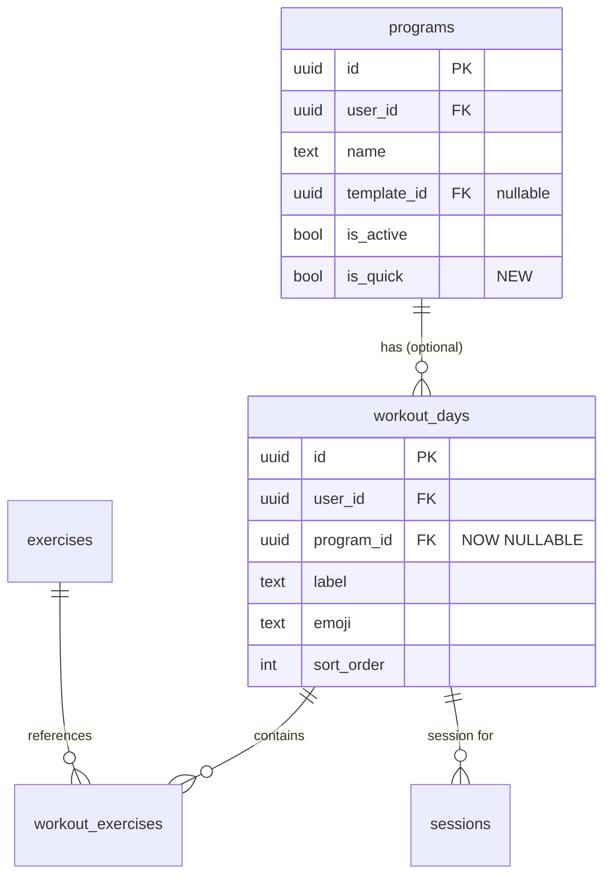
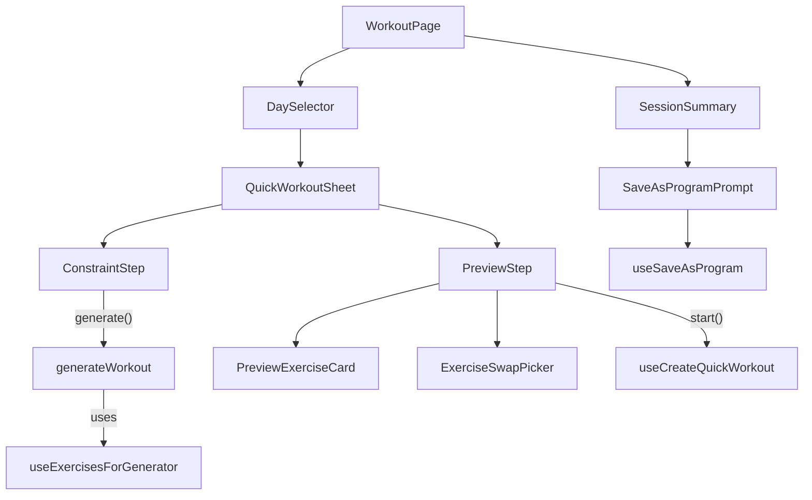

# Tech Plan — Workout Generator (On-the-fly)

## Architectural Approach

### Key Decisions

| Decision | Choice | Rationale |
|---|---|---|
| Persistence model | Orphan `workout_day` with `program_id = null` | Avoids program pollution. Opt-in save after session. Requires one migration. |
| Schema change | `ALTER TABLE workout_days ALTER COLUMN program_id DROP NOT NULL` | Safe: all existing rows have program_id. `useWorkoutDays` filters by program_id, so orphans are invisible. RLS uses user_id only. |
| Generator UI | Single Drawer (vaul) with internal step state | Consistent with app patterns (RirDrawer, SetsTable drawers). Two steps: constraints → preview/launch. |
| Exercise fetch | New `useExercisesForGenerator` hook, client-side query | Simple Supabase `.select()` with filters, no `.range()`. Returns 20–80 rows typically. |
| Selection algorithm | Pure function in `file:src/lib/generateWorkout.ts` | Testable, no side effects. Handles volume mapping, compound/isolation, randomization, adaptive fallback. |
| Compound/isolation | `secondary_muscles` field from exercises table | Populated from Wger import (~600 exercises). Null defaults to isolation (12–15 reps, safer). |
| Session wiring | Reuse existing `sessionAtom` + sync queue | Insert workout_day + exercises via Supabase, set `sessionAtom.currentDayId`, call `startSession()`. Zero changes to session/sync logic. |
| Save as Program | Prompt in `SessionSummary` for orphan days only | Creates `programs` row + updates `workout_day.program_id`. |
| Full Body distribution | Config constant `MAJOR_MUSCLE_GROUPS` | Maps category labels to DB muscle group values. Predictable coverage, easy to update, not fragile to dynamic DB content. |
| Orphan cleanup | None (for now) | Rows are tiny, session history references them, accumulation bounded by user behavior. Can add periodic cleanup later. |

### Critical Constraints

**`program_id` nullable migration** — the FK `ON DELETE CASCADE` still works for non-null values. Orphan days (null) won't cascade-delete when a program is deleted, which is correct behavior. The partial unique index `programs_active_unique ON programs (user_id) WHERE is_active = true` is unaffected — it's on the `programs` table, not `workout_days`.

**DaySelector during quick workout session** — when a quick workout session is active, `session.activeDayId` points to an orphan day that doesn't appear in `useWorkoutDays` results (those filter by active program_id). The DaySelector handles this via `isQuickWorkoutAtom`: when true, it shows a "⚡ Quick Workout" indicator pill instead of trying to select from the program days. `file:src/components/workout/DaySelector.tsx`

**`useWorkoutDays` is gated on `!!programId`** — it won't fetch without an active program. This is fine because the quick workout flow bypasses this hook entirely; exercises are loaded via `useWorkoutExercises(dayId)` which only needs a `dayId`. `file:src/hooks/useWorkoutDays.ts`

**`isQuickWorkoutAtom` safety valve** — this persisted atom could get stuck as `true` if session state is corrupted. Safety measure: reset `isQuickWorkoutAtom` to `false` whenever `sessionAtom.isActive` transitions to `false` (in `handleFinish()` and `handleNewSession()`).

**Existing queries audited for program_id null safety:**

- `file:src/hooks/useWorkoutDays.ts` — filters by `program_id = activeProgramId`, safe (orphan days excluded)
- `file:src/hooks/useBuilderMutations.ts` — always provides `program_id` from `activeProgramIdAtom`, safe
- `file:src/hooks/useGenerateProgram.ts` — always provides `program_id`, safe
- `file:src/pages/WorkoutPage.tsx` — uses `sessionAtom.currentDayId` for exercises, safe
- `file:src/pages/HistoryPage.tsx` — queries `sessions` table, joins to `workout_days`. Orphan days have valid `workout_day_id` in sessions; `workout_label_snapshot` provides fallback label if the day is ever deleted.

---

## Data Model

No new tables. One migration with two changes.



### Migration

Single migration file: `supabase/migrations/XXXXXX_quick_workout_schema.sql`

```sql
-- Allow orphan workout_days (quick workouts not attached to any program)
ALTER TABLE workout_days ALTER COLUMN program_id DROP NOT NULL;

-- Visual badge for programs saved from quick workouts
ALTER TABLE programs ADD COLUMN is_quick boolean NOT NULL DEFAULT false;
```

### Table Notes

- **workout_days.program_id = null** — ad-hoc / orphan day, not part of any program. Invisible in the builder and day selector. Session history preserved via `sessions.workout_day_id`.
- **programs.is_quick** — purely cosmetic. Enables the "Quick" badge in the program switcher UI. No behavioral difference from regular programs.

---

## Component Architecture

### Layer Overview



### New Files & Responsibilities

| File | Purpose |
|---|---|
| `supabase/migrations/XXXXXX_quick_workout_schema.sql` | Make `program_id` nullable, add `programs.is_quick` |
| `src/types/generator.ts` | Types: `Duration`, `EquipmentCategory`, `GeneratedExercise`, `GeneratedWorkout`, `GeneratorConstraints` |
| `src/lib/generateWorkout.ts` | Pure function: exercise selection algorithm (filter, volume map, compound/isolation, randomize, fallback) |
| `src/lib/generatorConfig.ts` | Constants: `VOLUME_MAP`, `EQUIPMENT_CATEGORY_MAP`, `MAJOR_MUSCLE_GROUPS` |
| `src/hooks/useExercisesForGenerator.ts` | Supabase query: all exercises matching muscle_group + equipment (no pagination) |
| `src/hooks/useCreateQuickWorkout.ts` | Mutation: insert orphan workout_day + workout_exercises, return day ID |
| `src/hooks/useSaveAsProgram.ts` | Mutation: create program (is_quick=true) + update workout_day.program_id |
| `src/components/generator/QuickWorkoutSheet.tsx` | Drawer with step state (constraints vs preview). Orchestrates the flow. |
| `src/components/generator/ConstraintStep.tsx` | Duration/Equipment/Focus pill selectors + Generate button |
| `src/components/generator/PreviewStep.tsx` | Exercise list + Start/Shuffle buttons + edit actions |
| `src/components/generator/PreviewExerciseCard.tsx` | Single exercise row: name, sets, reps, rest, delete/swap actions |
| `src/components/generator/ExerciseSwapPicker.tsx` | Filtered exercise picker for swapping (reuses `useExercisesForGenerator` scoped to same muscle group) |
| `src/components/generator/SaveAsProgramPrompt.tsx` | Post-session prompt shown in SessionSummary for orphan days |

### Modified Files

| File | Change |
|---|---|
| `file:src/components/workout/DaySelector.tsx` | Add "Quick Workout" button (opens sheet). Show "⚡ Quick Workout" pill when quick session is active. |
| `file:src/components/workout/SessionSummary.tsx` | Conditionally render `SaveAsProgramPrompt` when `isQuickWorkoutAtom` is true |
| `file:src/pages/WorkoutPage.tsx` | Mount `QuickWorkoutSheet`. Handle quick workout session start (set atoms, call startSession). |
| `file:src/store/atoms.ts` | Add `isQuickWorkoutAtom` (boolean, persisted via atomWithStorage) — true during quick workout sessions |
| `file:src/types/database.ts` | Add `is_quick: boolean` to Program type |
| i18n files | New `generator` namespace with keys for both FR and EN |

### Component Responsibilities

**`QuickWorkoutSheet`**
- Manages Drawer open/close state
- Tracks internal step: `"constraints"` | `"preview"`
- Holds the `GeneratedWorkout` in local React state
- On "Generate": calls `generateWorkout()` with fetched exercises and selected constraints, transitions to `"preview"` step
- On "Start": calls `useCreateQuickWorkout` mutation, sets `sessionAtom.currentDayId` to new day ID + `isQuickWorkoutAtom = true`, closes drawer, calls `startSession()` from WorkoutPage
- On close/back from preview: returns to `"constraints"` step, preserves constraint selections

**`ConstraintStep`**
- Three pill selector rows: Duration (15/30/45/60/90 min), Equipment (Bodyweight/Dumbbells/Full Gym), Focus (dynamic muscle groups from `useExerciseFilterOptions` + "Full Body" meta-option)
- Equipment pre-selected: Full Gym
- "Generate" button enabled only when all three constraints are selected (duration has no default, focus has no default)
- Reuses the horizontal pill UI pattern from `file:src/components/builder/ExerciseFilterPanel.tsx`

**`PreviewStep`**
- "Start" button fixed at top (prominent, primary color, not gated behind a confirmation)
- "Shuffle" button (secondary) next to Start — regenerates a fresh random selection with the same constraints
- Scrollable list of `PreviewExerciseCard` rows
- Shows adaptive fallback notice banner if equipment was widened
- Editable workout name field at the top (input, defaults to "Quick: {Focus} / {Equipment} / {Duration}")

**`PreviewExerciseCard`**
- Displays: exercise name, emoji, muscle group tag, sets × reps, rest time
- Actions: swipe-to-delete or tap delete icon, tap to swap (opens `ExerciseSwapPicker`), inline editable sets/reps counters

**`ExerciseSwapPicker`**
- Mini exercise picker (list, not the full library modal) scoped to the same muscle group + equipment constraints
- Excludes exercises already in the generated workout
- Selecting a replacement swaps the exercise in the `GeneratedWorkout` state

**`generateWorkout(exercises, constraints)` — the algorithm**

```
Input:  Exercise[], GeneratorConstraints { duration, equipmentCategory, muscleGroup }
Output: GeneratedWorkout { exercises: GeneratedExercise[], name: string, fallbackNotice: string | null }
```

- Step 1: Map `equipmentCategory` to DB equipment values via `EQUIPMENT_CATEGORY_MAP`:
  - `"bodyweight"` → `["bodyweight"]`
  - `"dumbbells"` → `["dumbbell"]`
  - `"full-gym"` → `["barbell", "dumbbell", "ez_bar", "machine", "cable", "bench", "kettlebell", "band"]`
- Step 2: Filter `exercises` by equipment values (`.equipment` in category set)
- Step 3: Filter by `muscleGroup` (skip for `"full-body"`)
- Step 4: Classify each: `secondary_muscles?.length > 0` → compound, else isolation
- Step 5: Look up `VOLUME_MAP[duration]` → `{ exerciseCount, setsPerExercise }`
- Step 6: For `"full-body"`, distribute `exerciseCount` evenly across `MAJOR_MUSCLE_GROUPS`, pick from each group's pool
- Step 7: Randomize selection. Variety heuristic: shuffle pool, then pick greedily avoiding consecutive same-`muscle_group` entries
- Step 8: Assign reps/rest: compound → `"8-10"` / 90s, isolation → `"12-15"` / 60s
- Step 9: **Adaptive fallback** — if filtered pool has fewer exercises than `exerciseCount`: widen equipment (add `"bodyweight"` to the filter set), re-run steps 2-8, set `fallbackNotice` on the result
- Step 10: Generate default name: `"Quick: {muscleGroup} / {equipmentCategory} / {duration}min"`

**`useCreateQuickWorkout`**
- `useMutation` that inserts:
  1. `workout_days` row: `{ user_id, program_id: null, label: workout.name, emoji: "⚡", sort_order: 0 }`
  2. `workout_exercises` rows (bulk insert): one per generated exercise with `{ workout_day_id, exercise_id, name_snapshot, muscle_snapshot, emoji_snapshot, sets, reps, weight: "0", rest_seconds, sort_order }`
- Returns the new `workout_day.id`
- On success: invalidates `["workout-exercises", newDayId]` query

**`useSaveAsProgram`**
- `useMutation`:
  1. Insert `programs`: `{ user_id, name, template_id: null, is_active: false, is_quick: true }`
  2. Update `workout_days`: set `program_id = newProgram.id` where `id = workoutDayId`
- `is_active: false` — saving doesn't switch programs. The quick workout program is stored for future access via the program switcher.
- On success: invalidates `["programs"]` query, show success toast

**`SaveAsProgramPrompt`**
- Rendered inside `SessionSummary` when `isQuickWorkoutAtom` is true
- Simple card: "Save this workout for later?" with editable name field + Save / Skip buttons
- Save calls `useSaveAsProgram` with the current `session.activeDayId`
- Skip dismisses the prompt and resets `isQuickWorkoutAtom`

**`generatorConfig.ts` — constants**

```typescript
export const VOLUME_MAP = {
  15:  { exerciseCount: 4,  setsPerExercise: 3 },
  30:  { exerciseCount: 5,  setsPerExercise: 3 },
  45:  { exerciseCount: 7,  setsPerExercise: 4 },
  60:  { exerciseCount: 9,  setsPerExercise: 4 },
  90:  { exerciseCount: 13, setsPerExercise: 4 },
} as const

export const EQUIPMENT_CATEGORY_MAP = {
  bodyweight: ["bodyweight"],
  dumbbells:  ["dumbbell"],
  "full-gym": ["barbell", "dumbbell", "ez_bar", "machine", "cable", "bench", "kettlebell", "band"],
} as const

export const MAJOR_MUSCLE_GROUPS = [
  "Pectoraux",
  "Dos",
  "Quadriceps",
  "Épaules",
  "Biceps",
  "Triceps",
  "Ischios",
  "Abdos",
] as const
```

### Failure Mode Analysis

| Failure | Behavior |
|---|---|
| Filter returns 0 exercises | Show "No exercises match these filters" with suggestion to change equipment or focus. Generate button stays disabled. |
| Filter returns fewer than target | Adaptive fallback: widen equipment to include bodyweight, show notice banner in preview |
| `secondary_muscles` is null for all results | All exercises classified as isolation (12–15 reps, 60s rest) — safe, slightly conservative default |
| Network failure during workout_day insert | Toast error ("Could not create workout"), user can retry. Session doesn't start. |
| User closes app mid-quick-session | `sessionAtom` is persisted (atomWithStorage). On reopen, session resumes — `currentDayId` points to the orphan day, exercises load via `useWorkoutExercises`. `isQuickWorkoutAtom` ensures DaySelector shows the Quick pill. |
| User declines "Save as Program" | Orphan workout_day stays in DB. Session history preserved. Day invisible in builder/day selector. No cleanup needed. |
| Orphan workout_day accumulation | Low risk: only created when user starts quick workouts (~2-3/week max). Rows are tiny. Periodic cleanup can be added later if needed. |
| Quick workout day deleted (future) | `sessions.workout_day_id` is nullable with no cascade — session history survives via `workout_label_snapshot`. |
| `isQuickWorkoutAtom` stuck as true | Safety valve: reset to false whenever `sessionAtom.isActive` transitions to false (in `handleFinish()` and `handleNewSession()`). |
