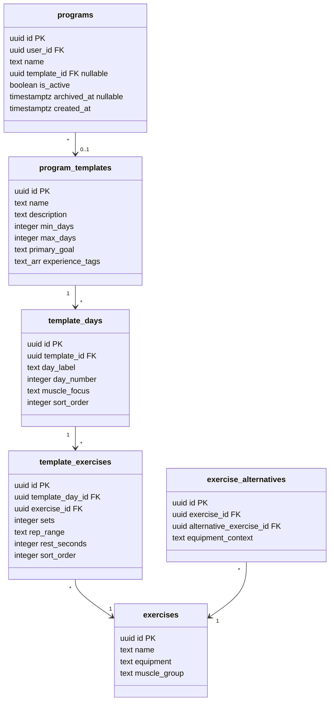
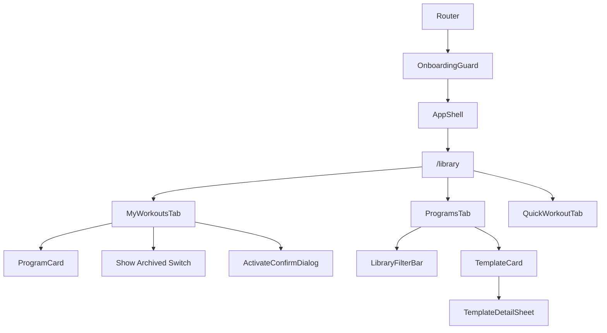

# Tech Plan — Workout Library Dashboard

## Architectural Approach

### Key Decisions

| Decision | Choice | Rationale |
|---|---|---|
| Equipment filter mechanism | Client-side derivation in `useTemplatesWithEquipment` hook | `file:src/hooks/useTemplates.ts` already loads all template exercises with exercise data. Adding `exercise_alternatives` is one extra query (~50 rows). No DB migration needed, zero-maintenance. |
| Tab framework | shadcn `Tabs` (Radix) | Already used in `file:src/pages/HistoryPage.tsx`. Consistent UX and codebase pattern. |
| Template detail UX | Bottom sheet (`Sheet side="bottom"`) opened via "Details" button on card; Save/Start also visible directly on card | Cards have quick actions for decisive users; detail sheet for explorers. Proven sheet pattern from `ExerciseLibraryPicker`. |
| Archive mechanism | `archived_at timestamptz` column on `programs` | Soft-archive, fully reversible, no cascade risk. Single migration. |
| `useGenerateProgram` modification | Add optional `activate` boolean param (default `true`) | Backward-compatible. `false` skips deactivation and atom updates. Onboarding callers unaffected. |
| Program activation | New `useActivateProgram` hook with sequential deactivate-then-activate + auto-rollback | Respects `programs_active_unique` index. Must deactivate first to avoid constraint violation. On failure, re-activates old program. |
| i18n | New `library` namespace | Clean separation from `onboarding`. Library is its own feature domain. |
| Bodyweight equipment rule | Bodyweight exercises are compatible with all contexts (gym/home/minimal) | Intuitive — push-ups work everywhere. Simplifies derivation logic. |
| Filter default state | Only equipment pre-filled from user profile, goal and experience cleared | With 5 templates, pre-filling multiple filters could return 0 results. Equipment is the most impactful filter (home/minimal users need it). Leaving goal/experience cleared encourages discovery. "Clear filters" link resets equipment to show all. |
| In-flight session guard | Read `sessionAtom.isActive` to block activation during a workout | Prevents corrupting in-progress `set_logs`. Reliable — `sessionAtom` is persisted via `atomWithStorage`. |

### Critical Constraints

**Unique index `programs_active_unique`** (`file:supabase/migrations/20260314000002_create_programs.sql`) enforces exactly one active program per user (`ON programs (user_id) WHERE is_active = true`). Implications:

- "Save" (pre-generate inactive): safe — `is_active = false` bypasses the index
- "Activate": must deactivate current program **before** activating the new one, sequentially. Parallel updates violate the constraint.
- The `activate = false` code path in `useGenerateProgram` must explicitly set `is_active: false` on insert — the column default is `true`.

**`useGenerateProgram` backward compatibility** — `file:src/hooks/useGenerateProgram.ts` is imported by `file:src/pages/OnboardingPage.tsx` and `file:src/pages/ChangeProgramPage.tsx`. The `activate` param defaults to `true` so existing callers behave identically. `ChangeProgramPage` will be deleted as part of this epic, but `OnboardingPage` must remain unaffected.

**Session atom coupling** — `file:src/store/atoms.ts` defines `sessionAtom` with `isActive: boolean`, persisted via `atomWithStorage`. The in-flight session guard in the Library reads this atom to disable activation. Since it survives page refreshes, the guard is reliable even if the user navigates away and back.

**React Query cache coherence** — all mutations (`useActivateProgram`, `useArchiveProgram`, modified `useGenerateProgram`) must invalidate the correct query keys: `["active-program", userId]`, `["workout-days"]`, and the new `["user-programs", userId]`. Missing an invalidation would show stale data in either My Workouts or the workout page.

---

## Data Model

### Schema Changes

Single migration — add `archived_at` to `programs`:

```sql
ALTER TABLE programs ADD COLUMN archived_at timestamptz;
```

No RLS changes needed — existing policy (`auth.uid() = user_id`) covers all CRUD on the new column. No data migration — all existing programs get `NULL` (not archived).

### Updated Entity Relationships



### TypeScript Type Changes

In `file:src/types/onboarding.ts`, update the `Program` interface:

```typescript
export interface Program {
  id: string
  user_id: string
  name: string
  template_id: string | null
  is_active: boolean
  archived_at: string | null
  created_at: string
}
```

### Equipment Derivation Algorithm

Computed client-side in `useTemplatesWithEquipment`. No DB objects needed.

```typescript
const BODYWEIGHT_EQUIPMENT = ["bodyweight", "body weight", "none"]

function deriveEquipmentContexts(
  template: ProgramTemplate,
  alternatives: ExerciseAlternative[],
): UserEquipment[] {
  const contexts: UserEquipment[] = ["gym"]

  for (const ctx of ["home", "minimal"] as const) {
    const allCovered = template.template_days.every((day) =>
      day.template_exercises.every((te) => {
        const eq = te.exercise?.equipment?.toLowerCase() ?? ""
        if (BODYWEIGHT_EQUIPMENT.includes(eq)) return true
        return alternatives.some(
          (a) => a.exercise_id === te.exercise_id && a.equipment_context === ctx,
        )
      }),
    )
    if (allCovered) contexts.push(ctx)
  }

  return contexts
}
```

### Table Notes

**`programs.archived_at`** — `NULL` means not archived. When set (`now()`), the program is hidden from the default My Workouts list. Un-archiving sets it back to `NULL`. The active program can never be archived — the UI prevents it. Archived programs retain all associated `workout_days`, `workout_exercises`, and linked `sessions`.

**`programs_active_unique` index** — partial unique index `ON programs (user_id) WHERE is_active = true`. Only applies to active programs. Inactive and archived programs are unconstrained. This means multiple saved (inactive) programs per user is fine.

---

## Component Architecture

### Layer Overview



### New Files & Responsibilities

| File | Purpose |
|---|---|
| `file:src/pages/LibraryPage.tsx` | Page component with 3-tab layout, header with back navigation |
| `file:src/components/library/MyWorkoutsTab.tsx` | User programs list: active + inactive + archived toggle |
| `file:src/components/library/ProgramsTab.tsx` | Template catalog with filter bar and template cards |
| `file:src/components/library/QuickWorkoutTab.tsx` | Disabled placeholder with "Coming Soon" message |
| `file:src/components/library/TemplateCard.tsx` | Reusable card: name, description, badges, Save/Start/Details buttons |
| `file:src/components/library/ProgramCard.tsx` | User program card: name, badges, Activate/Archive actions |
| `file:src/components/library/TemplateDetailSheet.tsx` | Bottom sheet: full template preview (days + exercises), Save/Start footer |
| `file:src/components/library/LibraryFilterBar.tsx` | Pill-style filters for goal, experience, equipment |
| `file:src/components/library/ActivateConfirmDialog.tsx` | Confirmation dialog with in-flight session guard |
| `file:src/hooks/useUserPrograms.ts` | Fetch all user programs (always includes archived, filtered client-side) |
| `file:src/hooks/useActivateProgram.ts` | Mutation: deactivate current → activate target → atoms + cache (with auto-rollback) |
| `file:src/hooks/useArchiveProgram.ts` | Mutation: set/clear `archived_at` |
| `file:src/hooks/useTemplatesWithEquipment.ts` | Wraps `useTemplates` + `useExerciseAlternatives`, derives equipment contexts per template |
| `file:src/locales/en/library.json` | English translations for Library feature |
| `file:src/locales/fr/library.json` | French translations for Library feature |
| `file:supabase/migrations/YYYYMMDD_add_archived_at_to_programs.sql` | `ALTER TABLE programs ADD COLUMN archived_at timestamptz` |

### Modified Files

| File | Change |
|---|---|
| `file:src/hooks/useGenerateProgram.ts` | Add optional `activate` param; when `false`: skip deactivation, set `is_active: false`, skip atom updates |
| `file:src/router/index.tsx` | Add `/library` route (inside `OnboardingGuard` > `AppShell`), remove `/change-program` route |
| `file:src/components/SideDrawer.tsx` | Replace "Change Program" `Link` with "Library" `Link` to `/library` |
| `file:src/lib/i18n.ts` | Register `library` namespace |
| `file:src/types/onboarding.ts` | Add `archived_at: string \| null` to `Program` interface |

### Deleted Files

| File | Reason |
|---|---|
| `file:src/pages/ChangeProgramPage.tsx` | Fully replaced by Library. Template selection and program generation absorbed by `ProgramsTab` + `TemplateDetailSheet`. **Self-directed path is intentionally dropped** from this epic — Library focuses on template-based programs. The existing Workout Builder (`/session`) remains accessible for users who want full manual control. |

### Component Responsibilities

**`LibraryPage`**
- Renders page header: back button (navigates to `/`) + "Library" title
- Renders `Tabs` with 3 tabs: My Workouts, Programs, Quick Workout
- Quick Workout tab trigger has a "Coming Soon" `Badge variant="secondary"` and is visually muted (`opacity-50 pointer-events-none`)
- Follows layout conventions from `file:src/pages/HistoryPage.tsx`: `flex flex-1 flex-col gap-4 overflow-y-auto px-4 pb-8`

**`MyWorkoutsTab`**
- Reads `useUserPrograms()` for full program list, filters client-side based on `showArchived` toggle
- Reads `sessionAtom.isActive` for in-flight guard (passed down to `ProgramCard` and `ActivateConfirmDialog`)
- Renders active program card at top with highlighted border (`border-primary/50`), inactive cards below
- `Switch` component at bottom: "Show Archived" (default OFF). When ON, appends archived programs with muted styling (`opacity-60`)
- Empty state when no programs (should not happen post-onboarding, but defensive)

**`ProgramsTab`**
- Reads `useTemplatesWithEquipment()` for enriched templates (with derived `equipmentContexts` per template)
- Reads `useUserPrograms()` to determine which templates are already saved. Duplicate check: match by `template_id` AND `archived_at IS NULL` — archived programs don't count as "saved". This lets users re-save a template they previously archived.
- Reads user profile query (same as `ChangeProgramPage`: inline `useQuery` on `user_profiles`) for generation pipeline and pre-filling filters
- Filter state: `selectedGoal`, `selectedExperience`, `selectedEquipment` — `selectedEquipment` initialized from user profile, other two start as `null` (no filter)
- Filtering logic per template:
  - Goal: `template.primary_goal === selectedGoal` (exact match, since a template has one goal)
  - Experience: `template.experience_tags.includes(selectedExperience)` (array membership, since a template can target multiple levels)
  - Equipment: `template.equipmentContexts.includes(selectedEquipment)` (derived array, see `useTemplatesWithEquipment`)
  - All three are AND-combined; `null` filter means "pass" (no constraint)
- "Clear filters" link visible when any filter is active
- Renders `LibraryFilterBar` + grid of `TemplateCard`
- Passes `useGenerateProgram` mutation + profile to card actions

**`QuickWorkoutTab`**
- Static content: centered icon + "Coming Soon" title + short description of what's planned (issue #55)
- No interactivity

**`TemplateCard`**
- Props: template data (with `equipmentContexts`), `isSaved` boolean, `onSave`, `onStart`, `onDetails`
- Displays: name, description (2-line truncate), day range `Badge variant="outline"` (e.g. "3–6 days"), goal `Badge variant="secondary"`, experience tags as `Badge variant="outline"`, equipment badges
- Three buttons in `CardFooter`:
  - "Save" `Button variant="outline" size="sm"` — or "Saved ✓" muted state if `isSaved`
  - "Start" `Button size="sm"` — triggers `ActivateConfirmDialog`
  - "Details" `Button variant="ghost" size="sm"` — opens `TemplateDetailSheet`
- Designed for reuse: accepts action slot props, abstract enough for #55 workout cards

**`ProgramCard`**
- Props: program data, `isActive`, `isSessionActive`, `onActivate`, `onArchive`
- Displays: name, "Active" `Badge variant="default"` (if active), "Generated on [date]" `Badge variant="outline"` using `created_at`, archived indicator if archived
- Actions: "Activate" `Button size="sm"` (hidden if active, disabled with tooltip if `isSessionActive`), "Archive"/"Unarchive" `Button variant="ghost" size="sm"` (hidden on active program)

**`TemplateDetailSheet`**
- `Sheet side="bottom"` with `className="max-h-[80vh]"`
- `SheetHeader`: template name + full description
- Body: scrollable list of days, each as a mini-card showing day label, muscle focus badge, exercise list (emoji + name + sets × reps + rest)
- `SheetFooter` (sticky): Save + Start buttons (same logic as `TemplateCard`)
- **"Start" flow from sheet**: clicking Start first dismisses the sheet (`setOpen(false)`), then opens `ActivateConfirmDialog` after sheet exit animation completes (use `onAnimationEnd` or a short `setTimeout(300ms)` matching Radix sheet transition). This avoids stacked overlays (sheet + dialog) which break z-index and trap focus.
- Display patterns reused from `file:src/components/onboarding/ProgramSummaryStep.tsx`

**`LibraryFilterBar`**
- Three filter groups as horizontal scrollable pill rows (following `ExerciseFilterPanel` pattern in `file:src/components/workout/ExerciseFilterPanel.tsx`)
- Goal: strength, hypertrophy, endurance, general_fitness
- Experience: beginner, intermediate, advanced
- Equipment: gym, home, minimal
- Single-select per group: tap to select, tap again to clear
- Selected pill: `border-transparent bg-primary text-primary-foreground`
- Unselected pill: `border-border bg-background text-muted-foreground hover:bg-accent`

**`ActivateConfirmDialog`**
- `Dialog` with title (e.g. "Switch Program?")
- Body: warns that current program will be deactivated
- If `sessionAtom.isActive`: amber warning banner "Finish your current workout first", confirm button disabled
- Footer: Cancel `Button variant="outline"` + Confirm `Button`

### Hook Details

**`useUserPrograms()`**
- Query key: `["user-programs", user?.id]`
- Query: `programs` table, filter `user_id = auth.uid()` — always fetches ALL programs including archived
- Select: `id, user_id, name, template_id, is_active, archived_at, created_at`
- Order: `is_active DESC, created_at DESC` (active first, then most recent)
- Returns `Program[]`
- The "Show Archived" toggle filters client-side (not a separate query). This avoids a double-fetch when toggling and keeps the cache simple — a single query key, instant toggle, no refetch. With a few dozen programs max per user, the overhead is negligible.

**`useActivateProgram()`**
- Mutation input: `{ programId: string }`
- Flow:
  1. Read current active program id from query cache or fetch
  2. Deactivate current: `programs.update({ is_active: false }).eq("id", currentId)`
  3. Activate target: `programs.update({ is_active: true }).eq("id", programId)`
  4. On success: update `activeProgramIdAtom`, `hasProgramAtom`, invalidate `["active-program"]`, `["workout-days"]`, `["user-programs"]`
  5. On error in step 3: **auto-rollback** — re-activate old program `programs.update({ is_active: true }).eq("id", currentId)`. Show error toast.
- Track analytics: `program_activated` event with `old_program_id`, `new_program_id`

**`useArchiveProgram()`**
- Mutation input: `{ programId: string, archive: boolean }`
- When `archive = true`: `programs.update({ archived_at: new Date().toISOString() }).eq("id", programId)`
- When `archive = false` (unarchive): `programs.update({ archived_at: null }).eq("id", programId)`
- On success: invalidate `["user-programs"]`
- Track analytics: `program_archived` / `program_unarchived`

**`useTemplatesWithEquipment()`**
- Composes `useTemplates()` + `useExerciseAlternatives()` (both existing hooks)
- Derives `equipmentContexts: UserEquipment[]` per template using `deriveEquipmentContexts`
- Returns `{ templates: EnrichedTemplate[], isLoading, error }` where `EnrichedTemplate = ProgramTemplate & { equipmentContexts: UserEquipment[] }`
- Derivation wrapped in `useMemo` keyed on both query results to avoid recomputation

**`useGenerateProgram` modification**
- New input shape: `{ template, profile, activate?: boolean }` (default `activate = true`)
- `mutationFn` changes:
  - When `activate = false`: skip the deactivation step, insert with explicit `is_active: false`, return program id
  - When `activate = true`: current behavior (deactivate old, insert active)
- `onSuccess` callback must branch on `variables.activate` — TanStack Query passes `(data, variables, context)` to `onSuccess`:

```typescript
onSuccess: (programId, variables) => {
  if (variables.activate !== false) {
    store.set(hasProgramAtom, true)
    store.set(activeProgramIdAtom, programId)
    qc.invalidateQueries({ queryKey: ["workout-days"] })
    qc.invalidateQueries({ queryKey: ["active-program"] })
  }
  qc.invalidateQueries({ queryKey: ["user-programs"] })
},
```

- `["user-programs"]` is always invalidated (both Save and Start affect My Workouts)
- Track analytics: `program_saved` (when `!activate`) or `program_started` (when `activate`)

### Failure Mode Analysis

| Failure | Behavior |
|---|---|
| "Save" while offline | Generation mutation fails (Supabase INSERT). Show error toast. No offline queue — saving a program is not time-critical. |
| "Activate" fails mid-way (deactivation succeeds, activation fails) | Auto-rollback: catch error, re-activate old program, show error toast. User stays on their current program. |
| User tries to archive active program | UI prevents: archive button hidden on active program card. |
| `exercise_alternatives` table empty | All templates show only "gym" in equipment filter. Filtering by "home"/"minimal" returns zero results. Honest representation. |
| Template has no exercises (empty template) | `deriveEquipmentContexts` returns all contexts (vacuously true). Edge case is theoretical — templates are admin-curated. |
| User profile missing when saving/starting | Post-onboarding users always have a profile. If missing (data corruption), show error toast from the mutation error handler. |
| Unique index violation on activate | Sequential deactivate-then-activate prevents this. If deactivation fails, activation is not attempted. Error toast shown. |
| Two browser tabs activate different programs | The unique index protects against two active programs. The losing tab gets a Postgres error → error toast. Acceptable for single-user app. |
| `useTemplatesWithEquipment` re-computes excessively | `useMemo` keyed on both query results prevents recomputation when data hasn't changed. React Query `staleTime` of 5 minutes for templates. |
