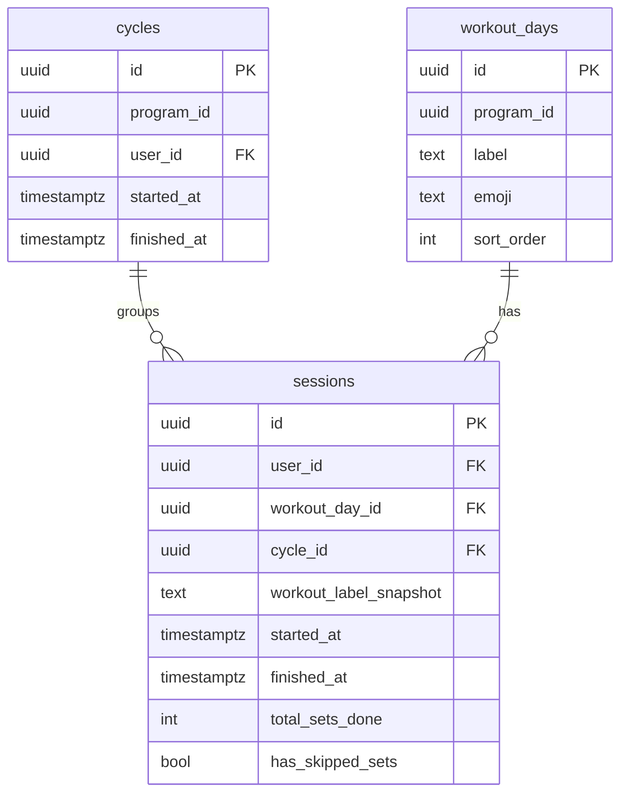
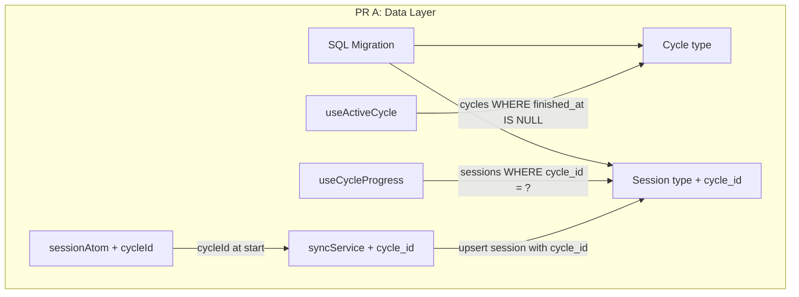
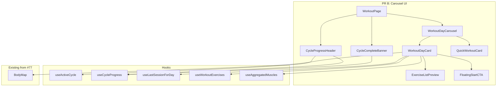

# Tech Plan — Workout Overview Session Cards

## Architectural Approach

### Key Decisions

| Decision | Choice | Rationale |
|---|---|---|
| PR split | PR A (data model + hooks) → PR B (carousel UI), strictly sequential | Different risk profiles: DB migration vs UI regressions. PR A is independently deployable — existing UI works unchanged since `cycle_id` is nullable. |
| Cycle creation timing | Eager Supabase insert at "Start Workout" tap | Cycle must exist before any session references it. Matches user intent ("I'm starting a rotation"). |
| One-active-cycle constraint | Partial unique index `WHERE finished_at IS NULL` on `(program_id, user_id)` | DB-enforced uniqueness — impossible to accidentally create duplicate active cycles, no application-level check needed. |
| Offline fallback | Start session with `cycleId = null` if insert fails | Rare edge case (PWA loads online). Adding sync queue complexity for cycles isn't justified. |
| Session-cycle linkage | `cycleId` stored in Jotai `sessionAtom`, written to Supabase at session finish via `enqueueSessionFinish` | Matches the existing offline-first session write pattern in `file:src/lib/syncService.ts`. |
| Cycle progress source | Client-side query on `sessions WHERE cycle_id = ?`, with optimistic cache update after finish | Immediate feedback without waiting for sync drain. Cache corrects on next drain via invalidation. |
| Cycle completion UX | Persistent banner derived from cycle state (all days done + `finished_at IS NULL`) | Reappears on every app load until confirmed. No extra state — purely derived from `useCycleProgress`. |
| Program switch | Cycles stay open — one active cycle per program | User can switch PPL → Full Body → back to PPL without losing cycle progress. Partial unique index scopes to `program_id`. |
| Carousel library | Embla Carousel via shadcn/ui `Carousel` component | Already in the shadcn ecosystem, lightweight, good mobile swipe UX. No new external dependency beyond `embla-carousel-react`. |
| Card layout | Cards expand in page flow, `position: sticky` CTA | Avoids nested-scroll conflict on mobile. CTA stays reachable at viewport bottom regardless of exercise list length. |
| Exercise lazy fetch | Active card + next neighbor via Embla `slidesInView` | Bounds initial fetches to 2 cards. TanStack Query cache handles revisits — zero re-fetches. |

### Critical Constraints

**Session atom backward compatibility** — Adding `cycleId: string | null` to the `SessionState` shape in `file:src/store/atoms.ts` is safe: `atomWithStorage` deserializes missing fields as `undefined`, which we treat as `null`. No localStorage migration needed.

**Sync service extension** — `enqueueSessionFinish` in `file:src/lib/syncService.ts` must include `cycle_id` in the session upsert payload. The drain function's cache invalidation list needs `["active-cycle"]` and `["cycle-sessions"]` added (partial key match) so cycle progress updates after sync.

**Migration is additive only** — New `cycles` table + nullable `cycle_id` column on `sessions`. No existing data is modified. Rollback path: `DROP COLUMN cycle_id; DROP TABLE cycles;`.

---

## Data Model

### New table: `cycles`

```sql
-- supabase/migrations/20260320120000_create_cycles_and_session_cycle_id.sql

CREATE TABLE cycles (
  id uuid PRIMARY KEY DEFAULT gen_random_uuid(),
  program_id uuid NOT NULL,
  user_id uuid NOT NULL REFERENCES auth.users(id) ON DELETE CASCADE,
  started_at timestamptz NOT NULL DEFAULT now(),
  finished_at timestamptz
);

CREATE UNIQUE INDEX one_active_cycle_per_program
  ON cycles(program_id, user_id) WHERE finished_at IS NULL;

ALTER TABLE cycles ENABLE ROW LEVEL SECURITY;

CREATE POLICY "Users manage own cycles" ON cycles
  FOR ALL USING (auth.uid() = user_id) WITH CHECK (auth.uid() = user_id);

-- Add cycle_id FK to sessions
ALTER TABLE sessions
  ADD COLUMN cycle_id uuid REFERENCES cycles(id);
```

Note: `program_id` is not a FK — there is no `programs` table. It stores the same UUID used in `workout_days.program_id` and `activeProgramIdAtom`.

### TypeScript types

```typescript
// src/types/database.ts — new
export interface Cycle {
  id: string
  program_id: string
  user_id: string
  started_at: string
  finished_at: string | null
}

// src/types/database.ts — updated Session
export interface Session {
  id: string
  user_id: string
  workout_day_id: string | null
  workout_label_snapshot: string
  started_at: string
  finished_at: string | null
  total_sets_done: number
  has_skipped_sets: boolean
  cycle_id: string | null  // NEW
}
```

### SessionState atom extension

```typescript
// src/store/atoms.ts — add to SessionState
{
  // ...existing fields...
  cycleId: string | null  // NEW — set at session start, read at finish
}
```

### ER Diagram



---

## Component Architecture

### PR A — Layer Overview



### PR A — New Files & Responsibilities

| File | Purpose |
|---|---|
| `supabase/migrations/20260320120000_create_cycles_and_session_cycle_id.sql` | `cycles` table, partial unique index, RLS, `sessions.cycle_id` FK |
| `file:src/hooks/useCycle.ts` | `useActiveCycle(programId)` and `useCycleProgress(cycleId, days)` hooks |
| `file:src/types/database.ts` (modify) | Add `Cycle` interface, add `cycle_id` to `Session` |
| `file:src/store/atoms.ts` (modify) | Add `cycleId: string | null` to `SessionState`, default `null` |
| `file:src/lib/syncService.ts` (modify) | Add `cycleId` to `enqueueSessionFinish` payload, include `cycle_id` in upsert, add cycle query keys to drain invalidation |
| `file:src/pages/WorkoutPage.tsx` (modify) | Pass `cycleId` to `enqueueSessionFinish`, resolve/create cycle on "Start Workout" |

### PR A — Component Responsibilities

**`useActiveCycle(programId: string | null)`**
- Queries `cycles` where `program_id = ?` and `finished_at IS NULL`, single row or `null`
- Query key: `["active-cycle", programId]`
- Handles `PGRST116` (no rows) → returns `null`
- `enabled: !!programId`

**`useCycleProgress(cycleId: string | null, days: WorkoutDay[])`**
- Queries `sessions` where `cycle_id = ?` and `finished_at IS NOT NULL`
- Query key: `["cycle-sessions", cycleId]`
- Derives via `useMemo`: `{ completedDayIds: string[], totalDays: number, nextDayId: string | null, isComplete: boolean }`
- `isComplete` when `completedDayIds.length >= totalDays`

### PR A — Cycle Start Flow

In `file:src/pages/WorkoutPage.tsx`, "Start Workout" becomes:

1. Read `activeCycle` from `useActiveCycle(activeProgramId)`
2. If `activeCycle` exists → use `activeCycle.id`
3. If no active cycle → `supabase.from("cycles").insert({ program_id, user_id }).select().single()`
4. If insert fails (offline) → `cycleId = null`, session starts without cycle
5. If insert hits unique constraint (race) → fetch existing active cycle via `useActiveCycle` refetch
6. Store `cycleId` in `sessionAtom`
7. Invalidate `["active-cycle", activeProgramId]`

### PR A — Session Finish Extension

In `handleFinish()`, extend `enqueueSessionFinish` payload:

```typescript
enqueueSessionFinish({
  sessionId,
  workoutDayId: activeSessionDayId ?? "",
  workoutLabelSnapshot: ...,
  startedAt: session.startedAt ?? Date.now(),
  finishedAt: Date.now(),
  totalSetsDone: daySetsDone,
  hasSkippedSets: hasSkipped,
  cycleId: session.cycleId,  // NEW
})
```

After enqueue, optimistically update cycle-sessions cache:

```typescript
queryClient.setQueryData<Session[]>(
  ["cycle-sessions", session.cycleId],
  (old) => [...(old ?? []), {
    workout_day_id: session.activeDayId,
    finished_at: new Date().toISOString(),
  }]
)
```

---

### PR B — Layer Overview



### PR B — New Files & Responsibilities

| File | Purpose |
|---|---|
| `src/components/ui/carousel.tsx` | shadcn/ui Carousel (generated via `npx shadcn@latest add carousel`) |
| `file:src/components/workout/WorkoutDayCarousel.tsx` | Embla carousel container; manages `slidesInView` for lazy fetch; renders cards; auto-scrolls to `nextDayId` on mount |
| `file:src/components/workout/WorkoutDayCard.tsx` | Single day card: status badge, header, `BodyMap`, stats, last session, `ExerciseListPreview`, floating CTA |
| `file:src/components/workout/ExerciseListPreview.tsx` | Compact exercise rows: thumbnail (32px), name, equipment badge, sets × reps × weight |
| `file:src/components/workout/CycleProgressHeader.tsx` | Compact bar: program name, filled/empty progress dots, "Finish rotation" three-dot menu |
| `file:src/components/workout/CycleCompleteBanner.tsx` | Persistent banner: "Rotation complete — start a new cycle?" with Confirm/Dismiss |
| `file:src/components/workout/QuickWorkoutCard.tsx` | Trailing carousel card: dashed border, Zap icon, opens `QuickWorkoutSheet` |
| `file:src/hooks/useLastSessionForDay.ts` | Most recent finished session for a day, optionally scoped to cycle |
| `file:src/pages/WorkoutPage.tsx` (modify) | Replace `DaySelector` + `SessionHeatmap` + `ExerciseStrip` + `ExerciseDetail` with carousel in pre-session |
| `file:src/locales/en/workout.json` (modify) | New i18n keys |
| `file:src/locales/fr/workout.json` (modify) | New i18n keys |

### PR B — Component Responsibilities

**`WorkoutDayCarousel`**
- Wraps shadcn/ui `Carousel` + `CarouselContent` + `CarouselItem`
- On mount, scrolls to `nextDayId` from `useCycleProgress`
- Tracks `slidesInView` via Embla API to pass `isVisible` prop to cards
- Renders `WorkoutDayCard` per `WorkoutDay`, plus trailing `QuickWorkoutCard`

**`WorkoutDayCard`**
- Receives `day: WorkoutDay`, `cycleId`, `isCompleted`, `isNext`, `isVisible`
- Conditionally fetches: `useWorkoutExercises(isVisible ? day.id : null)` — disabled when off-screen
- Renders `BodyMap` (always visible, aggregated via `useAggregatedMuscles`), stats, `ExerciseListPreview`, floating CTA
- CTA: "Start Workout" on pending/next days, "Completed" + "Reset day" on done days
- "Reset day": confirmation dialog → `supabase.from("sessions").update({ cycle_id: null }).eq("workout_day_id", day.id).eq("cycle_id", cycleId)` → invalidate cycle queries

**`ExerciseListPreview`**
- Compact list: `ExerciseThumbnail` (32px), exercise name, equipment badge, "3×12 @ 60kg"
- Purely informational — no interactivity before session start

**`CycleProgressHeader`**
- Reads `useActiveCycle` + `useCycleProgress`
- Renders program name, filled/empty dots per day, count text ("2/3")
- Three-dot menu: "Finish rotation" → `supabase.from("cycles").update({ finished_at: now() })`

**`CycleCompleteBanner`**
- Visible when `cycleProgress.isComplete && activeCycle?.finished_at === null`
- "Confirm" → sets `finished_at` on cycle, invalidates queries, toast "New rotation started"
- "Dismiss" → hides for this render (reappears on navigation/reload — derived from state)

**`useLastSessionForDay(dayId: string | null, cycleId?: string | null)`**
- Query key: `["last-session-day", dayId, cycleId ?? "any"]`
- Queries `sessions` where `workout_day_id = dayId`, `finished_at IS NOT NULL`, ordered by `started_at DESC`, `limit 1`
- If `cycleId` provided, scopes to that cycle; falls back to unscoped query when no cycle-scoped match
- Returns `Session | null`

### PR B — WorkoutPage View Transition

**Pre-session (new):**
```
CycleProgressHeader → CycleCompleteBanner → WorkoutDayCarousel[WorkoutDayCard × N + QuickWorkoutCard]
```

**In-session (unchanged):**
```
ExerciseStrip → ExerciseDetail → SessionNav
```

When `session.isActive`, the carousel is hidden and the existing in-session layout renders. No changes to the active session flow.

### PR B — i18n Keys

| Key | EN | FR |
|---|---|---|
| `cycleProgress` | `{{done}}/{{total}} done` | `{{done}}/{{total}} terminé` |
| `finishRotation` | `Finish rotation` | `Terminer la rotation` |
| `rotationComplete` | `Rotation complete — start a new cycle?` | `Rotation terminée — commencer un nouveau cycle ?` |
| `confirm` | `Confirm` | `Confirmer` |
| `dismiss` | `Dismiss` | `Ignorer` |
| `estimatedDuration` | `~{{minutes}} min` | `~{{minutes}} min` |
| `neverDone` | `Never done` | `Jamais effectué` |
| `resetDay` | `Reset day` | `Réinitialiser le jour` |
| `resetDayConfirm` | `This day will be marked as pending again. Your session data is kept in history.` | `Ce jour sera de nouveau en attente. Vos données de séance sont conservées.` |
| `lastSessionOn` | `Last: {{date}}` | `Dernier : {{date}}` |
| `nextWorkout` | `Next` | `Suivant` |
| `completed` | `Completed` | `Terminé` |

### Failure Mode Analysis

| Failure | Behavior |
|---|---|
| Offline at "Start Workout" | Cycle insert fails → session starts with `cycleId = null`. Toast: "Offline — cycle tracking unavailable" |
| Cycle insert hits unique constraint (race) | Catch unique violation → refetch active cycle and use its ID |
| `useWorkoutExercises` returns empty | Card shows "No exercises" placeholder, CTA hidden |
| All library exercise fetches fail | `useAggregatedMuscles` degrades to `muscle_snapshot` (primary only). Body map still renders. |
| `useLastSessionForDay` returns null | Card shows "Never done" label instead of last session stats |
| User deletes a day mid-cycle | Cycle completion check uses current program days — deleted day drops from count, progress adjusts |
| Embla fails to load | Fallback: render cards in a vertical stack. Unlikely since it's a direct dependency. |
| 100+ legacy sessions with `cycle_id = NULL` | Appear normally in `/history`. Carousel "Last session" queries by `workout_day_id` with `LIMIT 1`, unaffected. |
