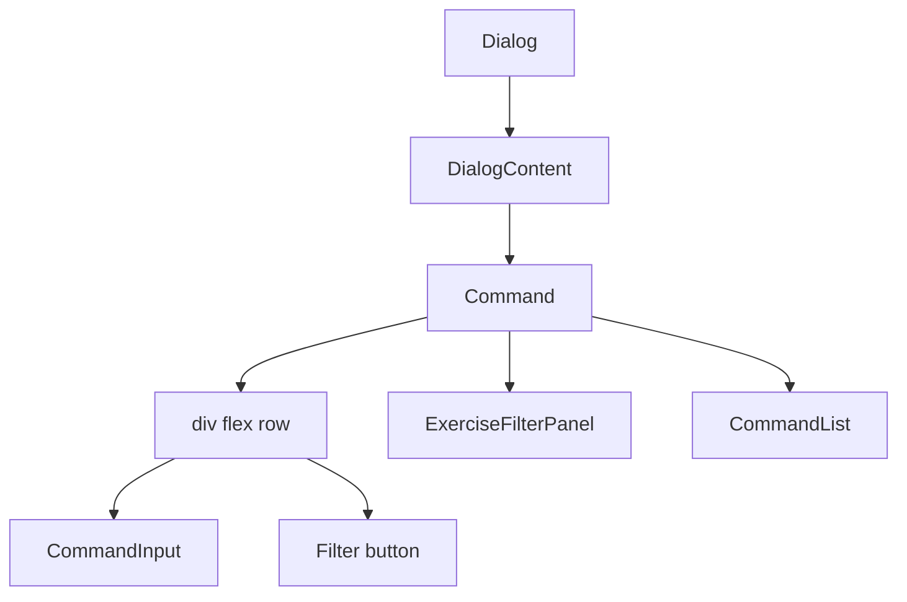

# Tech Plan — Missing filter button icon on mobile search input

## Architectural Approach

Fix the missing filter icon on native mobile by addressing the flex layout so the search input wrapper can shrink and the filter button is never clipped. Document the icon position decision (left vs right) with rationale. No data model or API changes; scope is limited to [ExerciseLibraryPicker.tsx](src/components/builder/ExerciseLibraryPicker.tsx), optional [command.tsx](src/components/ui/command.tsx) tweaks, and docs.

### Key Decisions

| Decision | Choice | Rationale |
|---|---|---|
| Root cause hypothesis | Flex item default `min-width: auto` on the cmdk input wrapper + `overflow-hidden` on Command | The input wrapper has `flex-1` but no `min-w-0`, so it won't shrink below content; on narrow viewports the filter button is pushed right and clipped. Desktop/responsive often has more width or different viewport behavior. |
| Primary fix | Add `min-w-0` to the search row so the input wrapper can shrink | Standard flex fix: allow the flex-1 child to shrink so the shrink-0 button stays visible. Applied via parent selector in ExerciseLibraryPicker: `**:[[cmdk-input-wrapper]]:min-w-0`. |
| Touch target | Ensure filter button meets ~44px tap area on mobile | Use padding (e.g. `p-2` or `min-h-[44px] min-w-[44px]`) so the icon remains tappable on real devices; keep existing `aria-label`. |
| Icon position | Evaluate left vs right; document in implementation ticket or tech plan addendum | Epic requires a documented decision. Right is current (discoverable next to input); left can avoid being clipped if any remaining edge cases exist. Decision to be recorded after fix is validated on device. |
| Verification | Layout fix validated in E2E (viewport) + manual/real-device check for native mobile | E2E can assert filter button visible at mobile viewport; final sign-off on real iOS/Android per epic (desktop responsive is explicitly insufficient). |

### Critical Constraints

- **Single component in scope.** All layout changes are in [ExerciseLibraryPicker.tsx](src/components/builder/ExerciseLibraryPicker.tsx) (and possibly [command.tsx](src/components/ui/command.tsx) if we need to expose a variant or global fix for cmdk-input-wrapper). No changes to filter panel content or behavior ([ExerciseFilterPanel](src/components/builder/ExerciseFilterPanel.tsx) is out of scope).
- **Command overflow.** [command.tsx](src/components/ui/command.tsx) applies `overflow-hidden` to `Command` (line 16). That clipping is what hides the button when the flex row overflows. Fix is to prevent overflow (by letting the input wrapper shrink), not to remove overflow-hidden from Command (which could affect scroll/list behavior).
- **cmdk structure.** [CommandInput](src/components/ui/command.tsx) renders a wrapper div with `cmdk-input-wrapper=""` (line 40). ExerciseLibraryPicker targets it with `**:[[cmdk-input-wrapper]]:flex-1`. Any fix must work with this selector pattern or equivalent; we avoid changing the public API of the shared Command/CommandInput.
- **No desktop-only validation.** The epic explicitly excludes treating desktop or responsive-only testing as sufficient. The plan must include a step to verify on real mobile (e.g. iOS Safari, Chrome Android) or document the limitation if automated real-device testing is not available.

---

## Data Model

No data model changes. This epic is UI/layout only.

---

## Component Architecture

### Layer Overview

### Files and responsibilities

| File | Purpose |
|---|---|
| [src/components/builder/ExerciseLibraryPicker.tsx](src/components/builder/ExerciseLibraryPicker.tsx) | Add `min-w-0` (and any overflow safeguards) to the search row; optionally adjust filter button padding for touch; no change to filter panel logic. |
| [src/components/ui/command.tsx](src/components/ui/command.tsx) | Only if needed: allow optional `min-w-0` or class on the input wrapper so picker does not rely on complex selectors. Prefer fixing in picker first. |
| docs (or ticket) | Document icon position decision (left vs right) with rationale. |

### Component responsibilities

**ExerciseLibraryPicker**
- Renders the "Add exercise" dialog with Command (search + list), a filter button, and collapsible ExerciseFilterPanel.
- The flex row (search + filter button) must keep the filter button visible on all viewports; layout fix is here.
- Reads `useExerciseLibrary`, `useAddExerciseToDay`; no new state.

**Command / CommandInput**
- Command provides `overflow-hidden`; CommandInput renders the `cmdk-input-wrapper` div. Fix does not require changing Command's overflow unless we later find a different root cause.

### Failure mode analysis

| Failure | Behavior |
|---|---|
| `min-w-0` insufficient on some devices | Button still clipped → next step: move icon left of input, or give the row a max-width and internal scroll (less preferred). Document and retest on device. |
| Touch target too small | Users miss taps on filter → increase padding to meet ~44px; keep icon size. |
| E2E passes but real mobile still hides icon | Possible viewport/safe-area difference → keep manual real-device check as acceptance criterion; consider adding a mobile viewport E2E assertion for filter button visibility. |
| Moving icon left breaks existing UX | If we switch to left: ensure RTL and keyboard flow still make sense; document rationale. |

---

## Icon position decision (implementation addendum)

**Decision: keep the filter icon on the right of the search input.**

**Rationale:**
- **Discoverability:** Right placement keeps the filter control immediately adjacent to the search field, so users see it as the next action after typing. Moving it left would separate it from the input and could make it feel like a global toolbar action rather than search-specific.
- **Layout fix suffices:** With `**:[[cmdk-input-wrapper]]:min-w-0`, the input wrapper shrinks on narrow viewports and the button remains in view. No need to move the icon left for clipping reasons.
- **Consistency:** Many search UIs place filter/sort controls to the right of the input (trailing action). Keeping the current order avoids churn and matches user expectations.
- **Focus and RTL:** Right-to-left layouts would naturally mirror the row; keeping a single placement (right in LTR) is simpler than special-casing. Tab order (input then button) is unchanged.

If real-device testing later shows the button still clipped on specific devices, the fallback is to move the icon left and document that exception; current implementation keeps it on the right.

---

## Implementation outline

1. **Reproduce (optional but recommended)** — Confirm on a real device (or via responsive + narrow width) that the filter icon is missing; note viewport width and browser.
2. **Fix layout** — In ExerciseLibraryPicker, on the search row div, add `**:[[cmdk-input-wrapper]]:min-w-0` so the input wrapper can shrink. Ensure the filter button has adequate touch target (e.g. `p-2` or explicit min size).
3. **Verify** — E2E: in builder flow, open picker at mobile viewport (e.g. 390px), assert filter button is visible and (optionally) clickable. Manual: confirm on iOS Safari and Chrome Android that the icon is visible and tappable.
4. **Icon position** — Evaluate left vs right; document the decision and rationale (see addendum above).
5. **No change** to filter panel content, Command list behavior, or ExerciseFilterPanel.

---

## References

- Epic Brief: [docs/Epic_Brief_—_Missing_filter_button_icon_on_mobile_search_input.md](docs/Epic_Brief_—_Missing_filter_button_icon_on_mobile_search_input.md)
- Doc template: [.cursor/rules/docs-format.mdc](.cursor/rules/docs-format.mdc)
