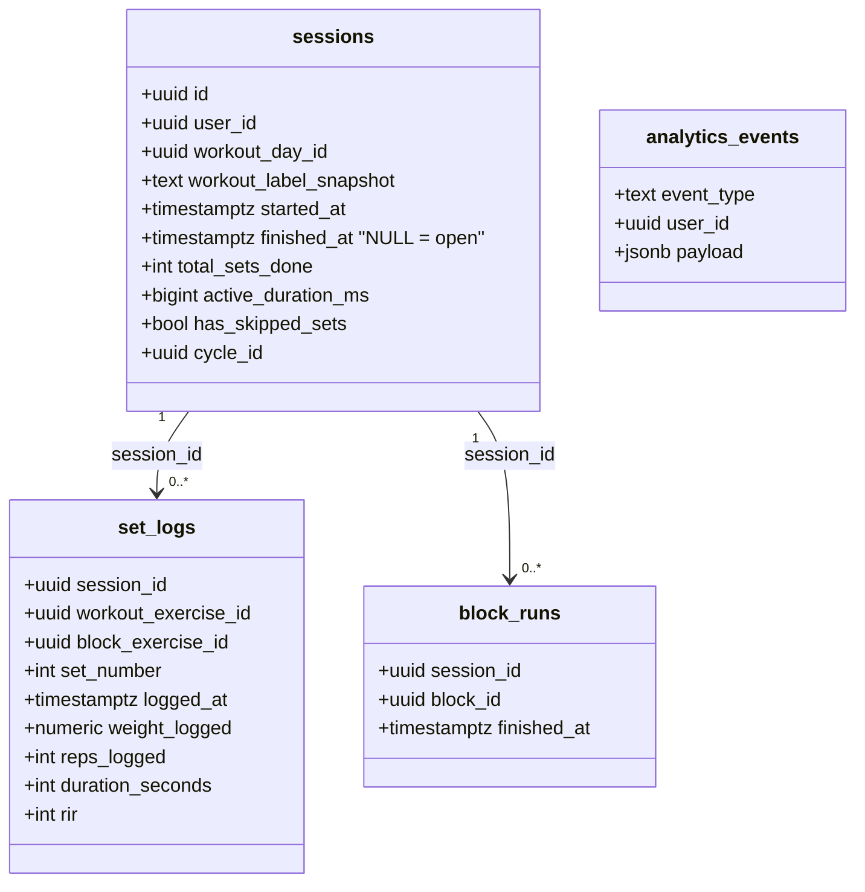
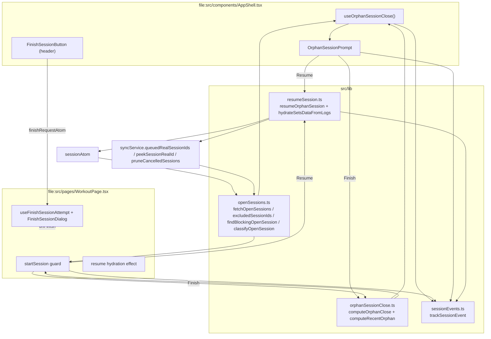

# Tech Plan — Prevent Orphan Sessions (#571)

> Implements `file:docs/done/Epic_Brief_—_Prevent_Orphan_Sessions_#571.md` — issue `PierreTsia/workout-app#571`. Context: ADR `file:docs/adr/0024-session-orphan-self-heal.md`, Tech Plan `file:docs/Tech_Plan_—_Session_Orphan_Self-Heal_#568.md`. Glossary: `file:docs/CONTEXT.md` (**Session**, **Cycle**).

---

## Architectural Approach

### Key Decisions

| Decision | Choice | Rationale |
|---|---|---|
| Guard location | A DB-backed read at the top of `startSession` (`file:src/pages/WorkoutPage.tsx:915`), before the atom is flipped | The local `isViewingLockedDay` lock is lost with the atom (reload, storage clear, another tab/device). The guard must read `sessions where finished_at is null`, not trust local state. |
| Guard exclusions | Reuse the #568 exclusion set: active local session (`peekSessionRealId`), offline queue (`queuedRealSessionIds`), cancellation deny-list (`pruneCancelledSessions`) | A session the current device still owns is not an orphan. Same three guards as `useOrphanSessionClose`, extracted once. |
| Guard failure mode | **Fail-open** on query error (proceed with the start, log) | Offline is the only case where the read fails; blocking a start on a dead network is worse than the rare lost-atom-offline orphan. The local atom lock still applies. |
| Guard choices | **Finish it** (close the orphan with the last-set rule, then start) / **Resume it** (reopen the orphan, cancel the start) | The issue says « la terminer / l'ignorer ». "Ignore" is implemented as **Resume**: starting a second concurrent session is exactly the bug. A user who wants to abandon the old one picks **Finish** — it preserves the sets. No third "start anyway" option. |
| Recent vs abandoned | `last set ≤ 3 h` → prompt **Resume / Finish**; `last set > 3 h` → auto-close (existing #568) | Reuses `ORPHAN_SESSION_THRESHOLD_MS` (`file:src/lib/orphanSessionClose.ts:23`). One threshold, two behaviors. |
| Prompt surface | A global dialog rendered by `AppShell`, driven by `useOrphanSessionClose` state | The hook already runs at app open in `AppShell`; the prompt is app-scoped, not route-scoped. |
| Prompt gating | Only when no local session is active, once per mount | If a session is live, the user is mid-workout — do not interrupt. The orphan is handled on a later open or by the start guard. |
| Resume mechanism | Seed `sessionMeta` (`local-<startedAt>` → the orphan's real UUID), set `sessionAtom` on the orphan's day, hydrate `setsData` from persisted `set_logs` | The queue keys sessions by `local-<startedAt>` → UUID (`file:src/lib/syncService.ts:274-291`). Without seeding the meta, new set logs would mint a **new** UUID and split the session. |
| Resume hydration | Rebuild solo `setsData` rows from `set_logs` (`done: true`, reps/weight/rir/duration); derive `completedBlockIds` from `block_runs.finished_at` | The sets table reads only `session.setsData` (`file:src/components/workout/SetsTable.tsx:158`); persisted logs are used for progress counting only. Without hydration the user sees every set as un-done. |
| Finish affordance | A persistent **Finish** button in the `AppShell` header, next to `SessionTimerChip`, visible whenever `session.isActive` | `WorkoutPage` returns early with only `BlockRunner` during a circuit (`file:src/pages/WorkoutPage.tsx:995-1023`), so the bottom nav is gone. The header is outside `WorkoutPage` and survives every route. |
| Finish trigger | A transient `finishRequestAtom` (counter) set by the header button; `WorkoutPage` consumes it and runs the shared finish-attempt | The header cannot call `handleFinish` directly (it lives in `WorkoutPage`). The atom is the seam; if the user is on another route, the button navigates to `/` first. |
| Finish-attempt extraction | Move the confirm logic out of `SessionNav` into a `useFinishSessionAttempt` hook + a `FinishSessionDialog` rendered by `WorkoutPage` | Both the bottom nav and the header must trigger the same confirm. One dialog, one source of truth. |
| Instrumentation | `analytics_events` rows via the existing `useTrackEvent` pattern (`file:src/hooks/useTrackEvent.ts`) | No new table, no new dependency. `analytics_events` already has an INSERT-own RLS policy (`file:supabase/migrations/20260314000007_create_analytics_events.sql`). |
| Sentry | Deferred | The issue conditions it on the dashboard token being restored. Tracked in the HITL ticket. |
| Schema | **No migration.** No new table, no new column | The guard reads existing columns; the close writes the same four columns as #568; instrumentation uses the existing `analytics_events`. |

### Critical Constraints

**Never fight the offline queue.** The guard and the close must exclude any `realSessionId` still in the queue (`queuedRealSessionIds`). A queued `session_finish` drains later and upserts `finished_at` with `now()` (`file:src/lib/syncService.ts:918`), overwriting an auto-close. This is the #568 invariant, unchanged.

**The active local session is not identified by DB id.** The queue maps `local-${startedAt}` to a UUID. The guard reads `peekSessionRealId()` when `sessionAtom.isActive`, never compares against the atom's session.

**Resume must seed `sessionMeta` before any set is logged.** `resolveSessionMeta` (`file:src/lib/syncService.ts:240`) mints a fresh UUID when the local id is unknown. Resume must write `sessionMeta[local-${startedAt}] = { realId: orphan.id, workoutDayId, workoutLabelSnapshot, startedAt }` first, or the resumed session splits into two rows.

**The guard is async and sits on the start path.** `startSession` is called from the pre-session button and from `handleQuickWorkoutStart` (`file:src/pages/WorkoutPage.tsx:900-913`). Both must route through the guard. The guard stores the pending start args and returns early; the dialog re-invokes the internal commit after the choice.

**`setsData` is the only source for the sets table.** `sessionProgress` reads both `setsData` and `persistedLogs`, but `SetsTable` reads only `setsData`. Resume hydration is therefore mandatory for a usable resume, not a nicety.

**StrictMode symmetry.** `file:src/main.tsx` wraps in `StrictMode`: hooks mount twice in dev. The prompt fires once per mount via a ref; the close UPDATE is idempotent (`.is("finished_at", null)`).

**RLS + `TZ=UTC`.** The open-session query relies on the existing user-scoped RLS on `sessions`; tests run `TZ=UTC` (`file:package.json`).

**No re-grant.** Neither the guard's finish nor the resume calls `check_and_grant_achievements`. #569 owns derived data.

---

## Data Model

No new tables, no new columns, no migration. The epic reads existing `sessions` / `set_logs` / `block_runs`, writes the same four `sessions` columns as #568, seeds the existing `sessionMeta` localStorage shape, and inserts `analytics_events` rows.



### Table Notes

- The close payload is unchanged from #568: `{ finished_at: max(logged_at), total_sets_done: count(set_logs), active_duration_ms: max − min, has_skipped_sets: false }`.
- `sessionMeta` (localStorage `sessionMeta:<userId>`) gains a seeded entry on resume; its shape is unchanged (`file:src/lib/syncService.ts:123-128`).
- `analytics_events` is append-only, user-scoped by RLS. No read path is added in the app; the dashboard reads it out of band.

### localStorage / atom shapes

```ts
// Seeded by resume — existing shape, new writer.
sessionMeta[`local-${startedAtMs}`] = {
  realId: orphan.id,
  workoutDayId: orphan.workout_day_id,
  workoutLabelSnapshot: orphan.workout_label_snapshot,
  startedAt: startedAtMs,
}

// New transient atom (not persisted) — header → WorkoutPage finish seam.
export const finishRequestAtom = atom(0)
```

---

## Component Architecture



### New Files & Responsibilities

| File | Purpose |
|---|---|
| `src/lib/openSessions.ts` | **new** — `fetchOpenSessions(userId)`, `excludedSessionIds(userId, session)`, `findBlockingOpenSession(userId, session)`, `classifyOpenSession(logs, now)`. Shared by the boot hook and the start guard. |
| `src/lib/openSessions.test.ts` | **new** — exclusion + classification unit tests. |
| `src/lib/resumeSession.ts` | **new** — `resumeOrphanSession(orphan, userId)` (seed meta + set atom) and pure `hydrateSetsDataFromLogs(exercises, logs, library)`. |
| `src/lib/resumeSession.test.ts` | **new** — hydration mapping (reps/duration/rir/done) + meta seeding. |
| `src/lib/sessionEvents.ts` | **new** — `trackSessionEvent(eventType, payload)` (fire-and-forget insert into `analytics_events`), typed event names. |
| `src/hooks/useOrphanSessionClose.ts` | edit — use `openSessions`, expose `{ recentOrphan, dismiss, resume, finish }`, emit events. |
| `src/hooks/useOrphanSessionClose.test.ts` | edit — recent orphan is exposed, not closed; stale is closed + event emitted. |
| `src/components/workout/OrphanSessionPrompt.tsx` | **new** — the app-open dialog (Resume / Finish / dismiss). |
| `src/components/workout/OpenSessionDialog.tsx` | **new** — the start-guard dialog (Finish it / Resume it). |
| `src/components/workout/FinishSessionButton.tsx` | **new** — header finish control; sets `finishRequestAtom`. |
| `src/hooks/useFinishSessionAttempt.ts` | **new** — extracted confirm logic (skipped count, remaining, dialog state). |
| `src/components/workout/FinishSessionDialog.tsx` | **new** — the confirm dialog, rendered by `WorkoutPage`. |
| `src/components/workout/SessionNav.tsx` | edit — drop the local dialog; call `onFinishAttempt`. |
| `src/pages/WorkoutPage.tsx` | edit — guard in `startSession`, resume hydration effect, consume `finishRequestAtom`, render `FinishSessionDialog`. |
| `src/components/AppShell.tsx` | edit — render `OrphanSessionPrompt` + `FinishSessionButton`. |
| `src/store/atoms.ts` | edit — add `finishRequestAtom`. |
| `src/lib/syncService.ts` | edit — add `seedSessionMeta(userId, localSessionId, meta)` (write-only). |
| `src/locales/{en,fr}/workout.json` | edit — 6 new keys (contract below). |

### Component Responsibilities

**`openSessions.ts`**
- `fetchOpenSessions(userId)`: `supabase.from("sessions").select("id, workout_day_id, workout_label_snapshot, started_at, cycle_id, set_logs(logged_at)").is("finished_at", null)`.
- `excludedSessionIds(userId, session)`: `queuedRealSessionIds()` ∪ `pruneCancelledSessions(userId)` ∪ `{peekSessionRealId(userId, local-${startedAt})}` when active.
- `findBlockingOpenSession(userId, session)`: first open row not in the exclusion set, or `null`.
- `classifyOpenSession(logs, now)`: `{ kind: "stale", close }` when `computeOrphanClose` returns a payload; `{ kind: "recent", lastSetAt }` when there is ≥ 1 set and the last set is inside the threshold; `null` otherwise (no sets).

**`useOrphanSessionClose()`** — returns `{ recentOrphan, dismiss, resume, finish }`.
- Fetches open sessions once per mount; excludes the active local session, the queue, and the deny-list.
- Stale rows → idempotent UPDATE (unchanged) + `session_orphan_closed { cause: "auto" }`.
- The most recent non-stale row with ≥ 1 set → `recentOrphan` (only when `!session.isActive`), + `session_orphan_prompted { surface: "app_open" }`.
- `resume()` → `resumeOrphanSession` + `session_orphan_resumed`; `finish()` → close + `session_orphan_closed { cause: "open_prompt" }`; `dismiss()` → clear the prompt, leave the row open.

**`startSession` guard** — at the top of `startSession`, `await findBlockingOpenSession`. If found: store `{ opts, orphan }`, open `OpenSessionDialog`, return. On **Finish**: close the orphan (last-set rule) + `session_orphan_closed { cause: "start_guard" }`, then commit the start. On **Resume**: `resumeOrphanSession` + `session_orphan_resumed`, clear the pending start. On query error: proceed (fail-open).

**`resumeOrphanSession(orphan, userId)`**
- `seedSessionMeta(userId, local-${startedAtMs}, { realId: orphan.id, workoutDayId, workoutLabelSnapshot, startedAt })`.
- `store.set(sessionAtom, { ...defaultSessionState, isActive: true, startedAt, currentDayId: workout_day_id, activeDayId: workout_day_id, cycleId: cycle_id })`.
- `WorkoutPage` then hydrates `setsData` from `activeSessionLogs` once exercises load (a `resumedRef` guards a single pass).

**`hydrateSetsDataFromLogs(exercises, logs, library)`** — pure.
- Solo logs (`workout_exercise_id != null`) grouped by slot; each row `done: true`, `reps`/`weight`/`rir` from the log, or `kind: "duration"` with `loggedSeconds` when `duration_seconds != null`.
- Slots with no logs keep their fresh rows (built by the existing effect).
- Block logs are ignored here; `completedBlockIds` is derived from `block_runs.finished_at` (best-effort, one query).

**`useFinishSessionAttempt({ exercises, itemCount, incompleteBlockCount, onFinish, onBlockedByPause })`** — returns `{ attempt, confirmOpen, setConfirmOpen, confirmBody, confirmFinish }`. Extracted verbatim from `SessionNav` (`file:src/components/workout/SessionNav.tsx:71-101`). `SessionNav` and the header both call `attempt`.

**`FinishSessionButton`** — header button, rendered when `session.isActive`. On click: if not on `/`, `navigate("/")`; then `setFinishRequestAtom(n => n + 1)`. `WorkoutPage` watches the atom and calls `attempt`.

### Failure Mode Analysis

| Failure | Behavior |
|---|---|
| Guard query fails (offline) | Fail-open: the start proceeds; the local atom lock still applies. Logged. |
| A live session is open in another tab | Its realId is in the queue ⇒ excluded; the guard does not fire. |
| A queued `session_finish` drains after a guard close | Impossible: the id is in `queuedRealSessionIds` at decision time ⇒ skipped. |
| Resume seeds meta but the user never logs | The orphan stays open; #568 closes it later. No split (meta points at the real id). |
| Resume hydration runs before exercises load | The effect waits for `exercises.length > 0`; `resumedRef` prevents a second pass. |
| Header finish tapped on another route | Navigates to `/` first; `WorkoutPage` consumes the atom on mount. |
| Two app mounts in StrictMode | Ref + idempotent UPDATE ⇒ at most one effective close; one prompt. |
| `computeRecentOrphan` sees unparseable timestamps | Returns `null` ⇒ no prompt. |
| A 0-set open row | Not prompted (nothing to resume) and not closed (no last set). Pre-existing #568 gap; noted, not fixed here. |

---

## i18n contract

**Namespace:** `workout`
**Surfaces:** `OpenSessionDialog` (start guard), `OrphanSessionPrompt` (app open). The header finish button reuses the existing `finish` key.

| Key | EN | FR | Why this wording |
|---|---|---|---|
| `openSession.title` | Unfinished session | Séance non terminée | Names the state; matches the History badge (`unfinishedBadge`). |
| `openSession.body` | You have an unfinished session. Finish it, or resume it? | Tu as une séance non terminée. La terminer, ou la reprendre ? | States the fact, offers both actions in button order. |
| `openSession.finish` | Finish it | La terminer | Closes the session with the last set as its end. |
| `openSession.resume` | Resume it | La reprendre | Reopens the session on its day. |
| `orphanPrompt.title` | Your last session wasn't finished | Ta dernière séance n'a pas été terminée | Explains why the prompt appears at open. |
| `orphanPrompt.body` | Resume it, or finish it to save your sets? | La reprendre, ou la terminer pour enregistrer tes séries ? | Names the consequence of finishing. |

### Rejected

- `orphanPrompt.close` → `openSession.finish` — "close" is not the product verb; **Terminer** is.
- `openSession.ignore` → `openSession.resume` — starting a second concurrent session is the bug; "ignore" is not offered.

### Open

- None. All terms (**Session**, **Circuit**) are in `file:docs/CONTEXT.md`.

---

## Stress-Test List

1. **Guard latency** — the guard adds one SELECT before every start. On a slow network this delays the start by the round-trip. Accepted: the query is a single indexed `finished_at IS NULL` read; fail-open caps the worst case.
2. **Resume vs the local atom** — if the atom is present but stale (another device resumed), the boot prompt is gated on `!session.isActive`, so no double-resume. If two devices resume the same orphan, both seed their own `sessionMeta` to the same real id; set logs upsert on `(session_id, log_slot, set_number)` — last write wins, no duplicate rows.
3. **Block resume is best-effort** — `completedBlockIds` from `block_runs` may miss a circuit that was in progress (no `finished_at`). The user re-runs it; `block_runs` upserts on `(session_id, block_id)`. Accepted for v1.
4. **Finish affordance on non-WorkoutPage routes** — the header button navigates to `/` before triggering. If the user is mid-edit elsewhere, the navigation is a context switch; accepted (finishing a session is a deliberate act).
5. **Instrumentation volume** — one event per close/prompt/decision. Bounded by the number of orphans; negligible.
6. **Issue inconsistency** — the issue says « l'ignorer »; this plan implements **Resume** instead. Intentional: an explicit "start anyway" would recreate trigger 2. Recorded in Key Decisions.
7. **No migration escape hatch needed** — no schema change; reverting is a code revert.

---

## Delivery Pipeline

1. **Foundation** — `openSessions.ts` + `sessionEvents.ts` + `useOrphanSessionClose` refactor (recent vs stale + instrumentation). Unit tests.
2. **Resume** — `resumeSession.ts` + `seedSessionMeta` + hydration. Unit tests.
3. **Guard (B)** — `startSession` guard + `OpenSessionDialog`. Integration tests.
4. **Prompt (A)** — `OrphanSessionPrompt` in `AppShell`. Integration tests.
5. **Finish affordance (D)** — `useFinishSessionAttempt` extraction + `FinishSessionButton` + `finishRequestAtom`. Render tests.
6. **QA** — manual pass on the two prod triggers; confirm `analytics_events` rows; Sentry follow-up once the token is restored.
