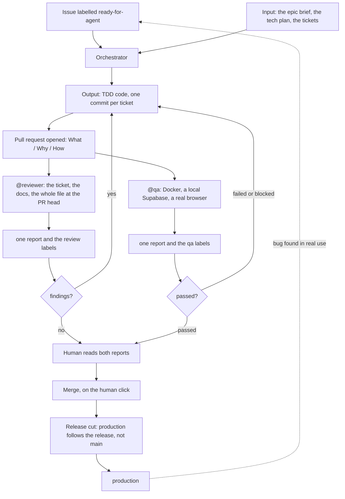

import Mermaid from '@/components/mdx/Mermaid.astro'
import AgentCard from '@/components/mdx/AgentCard.astro'
import TechHeavy from '@/components/mdx/TechHeavy.astro'
import PRTimeline from '@/components/mdx/PRTimeline.astro'
import reviewerArt from '@/assets/screenshots/reviewer-8bit.png'
import qaArt from '@/assets/screenshots/qa-8bit.png'

At 23:55 on the night of 1 October, a pull request opened in this repository carrying about twenty-two hundred lines. It merged at 01:35. Somewhere between the two, at 00:17, its browser pass failed, and it took until 00:33 to come back green.

I was asleep for all of it.

So the honest question is how much of a project like this can develop without me watching. Not maintain. Maintaining is a different job, and I am not claiming it: GymLogic is in active development, several evenings a week. What I stopped doing by hand is the delivery of a change: the reading, the browser walk, the evidence, the labels. On this site's About page that is the fifth step, the one compressed into a line called `Push for review`.

Two subagents now read every pull request in this repository, and neither one is allowed to touch the code it judges. One reads the change against the ticket. The other drives the app in a real browser and comes back with screenshots. They run unattended, they run on every PR, and the quality bar comes out higher, not lower, because nothing in the loop is taken on trust.

The same page puts the contrast in three words: **Agent-driven ≠ vibe-coded**. The difference between the two is not the model, and it is not the prompt. It is the harness: what each agent is allowed to touch, what it is required to show, and where a human still decides. The field settled on that name in 2026, with a formula worth keeping in mind for the rest of this post. Agent = model + harness. The model reasons; the harness is everything that turns reasoning into work you can audit, which is why two teams running the same model get different results.

The harness that matters here is the outer one, the part you assemble yourself around a model you do not control: instruction files, permissions, tools, evidence. Inside it, `@reviewer` and `@qa` are the narrowest component of all, the part whose only job is to check the result and refuse to take the model's word for it.

One of them reads, the other drives. `@reviewer` reads the change against the ticket that asked for it and against the repo's own rules by name; `@qa` drives the app in a real browser and comes back with screenshots. Neither can change the code it judges.

<Mermaid />

Both are markdown files in the repository, readable exactly as they run: `.opencode/agents/reviewer.md` and `.opencode/agents/qa.md`. Neither reads the other's labels or comments. They look at the same PR, at the same time, and they never coordinate.

<AgentCard
  name="@reviewer"
  role="The senior engineer. He reads the code and the documentation, and he can touch neither."
  src={reviewerArt}
  alt="Pixel-art portrait of a senior engineer with a dark ponytail, arms crossed, glancing at a block of code and a folded document."
  reads={[
    { name: 'gh issue view', what: 'the ticket it has to satisfy' },
    { name: 'the Epic Brief, the Tech Plan, the T<n> doc', what: 'when the PR points at one — above all its acceptance criteria' },
    { name: '.cursor/rules/', what: "the repo's own standards, each one pinned to an ADR" },
    { name: 'docs/CONTEXT.md', what: 'the domain words: Program, Session, Cycle, Exercise Slot' },
    { name: 'the whole file at the PR head', what: 'not the diff hunk' },
  ]}
  runs={[
    { name: 'git diff | log | show', what: 'the change, and the history behind it' },
    { name: 'gh pr view | diff | checks', what: 'the ticket it has to satisfy, and the CI state' },
    { name: 'npm run lint, npx tsc', what: "the repo's own checks — never npx tsc --noEmit, which loads zero files here" },
    { name: 'raw.githubusercontent.com/.../refs/pull/N/head/...', what: 'the file at the PR head, without checking out the branch' },
    { name: 'ponytail', what: 'a complexity pass loaded as a skill: one line per finding, never the verdict' },
    { name: 'gh pr edit, gh pr comment', what: 'one label family, and one report per pass' },
  ]}
/>

<AgentCard
  name="@qa"
  role="The tester. He drives the app in a real browser and comes back with screenshots."
  src={qaArt}
  alt="Pixel-art portrait of a tester in a lab coat holding a large lens in front of one eye, a small browser window reflected in the lens, a joystick at his feet."
  reads={[
    { name: 'the ticket, the PR body, the Epic Brief', what: 'the scope it has to walk, and the stories the change came from' },
    { name: 'e2e/workout-session.spec.ts, e2e/blocks-session.spec.ts', what: 'the selectors, which must match English and French alike' },
    { name: 'its own fallback', what: 'home → start a session → log a set → finish, when the change asks for nothing specific' },
  ]}
  runs={[
    { name: 'docker, colima start', what: 'a Supabase stack of its own on 127.0.0.1:54321' },
    { name: 'npx playwright test --project=chromium', what: 'one throwaway spec per PR, named e2e/qa-<slug>.spec.ts' },
    { name: 'npm run build, vite preview', what: 'a fresh build on port 4175 — reuse would serve a stale one' },
    { name: '/tmp/qa-<slug>/', what: 'numbered screenshots, each one behind an assertion' },
    { name: 'gh pr edit, gh pr comment', what: 'one of qa:passed, qa:failed, qa:blocked, and one report' },
  ]}
/>

| Agent | Owns | May write | Produces |
|---|---|---|---|
| `@reviewer` | `review:*` | those labels, plus one report per pass | `## Reviewer report` — findings, spec fit, verdict |
| `@qa` | `qa:*` | those labels, plus one report per pass | `## QA report` — screenshots, per-step pass/fail, bugs, environment |

## Two passes, not one

The obvious design would be one reviewer that also drives a browser. That is not what this is, and the difference is not cosmetic: two agents, two runs, on the same pull request, neither waiting on the other.

Each run leaves exactly one message and one label. The label says who spoke — `review:` comes from the reader, `qa:` from the browser pass — and the message always opens on the same line, `## Reviewer report` or `## QA report`. So the history of a pull request is not a conversation. It is a list of checkpoints, and you can read them in any order.

Put both jobs in one agent and you get a queue instead: the browser pass waits on the reading pass, and when the run fails you cannot tell which half failed.

The independence is what makes it usable. Run the reader alone on a documentation change, the browser alone after a UI fix, or both at once on the same PR, and you get the same result. A pass that found nothing still leaves its message, which is the part worth keeping: no report at all means the pass never ran, and that is not the same thing as a clean pass.

## The clock

An orchestrator runs this chain from the epic brief to the reviewers. The part I can measure from the repository is what happens once a ticket is armed: PR opened, PR merged.

| PR | Size | Opened → merged | Labels when it merged |
|---|---|---|---|
| #639 | 393 lines | 15 min | `review:follow-up`, `qa:passed` |
| #636 | 82 lines | 21 min | `review:follow-up`, `qa:passed` |
| #596 | 146 lines | 29 min | `review:follow-up`, `review:hitl` |
| #536 | 356 lines | 36 min | `review:blocking`, `review:follow-up` |
| #588 | 703 lines | 50 min | `qa:passed` |
| #598 | 2193 lines | 99 min | `review:follow-up`, `qa:passed` |
| #542 | 4208 lines | 107 min | `review:follow-up`, `review:hitl` |

Every one of those is a merged public PR with its labels on it, so you can check the claim instead of believing it. A feature of about seven hundred lines goes from open to merge-ready in fifty minutes. The biggest thing shipped this way, four thousand two hundred lines, took a hundred and seven. A small fix lands under half an hour, and a repository-wide audit does not.

The honest version of "an hour per feature" is a range: fifteen minutes to just under two hours, moving with the size of the change and not with how uncertain the work was. That second part is the interesting one. Nothing in the table says "tests are green". All of it says who looked, and what they found.

## `@reviewer` — a permission model, not a prompt

Ask an agent to review a pull request and it will review a pull request. Ask it not to change anything and you have a request, not a guarantee. This one is written the other way round: `edit: deny`, then `bash: "*": deny`, then an allow-list.

You report; the user decides what to fix.

That single line, from the file itself, is the design. The reviewer cannot fix what it finds. It cannot commit, cannot push, cannot open a GitHub review, react, or resolve a thread. Its power is its reading, and it is the only power it has.

<TechHeavy title="reviewer.md">

What it may run: `git status`, `git diff`, `git log`, `git show`, `git branch --show-current`; `gh pr view`, `gh pr diff`, `gh pr checks`, `gh pr list`; `gh issue view`; `npm run lint`; `npx tsc`; the two label commands; one comment command. It may not pipe one of those into another — permission rules match the parsed command, and a pipe is denied — so it asks for the `--json` fields it needs instead.

What it reads is more than a diff. Step two of its workflow is the linked issue, `gh issue view <N>`, plus any `docs/` file the PR references — the Epic Brief, the Tech Plan, the `T<n>` ticket — "especially its Acceptance Criteria. You review against what was asked, not just the code." Step four is where a diff stops being enough: it reads the whole file, and its test file, for every non-trivial change. When the branch is not checked out locally it fetches both from `raw.githubusercontent.com/{owner}/{repo}/refs/pull/<N>/head/<path>`.

The rules it enforces are named rather than gestured at. No `as unknown as T` casts. No setState-in-effect to sync from props or state, and no effect fired by a user event: that logic belongs in the handler. `.map`/`.filter`/`.reduce` over `for` loops pushing into mutable arrays. `shadcn` primitives before hand-rolled Tailwind. Copy in both languages. Domain words taken from `docs/CONTEXT.md`. Component tests must mock the Supabase client with `vi.mock("@/lib/supabase")`, or they "pass locally and die in CI".

Two lines keep the report honest. Every finding carries a `file:line`, and there is no such thing as a location-less "consider improving…". When the diff is clean it writes `No findings`, because inventing issues is a failure mode, not diligence.

And one instruction carries more weight than the rest: `NEVER npx tsc --noEmit` — the root tsconfig is a solution file, it loads zero files and always passes. A check that always passes does not merely catch nothing. It prints confidence: the reader sees a green command and concludes the types are fine, when nothing was type-checked at all. The file tells the agent which of its own tools is lying to it.

A second and stranger pass runs over the same diff. `ponytail`, loaded as a skill, reports complexity only: one line per finding, tagged `delete:` / `stdlib:` / `native:` / `yagni:` / `shrink:`, closed by `net: -N lines possible.` or `Lean already. Ship.` It never drives the verdict. The same report can tell you to delete forty lines and approve the PR.

</TechHeavy>

## `@qa` — the browser pass

`@reviewer` reads. `@qa` drives. It runs a real browser over a GymLogic change and produces screenshots as evidence — the automated version of a manual QA session.

<TechHeavy title="qa.md">

Before it can look at anything, it builds a machine. `docker info` has to answer, or it runs `colima start` and waits a minute. The e2e harness expects a local Supabase on `127.0.0.1:54321`, so `supabase status`, then `supabase start` if needed. That harness seeds a world of its own: a `globalSetup` creates the e2e user and plants a program on Mon/Wed/Fri with a Circuit on Friday. The `webServer` runs `npm run build`, then `vite preview`, which takes minutes the first time.

Then it writes one throwaway spec, `e2e/qa-<slug>.spec.ts`, and the most interesting rule in the file is about what it must not import: `@playwright/test`, never `./fixtures`. The repo's own fixture is built for isolation — it deletes open sessions after every test — and a QA walk needs continuity, a session that survives a reload inside one test. So the agent steps outside its own harness for a single file, and then deletes it: "leave no QA file in the repo".

The evidence rule carries the file. Every screenshot sits behind an assertion, "so each screenshot is backed by a pass/fail, not just a picture". They are numbered into `/tmp/qa-<slug>/`, selectors match English and French alike (`/finish|terminer/i`), and console and page errors are captured as one JSON line so the report can quote them. The build runs fresh on a free port, because reuse "would serve a stale build".

It ends with exactly one label and exactly one comment. `gh` cannot upload images, so the report lists absolute screenshot paths and the files stay on disk. And when the environment itself breaks: "If the build or server fails, report the raw error and tag `qa:blocked` — do not patch app code to make it pass." An agent that cannot get its own tooling running says so, instead of editing the app until the red goes away.

</TechHeavy>
## Short contexts, and a door left open

The scarce resource in an agentic system is the context window, which is why every window here is kept short. Neither agent inherits the other's transcript: each starts with a task, a diff, and a tool list. The reviewer fetches the file it needs at the PR head rather than checking out the branch, and reads the whole file only for non-trivial changes. It closes by writing one comment with a stable prefix, so the next agent reads one message instead of a conversation.

That is not thrift. Long contexts are where agents get vague, and a review that starts vague is a review you have to re-read yourself. The loop here is many short, disposable contexts rather than one long one, and that is the part of this design I would defend first.

It is also what makes the next move cheap. Each agent is a file whose frontmatter can carry a model. Today neither `reviewer.md` nor `qa.md` sets one: both run on whatever the session defaults to. The door is open and unused. Reading a diff and driving a browser are different jobs with different failure modes, and tomorrow they can run on different models at different prices. Nothing here uses that door yet, and the point is only that using it will not mean rewriting the loop.

## What it costs

The loop runs unattended, which is not the same as running without a machine.

Nothing in `.github/workflows` reacts to a label. There is no `on: labeled` trigger anywhere: the thing that reads `ready-for-agent` and starts the chain is a process on my laptop. Close the lid and the chain stops where it stands, mid-review, with a report half-written.

The rest of the bill is the browser pass, and none of it is a cloud dependency. It is a machine someone owns, with Docker, a database and a browser on it, and that machine is shared with everything else I run. So the agent carries a rule for the day it is not alone. If another project's stack holds `54321-54324`, it stops that stack and restarts it when it is done, saying plainly what it stopped and what it restarted.

Two things are missing from this picture, and the second one is uncomfortable.

There is no telemetry. The loop produces artefacts, not measurements: no per-run duration, no token or dollar cost per agent, no pass rate, no count of how often a review was wrong. Sentry watches the application, not the harness. So if you want to argue with these agents about what they cost or how often they are right, there is currently nothing to argue with. That is on the list, not in the repository.

The permissions are uneven, and the section above should not be read as though they were not. The reviewer's shell is an allow-list; `@qa` runs `edit: allow` with `bash: "*": allow`, because starting Docker, Supabase and Chromium is not a fixed command set. Its restraint lives in its instructions — write one throwaway spec, write screenshots, delete the spec — and not in the permission model. One of these two agents cannot touch the repository at all. The other can, and is asked not to.

So the honest summary is that this trades a person's attention for a person's laptop. It works while I sleep and it does not work while the machine does. The next step is to move the orchestration off the laptop so that the loop, and not just the work, survives the lid closing. That is a different post.

## What is enforced, versus "tests are green"

On the twenty-one-hundred-line PR in that table, every test was green at delivery: 3 122 of them, plus a clean type check. The first review still came back with a finding that the report described as "actively misleading". The debrief screen was reading the offline queue instead of the deviation-events table, so a user who had missed their session was told there was no deviation to show.

Fourteen minutes later, a second pass found something the first had let through: a cache that was never invalidated after a drain. Both bugs lived in the same place, and it is not a place a test suite can see. Green tests prove the code does what the author wrote. The loop reads the code against what was asked.

## What it did not prevent

The loop did not stop every bug. The feature from the opening reached production on 4 October; a real session caught one of its screens being wrong at 12:41, and the same pipeline carried the fix — merged twenty-one minutes later, in production at 13:45.

<PRTimeline
  segments={[
    { label: '#598 — the feature', meta: '99 minutes', width: 34 },
    { label: 'no code moving', meta: '59 h 06 min', width: 32, kind: 'rest' },
    { label: '#636 — the fix', meta: '21 minutes', width: 34 },
  ]}
  marks={[
    { pct: 7, label: '2 Oct 00:17 · browser pass failed', tone: 'fail', level: 2 },
    { pct: 13, label: '2 Oct 00:33 · green', tone: 'pass', level: 1 },
    { pct: 60, label: '4 Oct 02:16 · in production', level: 2 },
    { pct: 66, label: '4 Oct 12:41 · bug reported', level: 1 },
    { pct: 100, label: '4 Oct 13:02 · fix merged', tone: 'pass', level: 2 },
  ]}
  note="Each phase is drawn at the same width: the two deliveries and the three days between them are not to scale, and every duration is labelled."
/>
## Several projects at once

Everything above was designed to run on the same evening as something else.

The two agents never read each other, and their label families are exclusive. Each writes exactly one report per pass, so the human reading load for a PR is a couple of messages with known prefixes. Nothing in the loop knows how many repositories are moving at once.

Which is not the same as saying it runs everywhere. On the other project I work on, the gate is a review, not a browser pass: its `qa:*` labels are defined, and no pull request has ever carried one. The browser pass is the newest part of this and the least proven. The only trace of another project anywhere in these files is the environment rule: if a foreign Supabase stack holds `54321-54324`, stop it, then put it back and say so.

The throughput number I can defend is this repository's own. On 1 October, 46 commits landed on it, 40 of them mine; 36 more on the 3rd. Not a total across everything I was working on that week. Just this repo, where anyone can count.

What makes the parallel case work is not having more agents. It is that every output is a claim with an address: a label, a commit per ticket, a numbered screenshot path, exactly one comment.

## What you actually read

After all of that, the human surface is small. Two label families whose values tell you at a glance whether the code was reviewed and whether the browser walked it. One report per agent per pass, scanned in order, each headed by its marker. And the merge.

The merge is still mine, on purpose. Every PR in that table was merged by hand, after I read both reports. The loop did not take that over, and I would not let it.

What it took over is narrower, and worth stating plainly: it removed the need to trust a report that nobody could re-run. Both agents live in the repository, in `.opencode/agents/reviewer.md` and `.opencode/agents/qa.md`, readable exactly as they run, permissions included.

---
